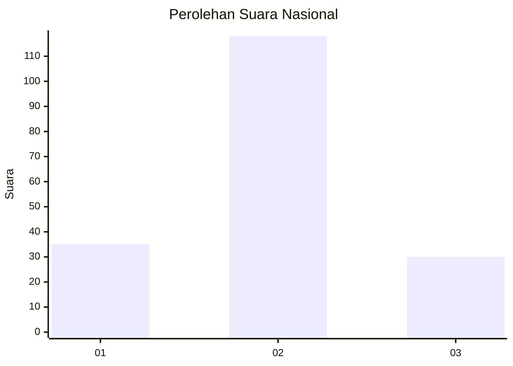

# Hasil

## Grafik

## Tabel

| No. | Nama Paslon    | Suara | Suara (raw) | Persentase |
|:--- |:-------------- | -----:| -----------:| ----------:|
| 1   | ANIES MUHAIMIN | 35    | [35][p-1]   | 19,13      |
| 2   | PRABOWO GIBRAN | 118   | [118][p-2]  | 64,48      |
| 3   | GANJAR MAHFUD  | 30    | [30][p-3]   | 16,39      |

[p-1]: https://github.com/gigit-pemilu/pemilu-2024/blob/main/pilpres/hitung-suara/sub/16-sumatera-selatan/sub/04-lahat/sub/17-kikim-timur/sub/2005-lubuk-nambulan/sub/001-tps/sub/paslon-1.txt
[p-2]: https://github.com/gigit-pemilu/pemilu-2024/blob/main/pilpres/hitung-suara/sub/16-sumatera-selatan/sub/04-lahat/sub/17-kikim-timur/sub/2005-lubuk-nambulan/sub/001-tps/sub/paslon-2.txt
[p-3]: https://github.com/gigit-pemilu/pemilu-2024/blob/main/pilpres/hitung-suara/sub/16-sumatera-selatan/sub/04-lahat/sub/17-kikim-timur/sub/2005-lubuk-nambulan/sub/001-tps/sub/paslon-3.txt

## Foto C Plano

https://sirekap-obj-formc.kpu.go.id/4fac/pemilu/ppwp/16/04/17/20/05/1604172005001-20240215-001124--b5f88297-7c04-4d55-8161-629d9ca8e920.jpg

https://sirekap-obj-formc.kpu.go.id/4fac/pemilu/ppwp/16/04/17/20/05/1604172005001-20240215-001234--15549d85-d3e5-4a4a-9309-56d86c1b6071.jpg

https://sirekap-obj-formc.kpu.go.id/4fac/pemilu/ppwp/16/04/17/20/05/1604172005001-20240215-001315--b4a931d6-d3d1-4eec-834f-c820ef06cb2d.jpg

## Metadata

| Key        | Value               |
| ---------- | ------------------- |
| Time Stamp | 2024-02-15 20:00:44 |

