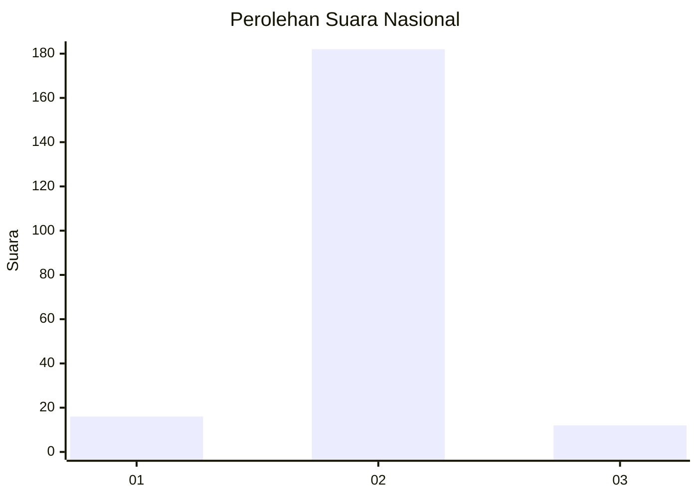
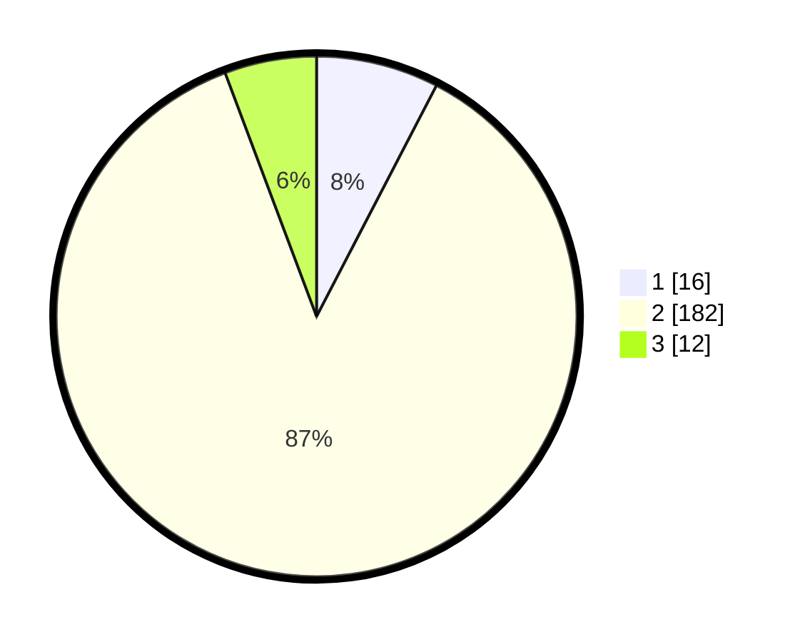

# Hasil

## Grafik

## Tabel

| No. | Nama Paslon    | Suara | Suara (raw) | Persentase |
|:--- |:-------------- | -----:| -----------:| ----------:|
| 1   | ANIES MUHAIMIN | 16    | [16][p-1]   | 7,62       |
| 2   | PRABOWO GIBRAN | 182   | [182][p-2]  | 86,67      |
| 3   | GANJAR MAHFUD  | 12    | [12][p-3]   | 5,71       |

[p-1]: https://github.com/gigit-pemilu/pemilu-2024/blob/main/pilpres/hitung-suara/sub/16-sumatera-selatan/sub/04-lahat/sub/17-kikim-timur/sub/2015-patikal-lama/sub/002-tps/sub/paslon-1.txt
[p-2]: https://github.com/gigit-pemilu/pemilu-2024/blob/main/pilpres/hitung-suara/sub/16-sumatera-selatan/sub/04-lahat/sub/17-kikim-timur/sub/2015-patikal-lama/sub/002-tps/sub/paslon-2.txt
[p-3]: https://github.com/gigit-pemilu/pemilu-2024/blob/main/pilpres/hitung-suara/sub/16-sumatera-selatan/sub/04-lahat/sub/17-kikim-timur/sub/2015-patikal-lama/sub/002-tps/sub/paslon-3.txt

## Foto C Plano

https://sirekap-obj-formc.kpu.go.id/8b74/pemilu/ppwp/16/04/17/20/15/1604172015002-20240215-075112--a1cc84f2-857b-4f5f-8ea2-0a933289e1cd.jpg

https://sirekap-obj-formc.kpu.go.id/8b74/pemilu/ppwp/16/04/17/20/15/1604172015002-20240215-075436--3f439857-ebda-4483-ab24-3af2edd5e32f.jpg

https://sirekap-obj-formc.kpu.go.id/8b74/pemilu/ppwp/16/04/17/20/15/1604172015002-20240215-075855--d12a5d9e-1b25-4fd1-b5c0-06baa3d57a61.jpg

## Metadata

| Key        | Value               |
| ---------- | ------------------- |
| Time Stamp | 2024-02-15 21:30:27 |

