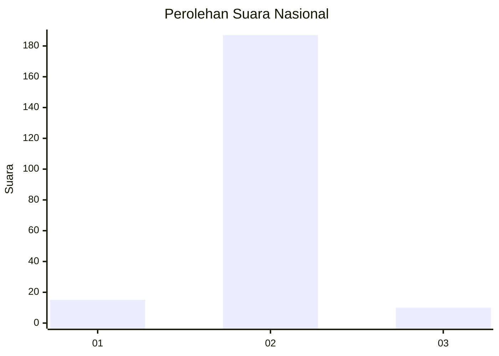
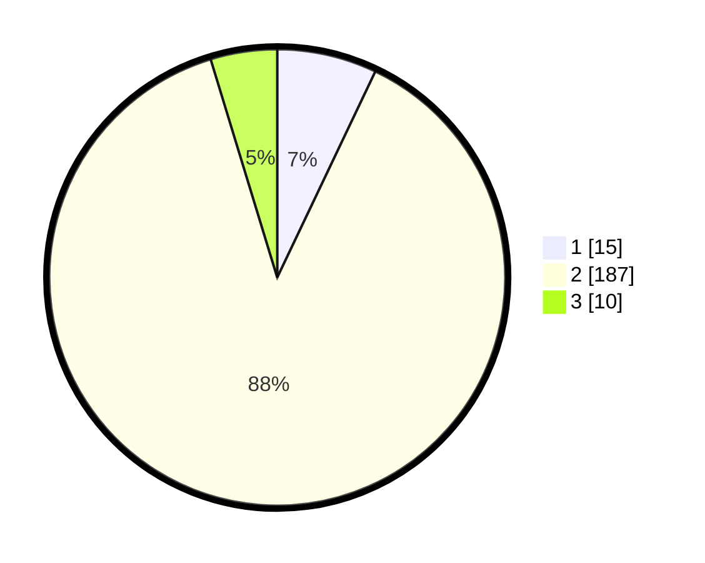

# Hasil

## Grafik

## Tabel

| No. | Nama Paslon    | Suara | Suara (raw) | Persentase |
|:--- |:-------------- | -----:| -----------:| ----------:|
| 1   | ANIES MUHAIMIN | 15    | [15][p-1]   | 7,08       |
| 2   | PRABOWO GIBRAN | 187   | [187][p-2]  | 88,21      |
| 3   | GANJAR MAHFUD  | 10    | [10][p-3]   | 4,72       |

[p-1]: https://github.com/gigit-pemilu/pemilu-2024/blob/main/pilpres/hitung-suara/sub/16-sumatera-selatan/sub/04-lahat/sub/17-kikim-timur/sub/2016-muara-empayang/sub/001-tps/sub/paslon-1.txt
[p-2]: https://github.com/gigit-pemilu/pemilu-2024/blob/main/pilpres/hitung-suara/sub/16-sumatera-selatan/sub/04-lahat/sub/17-kikim-timur/sub/2016-muara-empayang/sub/001-tps/sub/paslon-2.txt
[p-3]: https://github.com/gigit-pemilu/pemilu-2024/blob/main/pilpres/hitung-suara/sub/16-sumatera-selatan/sub/04-lahat/sub/17-kikim-timur/sub/2016-muara-empayang/sub/001-tps/sub/paslon-3.txt

## Foto C Plano

https://sirekap-obj-formc.kpu.go.id/4b7a/pemilu/ppwp/16/04/17/20/16/1604172016001-20240215-014849--d714a408-7d0f-4997-ba1c-83e15ef45476.jpg

https://sirekap-obj-formc.kpu.go.id/4b7a/pemilu/ppwp/16/04/17/20/16/1604172016001-20240215-021921--d9700e3e-ebc2-455a-a059-f4b8399deba7.jpg

https://sirekap-obj-formc.kpu.go.id/4b7a/pemilu/ppwp/16/04/17/20/16/1604172016001-20240215-020712--5f76052d-a851-43be-9eb1-0ec0d941897d.jpg

## Metadata

| Key        | Value               |
| ---------- | ------------------- |
| Time Stamp | 2024-02-15 20:00:44 |

