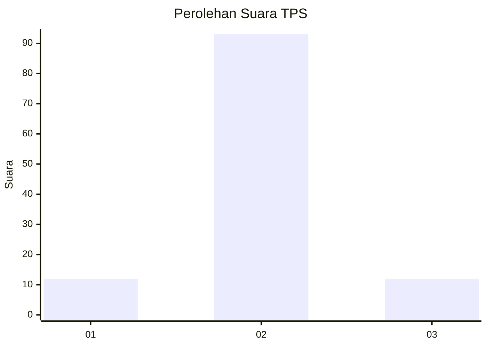
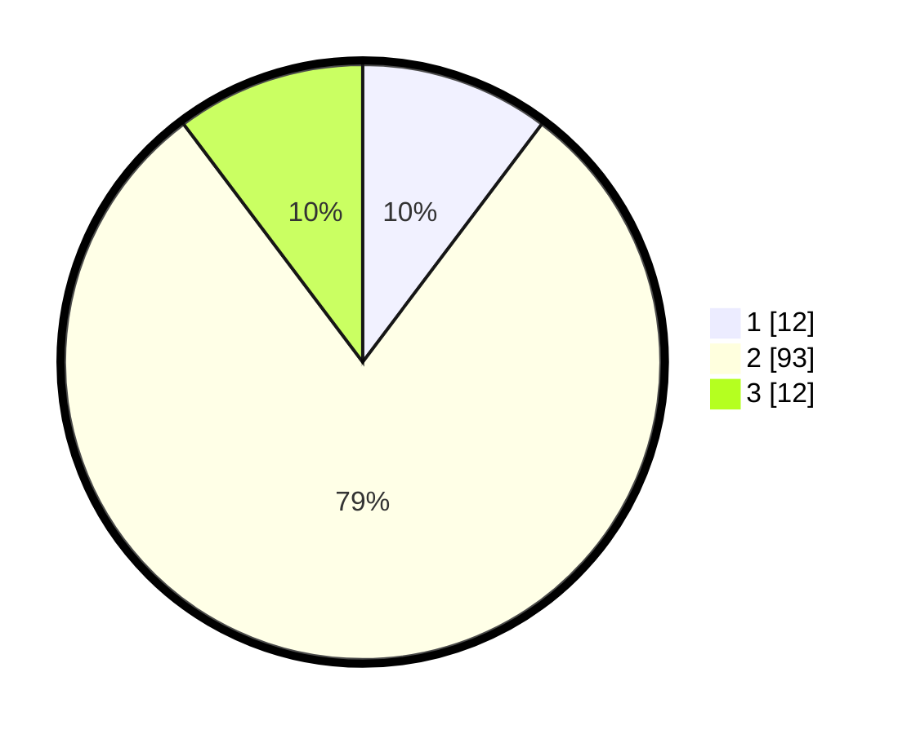

# Hasil

## Grafik

## Tabel

| No. | Nama Paslon    | Suara | Suara (raw) | Persentase |
|:--- |:-------------- | -----:| -----------:| ----------:|
| 1   | ANIES MUHAIMIN | 12    | [12][p-1]   | 10,26      |
| 2   | PRABOWO GIBRAN | 93    | [93][p-2]   | 79,49      |
| 3   | GANJAR MAHFUD  | 12    | [12][p-3]   | 10,26      |

[p-1]: https://github.com/gigit-pemilu/pemilu-2024-16-sumatera-selatan/blob/main/pilpres/hitung-suara/sub/16-sumatera-selatan/sub/04-lahat/sub/17-kikim-timur/sub/2019-gedung-agung/sub/001-tps/sub/paslon-1.txt
[p-2]: https://github.com/gigit-pemilu/pemilu-2024-16-sumatera-selatan/blob/main/pilpres/hitung-suara/sub/16-sumatera-selatan/sub/04-lahat/sub/17-kikim-timur/sub/2019-gedung-agung/sub/001-tps/sub/paslon-2.txt
[p-3]: https://github.com/gigit-pemilu/pemilu-2024-16-sumatera-selatan/blob/main/pilpres/hitung-suara/sub/16-sumatera-selatan/sub/04-lahat/sub/17-kikim-timur/sub/2019-gedung-agung/sub/001-tps/sub/paslon-3.txt

## Foto C Plano

https://sirekap-obj-formc.kpu.go.id/0c78/pemilu/ppwp/16/04/17/20/19/1604172019001-20240215-021148--edc7c468-55fe-44e4-b56c-9e45d2539eee.jpg

https://sirekap-obj-formc.kpu.go.id/0c78/pemilu/ppwp/16/04/17/20/19/1604172019001-20240215-032540--c22a33fd-1c8f-4e72-912f-97aae59fc662.jpg

https://sirekap-obj-formc.kpu.go.id/0c78/pemilu/ppwp/16/04/17/20/19/1604172019001-20240215-020840--96dd912b-bcb8-485e-a827-ba2bbc550482.jpg

## Metadata

| Key        | Value               |
| ---------- | ------------------- |
| Time Stamp | 2024-02-15 20:00:44 |

