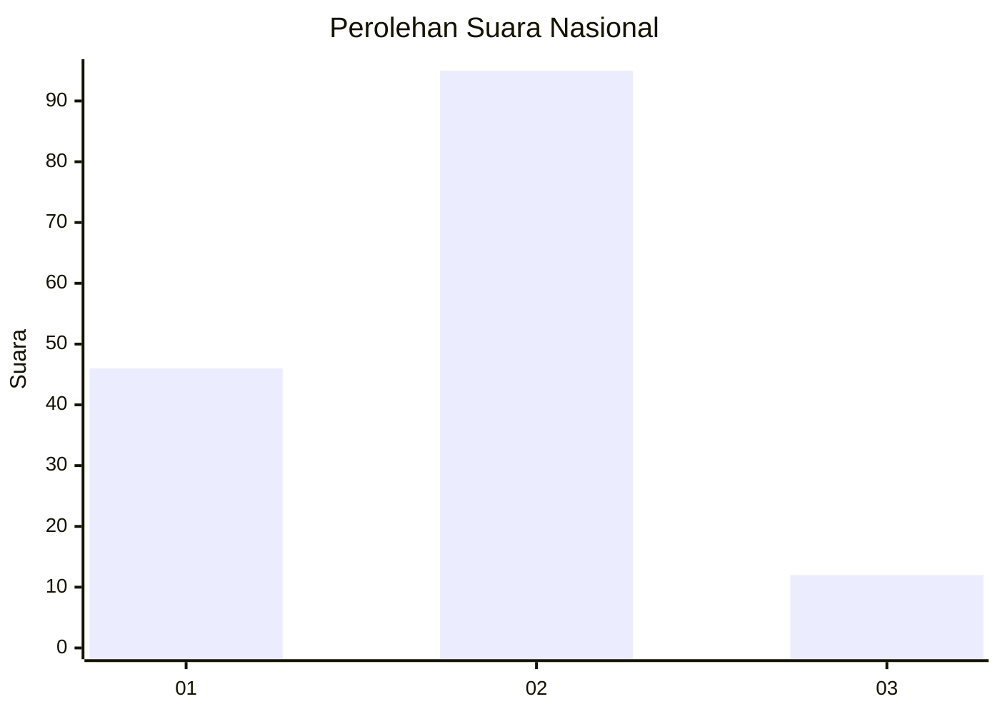
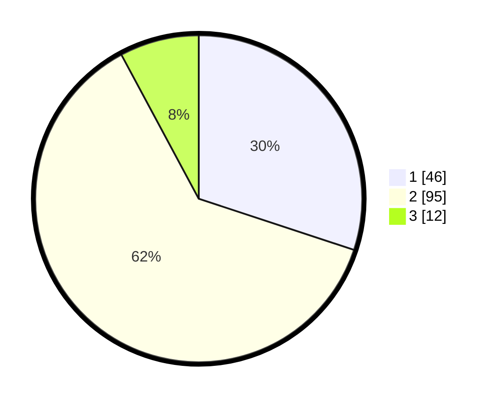

# Hasil

## Grafik

## Tabel

| No. | Nama Paslon    | Suara | Suara (raw) | Persentase |
|:--- |:-------------- | -----:| -----------:| ----------:|
| 1   | ANIES MUHAIMIN | 46    | [46][p-1]   | 30,07      |
| 2   | PRABOWO GIBRAN | 95    | [95][p-2]   | 62,09      |
| 3   | GANJAR MAHFUD  | 12    | [12][p-3]   | 7,84       |

[p-1]: https://github.com/gigit-pemilu/pemilu-2024/blob/main/pilpres/hitung-suara/sub/16-sumatera-selatan/sub/04-lahat/sub/17-kikim-timur/sub/2022-muara-danau/sub/002-tps/sub/paslon-1.txt
[p-2]: https://github.com/gigit-pemilu/pemilu-2024/blob/main/pilpres/hitung-suara/sub/16-sumatera-selatan/sub/04-lahat/sub/17-kikim-timur/sub/2022-muara-danau/sub/002-tps/sub/paslon-2.txt
[p-3]: https://github.com/gigit-pemilu/pemilu-2024/blob/main/pilpres/hitung-suara/sub/16-sumatera-selatan/sub/04-lahat/sub/17-kikim-timur/sub/2022-muara-danau/sub/002-tps/sub/paslon-3.txt

## Foto C Plano

https://sirekap-obj-formc.kpu.go.id/abbb/pemilu/ppwp/16/04/17/20/22/1604172022002-20240214-210038--3b6a744f-4f2c-449b-9491-e0e3dbf3dec7.jpg

https://sirekap-obj-formc.kpu.go.id/abbb/pemilu/ppwp/16/04/17/20/22/1604172022002-20240214-210341--687555d0-d62e-461c-b24f-22eecf21b02e.jpg

https://sirekap-obj-formc.kpu.go.id/abbb/pemilu/ppwp/16/04/17/20/22/1604172022002-20240214-210805--36004d1c-88b5-4f69-889b-568a934e4bad.jpg

## Metadata

| Key        | Value               |
| ---------- | ------------------- |
| Time Stamp | 2024-02-15 15:00:29 |

