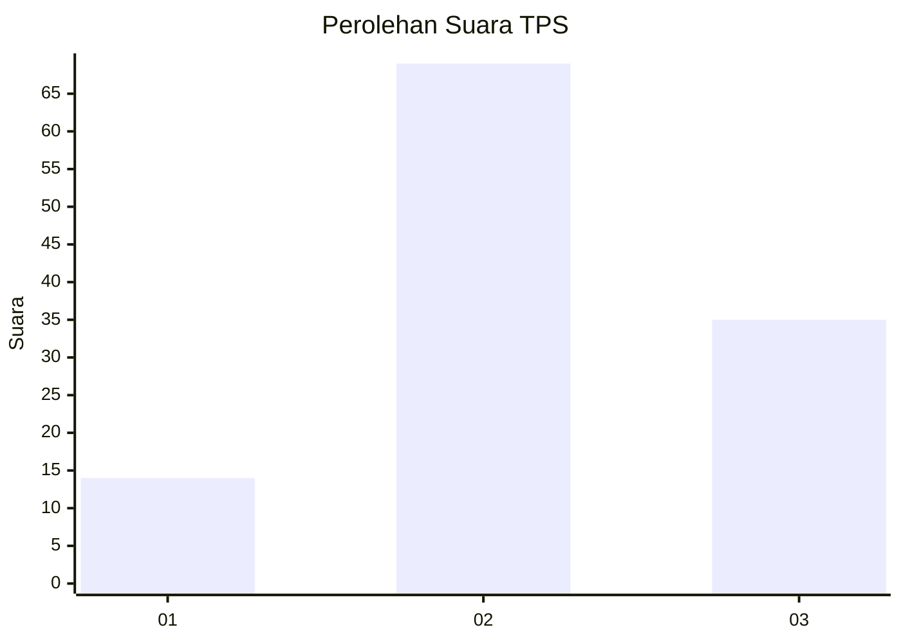
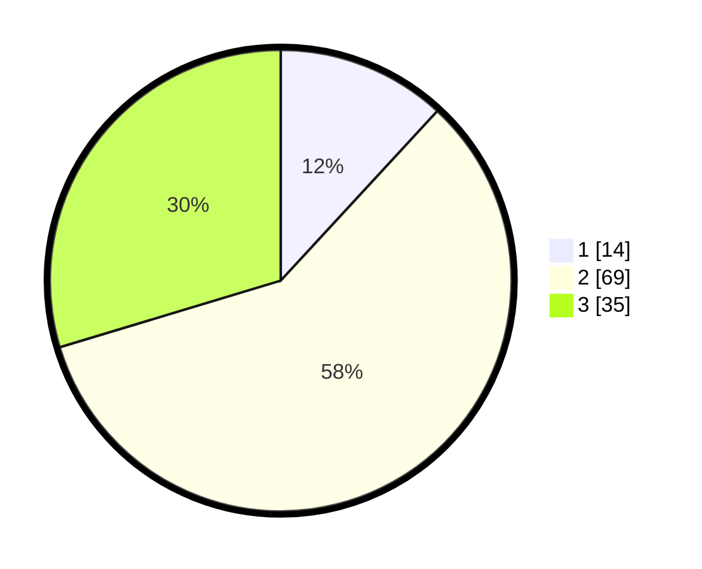

# Hasil

## Grafik

## Tabel

| No. | Nama Paslon    | Suara | Suara (raw) | Persentase |
|:--- |:-------------- | -----:| -----------:| ----------:|
| 1   | ANIES MUHAIMIN | 14    | [14][p-1]   | 11,86      |
| 2   | PRABOWO GIBRAN | 69    | [69][p-2]   | 58,47      |
| 3   | GANJAR MAHFUD  | 35    | [35][p-3]   | 29,66      |

[p-1]: https://github.com/gigit-pemilu/pemilu-2024-16-sumatera-selatan/blob/main/pilpres/hitung-suara/sub/16-sumatera-selatan/sub/04-lahat/sub/17-kikim-timur/sub/2023-sendawar/sub/002-tps/sub/paslon-1.txt
[p-2]: https://github.com/gigit-pemilu/pemilu-2024-16-sumatera-selatan/blob/main/pilpres/hitung-suara/sub/16-sumatera-selatan/sub/04-lahat/sub/17-kikim-timur/sub/2023-sendawar/sub/002-tps/sub/paslon-2.txt
[p-3]: https://github.com/gigit-pemilu/pemilu-2024-16-sumatera-selatan/blob/main/pilpres/hitung-suara/sub/16-sumatera-selatan/sub/04-lahat/sub/17-kikim-timur/sub/2023-sendawar/sub/002-tps/sub/paslon-3.txt

## Foto C Plano

https://sirekap-obj-formc.kpu.go.id/8b80/pemilu/ppwp/16/04/17/20/23/1604172023002-20240215-035032--3ad6155a-64c1-4c11-9e62-e7caaffa80ad.jpg

https://sirekap-obj-formc.kpu.go.id/8b80/pemilu/ppwp/16/04/17/20/23/1604172023002-20240214-233445--825debf1-f19a-48a2-a5d5-7ff08b2396fe.jpg

https://sirekap-obj-formc.kpu.go.id/8b80/pemilu/ppwp/16/04/17/20/23/1604172023002-20240215-035217--5ae2da41-adc1-442c-bc02-2e8c6a350bcf.jpg

## Metadata

| Key        | Value               |
| ---------- | ------------------- |
| Time Stamp | 2024-02-15 18:00:26 |

