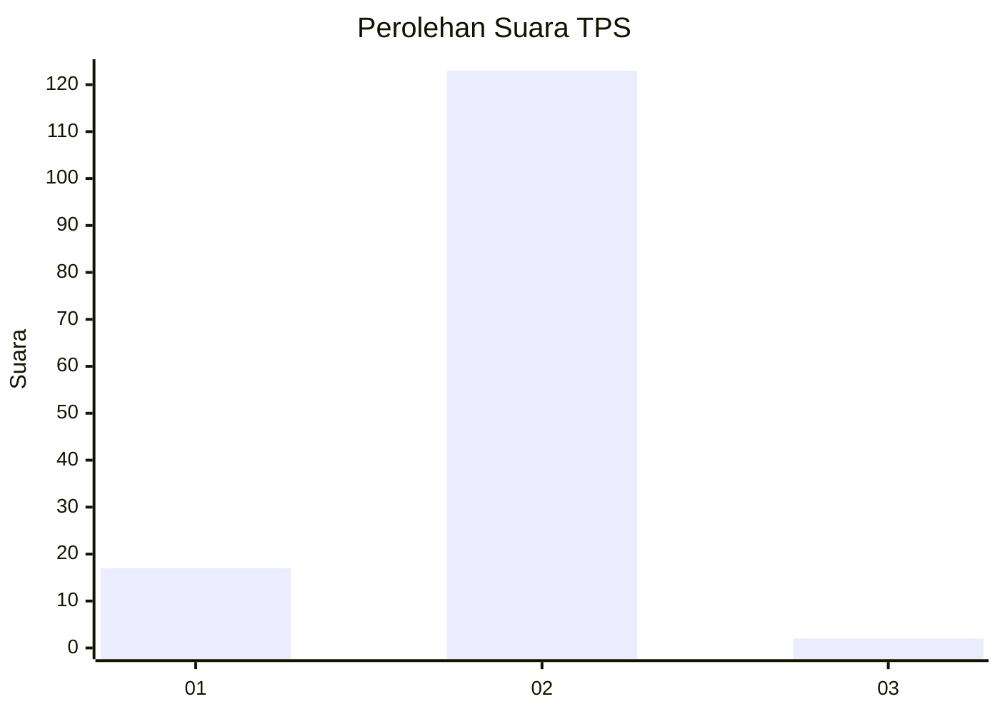
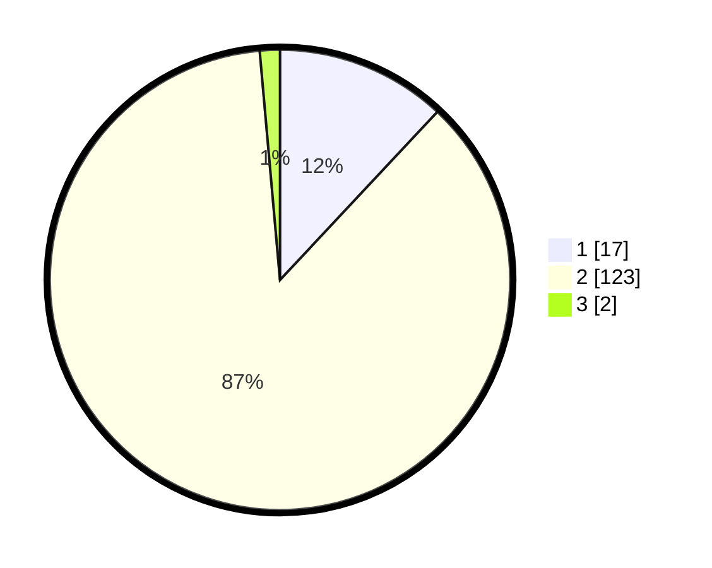

# Hasil

## Grafik

## Tabel

| No. | Nama Paslon    | Suara | Suara (raw) | Persentase |
|:--- |:-------------- | -----:| -----------:| ----------:|
| 1   | ANIES MUHAIMIN | 17    | [17][p-1]   | 11,97      |
| 2   | PRABOWO GIBRAN | 123   | [123][p-2]  | 86,62      |
| 3   | GANJAR MAHFUD  | 2     | [2][p-3]    | 1,41       |

[p-1]: https://github.com/gigit-pemilu/pemilu-2024-16-sumatera-selatan/blob/main/pilpres/hitung-suara/sub/16-sumatera-selatan/sub/04-lahat/sub/17-kikim-timur/sub/2025-binjai/sub/002-tps/sub/paslon-1.txt
[p-2]: https://github.com/gigit-pemilu/pemilu-2024-16-sumatera-selatan/blob/main/pilpres/hitung-suara/sub/16-sumatera-selatan/sub/04-lahat/sub/17-kikim-timur/sub/2025-binjai/sub/002-tps/sub/paslon-2.txt
[p-3]: https://github.com/gigit-pemilu/pemilu-2024-16-sumatera-selatan/blob/main/pilpres/hitung-suara/sub/16-sumatera-selatan/sub/04-lahat/sub/17-kikim-timur/sub/2025-binjai/sub/002-tps/sub/paslon-3.txt

## Foto C Plano

https://sirekap-obj-formc.kpu.go.id/c602/pemilu/ppwp/16/04/17/20/25/1604172025002-20240214-223417--b97ac256-52b3-458a-8b2a-17aa1fc48151.jpg

https://sirekap-obj-formc.kpu.go.id/c602/pemilu/ppwp/16/04/17/20/25/1604172025002-20240214-223544--9f6c1603-aeee-4934-a599-0ae6c0e1a42a.jpg

https://sirekap-obj-formc.kpu.go.id/c602/pemilu/ppwp/16/04/17/20/25/1604172025002-20240214-223641--91d47ef7-b6ec-4b6f-97e5-edc7c4d662ee.jpg

## Metadata

| Key        | Value               |
| ---------- | ------------------- |
| Time Stamp | 2024-02-15 15:00:29 |

