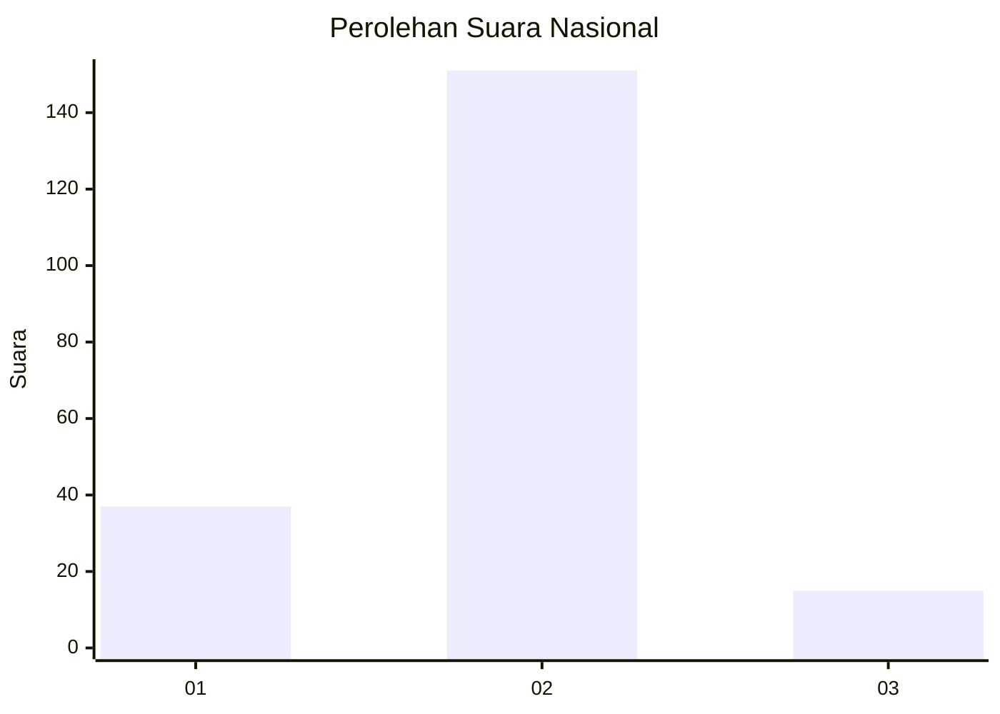
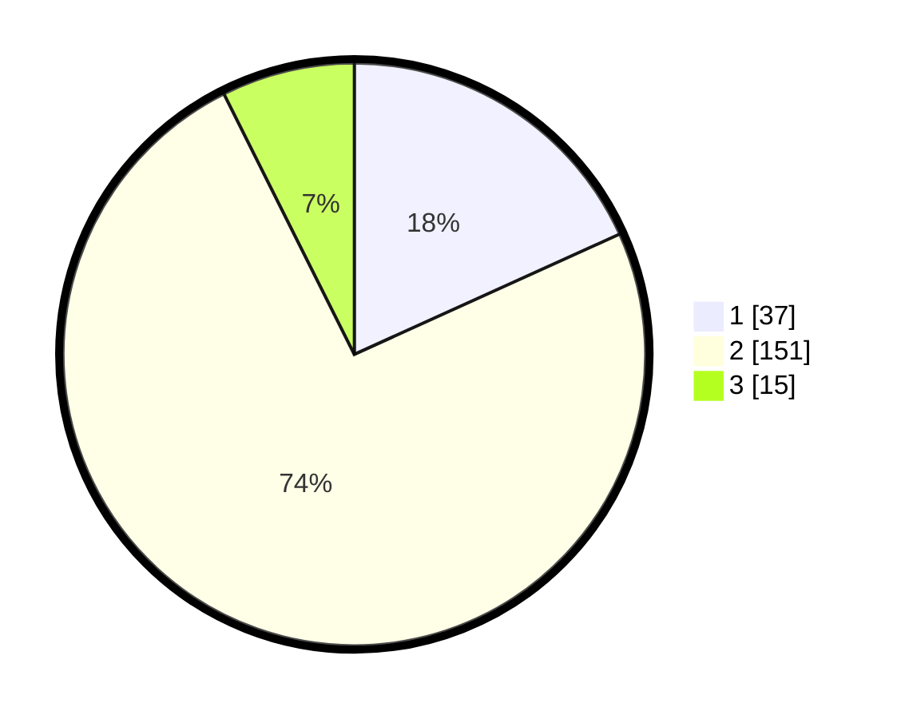

# Hasil

## Grafik

## Tabel

| No. | Nama Paslon    | Suara | Suara (raw) | Persentase |
|:--- |:-------------- | -----:| -----------:| ----------:|
| 1   | ANIES MUHAIMIN | 37    | [37][p-1]   | 18,23      |
| 2   | PRABOWO GIBRAN | 151   | [151][p-2]  | 74,38      |
| 3   | GANJAR MAHFUD  | 15    | [15][p-3]   | 7,39       |

[p-1]: https://github.com/gigit-pemilu/pemilu-2024/blob/main/pilpres/hitung-suara/sub/16-sumatera-selatan/sub/04-lahat/sub/17-kikim-timur/sub/2026-lubuk-layang-ulu/sub/001-tps/sub/paslon-1.txt
[p-2]: https://github.com/gigit-pemilu/pemilu-2024/blob/main/pilpres/hitung-suara/sub/16-sumatera-selatan/sub/04-lahat/sub/17-kikim-timur/sub/2026-lubuk-layang-ulu/sub/001-tps/sub/paslon-2.txt
[p-3]: https://github.com/gigit-pemilu/pemilu-2024/blob/main/pilpres/hitung-suara/sub/16-sumatera-selatan/sub/04-lahat/sub/17-kikim-timur/sub/2026-lubuk-layang-ulu/sub/001-tps/sub/paslon-3.txt

## Foto C Plano

https://sirekap-obj-formc.kpu.go.id/1c30/pemilu/ppwp/16/04/17/20/26/1604172026001-20240215-015058--5660bd8a-ef82-41ad-b68d-8ec390989968.jpg

https://sirekap-obj-formc.kpu.go.id/1c30/pemilu/ppwp/16/04/17/20/26/1604172026001-20240215-015152--3ffa093c-bc99-4aee-b9e8-6b4321a445c0.jpg

https://sirekap-obj-formc.kpu.go.id/1c30/pemilu/ppwp/16/04/17/20/26/1604172026001-20240215-015235--af084479-81fc-4bf8-85ae-d64360be46ff.jpg

## Metadata

| Key        | Value               |
| ---------- | ------------------- |
| Time Stamp | 2024-02-15 20:00:44 |

