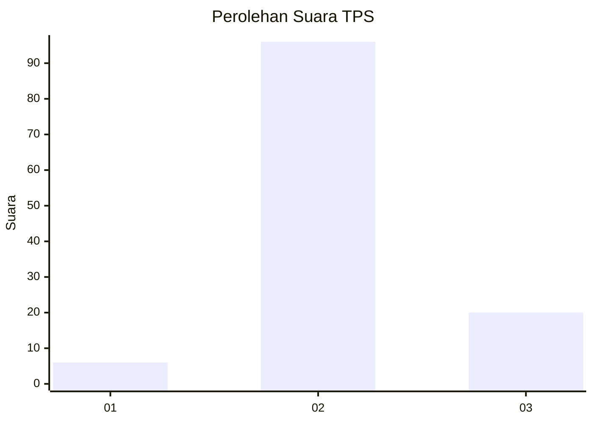
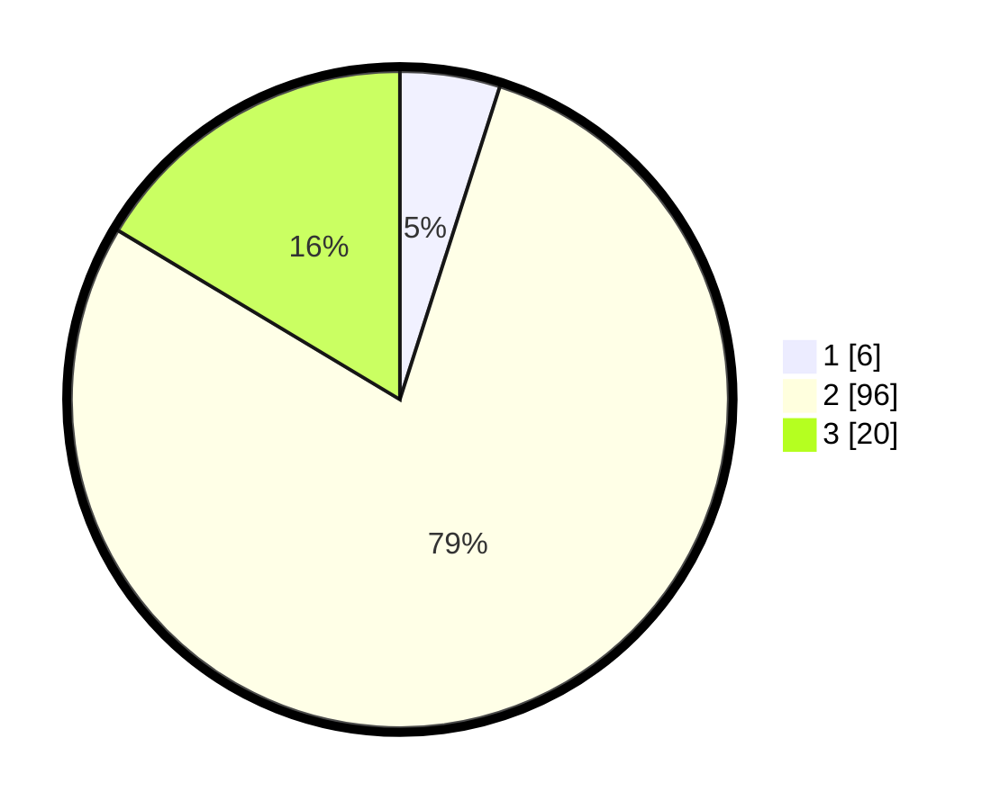

# Hasil

## Grafik

## Tabel

| No. | Nama Paslon    | Suara | Suara (raw) | Persentase |
|:--- |:-------------- | -----:| -----------:| ----------:|
| 1   | ANIES MUHAIMIN | 6     | [6][p-1]    | 4,92       |
| 2   | PRABOWO GIBRAN | 96    | [96][p-2]   | 78,69      |
| 3   | GANJAR MAHFUD  | 20    | [20][p-3]   | 16,39      |

[p-1]: https://github.com/gigit-pemilu/pemilu-2024-16-sumatera-selatan/blob/main/pilpres/hitung-suara/sub/16-sumatera-selatan/sub/04-lahat/sub/18-kikim-tengah/sub/2004-kepala-siring/sub/001-tps/sub/paslon-1.txt
[p-2]: https://github.com/gigit-pemilu/pemilu-2024-16-sumatera-selatan/blob/main/pilpres/hitung-suara/sub/16-sumatera-selatan/sub/04-lahat/sub/18-kikim-tengah/sub/2004-kepala-siring/sub/001-tps/sub/paslon-2.txt
[p-3]: https://github.com/gigit-pemilu/pemilu-2024-16-sumatera-selatan/blob/main/pilpres/hitung-suara/sub/16-sumatera-selatan/sub/04-lahat/sub/18-kikim-tengah/sub/2004-kepala-siring/sub/001-tps/sub/paslon-3.txt

## Foto C Plano

https://sirekap-obj-formc.kpu.go.id/623c/pemilu/ppwp/16/04/18/20/04/1604182004001-20240214-201309--b8bfc191-1e8b-4bb2-9c74-57cc5fe0c051.jpg

https://sirekap-obj-formc.kpu.go.id/623c/pemilu/ppwp/16/04/18/20/04/1604182004001-20240214-201448--74f68a03-aa22-4b6f-956d-8016d61b0ef8.jpg

https://sirekap-obj-formc.kpu.go.id/623c/pemilu/ppwp/16/04/18/20/04/1604182004001-20240214-212036--2856811b-5449-4228-bfe4-54cff3f7e56d.jpg

## Metadata

| Key        | Value               |
| ---------- | ------------------- |
| Time Stamp | 2024-02-15 15:00:29 |

