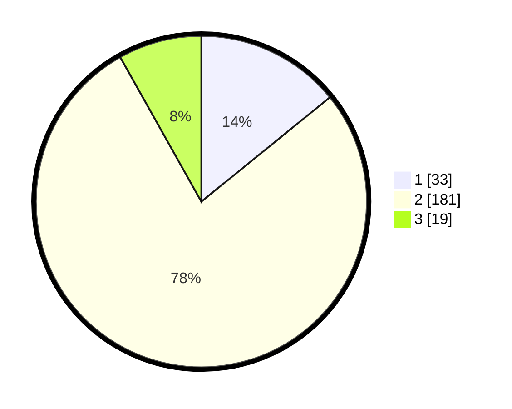

# Hasil

## Grafik

## Tabel

| No. | Nama Paslon    | Suara | Suara (raw) | Persentase |
|:--- |:-------------- | -----:| -----------:| ----------:|
| 1   | ANIES MUHAIMIN | 33    | [33][p-1]   | 14,16      |
| 2   | PRABOWO GIBRAN | 181   | [181][p-2]  | 77,68      |
| 3   | GANJAR MAHFUD  | 19    | [19][p-3]   | 8,15       |

[p-1]: https://github.com/gigit-pemilu/pemilu-2024/blob/main/pilpres/hitung-suara/sub/16-sumatera-selatan/sub/04-lahat/sub/18-kikim-tengah/sub/2007-tanjung-aur/sub/002-tps/sub/paslon-1.txt
[p-2]: https://github.com/gigit-pemilu/pemilu-2024/blob/main/pilpres/hitung-suara/sub/16-sumatera-selatan/sub/04-lahat/sub/18-kikim-tengah/sub/2007-tanjung-aur/sub/002-tps/sub/paslon-2.txt
[p-3]: https://github.com/gigit-pemilu/pemilu-2024/blob/main/pilpres/hitung-suara/sub/16-sumatera-selatan/sub/04-lahat/sub/18-kikim-tengah/sub/2007-tanjung-aur/sub/002-tps/sub/paslon-3.txt

## Foto C Plano

https://sirekap-obj-formc.kpu.go.id/7d39/pemilu/ppwp/16/04/18/20/07/1604182007002-20240214-210910--0f451bc7-3bc0-4f3b-ae6d-2543585eb5e9.jpg

https://sirekap-obj-formc.kpu.go.id/7d39/pemilu/ppwp/16/04/18/20/07/1604182007002-20240214-211323--acd74a03-6c4b-4fbf-8ed0-7eac3d386ede.jpg

https://sirekap-obj-formc.kpu.go.id/7d39/pemilu/ppwp/16/04/18/20/07/1604182007002-20240214-211500--4375ac06-969c-4d19-90ac-94d3ef6b817c.jpg

## Metadata

| Key        | Value               |
| ---------- | ------------------- |
| Time Stamp | 2024-02-15 15:00:29 |

