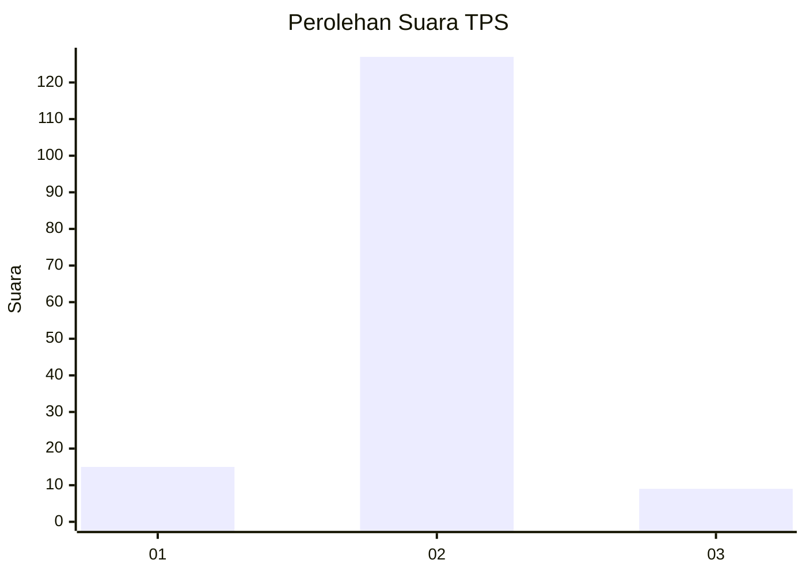
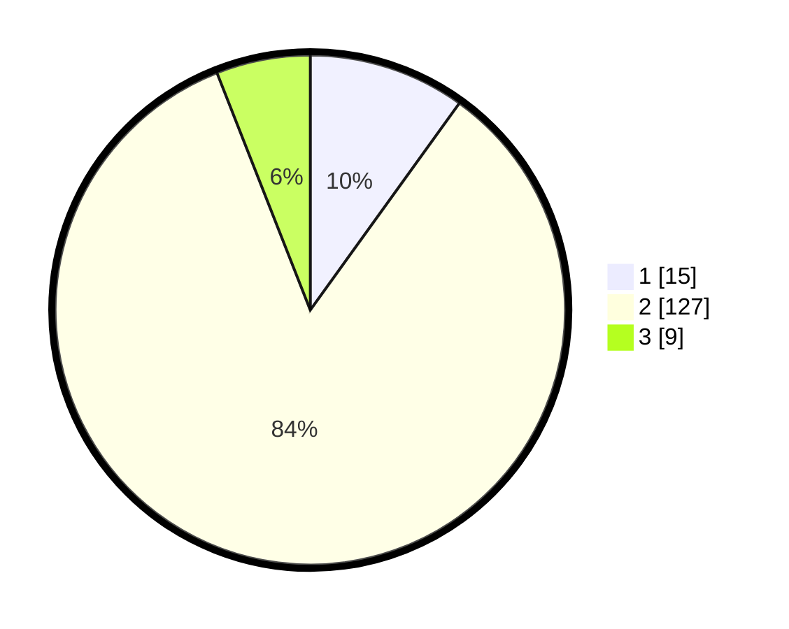

# Hasil

## Grafik

## Tabel

| No. | Nama Paslon    | Suara | Suara (raw) | Persentase |
|:--- |:-------------- | -----:| -----------:| ----------:|
| 1   | ANIES MUHAIMIN | 15    | [15][p-1]   | 9,93       |
| 2   | PRABOWO GIBRAN | 127   | [127][p-2]  | 84,11      |
| 3   | GANJAR MAHFUD  | 9     | [9][p-3]    | 5,96       |

[p-1]: https://github.com/gigit-pemilu/pemilu-2024-16-sumatera-selatan/blob/main/pilpres/hitung-suara/sub/16-sumatera-selatan/sub/04-lahat/sub/19-kikim-barat/sub/2001-saung-naga/sub/001-tps/sub/paslon-1.txt
[p-2]: https://github.com/gigit-pemilu/pemilu-2024-16-sumatera-selatan/blob/main/pilpres/hitung-suara/sub/16-sumatera-selatan/sub/04-lahat/sub/19-kikim-barat/sub/2001-saung-naga/sub/001-tps/sub/paslon-2.txt
[p-3]: https://github.com/gigit-pemilu/pemilu-2024-16-sumatera-selatan/blob/main/pilpres/hitung-suara/sub/16-sumatera-selatan/sub/04-lahat/sub/19-kikim-barat/sub/2001-saung-naga/sub/001-tps/sub/paslon-3.txt

## Foto C Plano

https://sirekap-obj-formc.kpu.go.id/33a8/pemilu/ppwp/16/04/19/20/01/1604192001001-20240222-091401--fb2a77a4-c47c-486e-b680-73e7b69c9bea.jpg

https://sirekap-obj-formc.kpu.go.id/33a8/pemilu/ppwp/16/04/19/20/01/1604192001001-20240222-090443--189cd09f-5e63-427e-a9e5-ead55cb8c941.jpg

https://sirekap-obj-formc.kpu.go.id/33a8/pemilu/ppwp/16/04/19/20/01/1604192001001-20240222-090603--69cadd56-ad74-4b93-94c8-5f8860b1e4f6.jpg

## Metadata

| Key        | Value               |
| ---------- | ------------------- |
| Time Stamp | 2024-02-24 22:31:28 |

