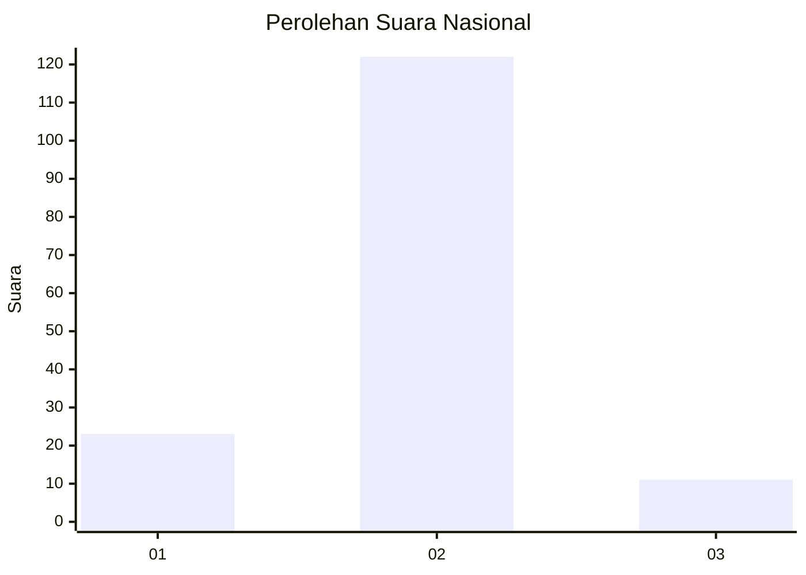
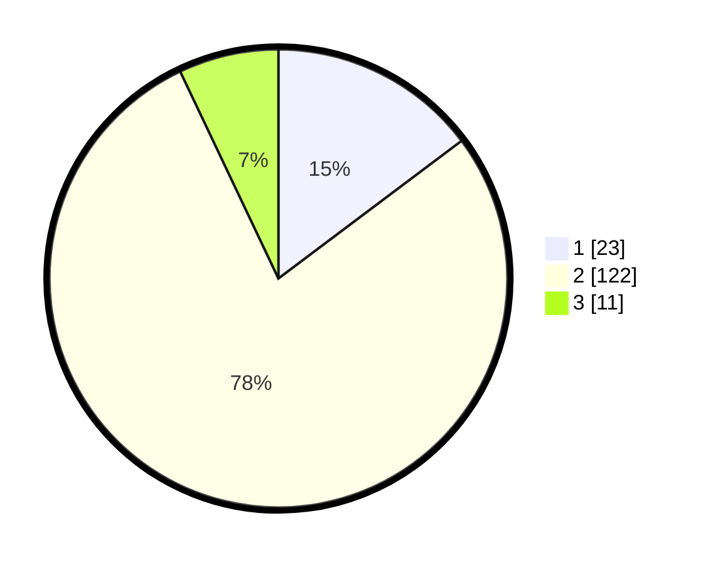

# Hasil

## Grafik

## Tabel

| No. | Nama Paslon    | Suara | Suara (raw) | Persentase |
|:--- |:-------------- | -----:| -----------:| ----------:|
| 1   | ANIES MUHAIMIN | 23    | [23][p-1]   | 14,74      |
| 2   | PRABOWO GIBRAN | 122   | [122][p-2]  | 78,21      |
| 3   | GANJAR MAHFUD  | 11    | [11][p-3]   | 7,05       |

[p-1]: https://github.com/gigit-pemilu/pemilu-2024/blob/main/pilpres/hitung-suara/sub/16-sumatera-selatan/sub/04-lahat/sub/19-kikim-barat/sub/2001-saung-naga/sub/002-tps/sub/paslon-1.txt
[p-2]: https://github.com/gigit-pemilu/pemilu-2024/blob/main/pilpres/hitung-suara/sub/16-sumatera-selatan/sub/04-lahat/sub/19-kikim-barat/sub/2001-saung-naga/sub/002-tps/sub/paslon-2.txt
[p-3]: https://github.com/gigit-pemilu/pemilu-2024/blob/main/pilpres/hitung-suara/sub/16-sumatera-selatan/sub/04-lahat/sub/19-kikim-barat/sub/2001-saung-naga/sub/002-tps/sub/paslon-3.txt

## Foto C Plano

https://sirekap-obj-formc.kpu.go.id/7e78/pemilu/ppwp/16/04/19/20/01/1604192001002-20240222-100844--a1092b73-406b-414c-9e25-329a65d1ba0e.jpg

https://sirekap-obj-formc.kpu.go.id/7e78/pemilu/ppwp/16/04/19/20/01/1604192001002-20240222-100929--938e1acf-4a3f-44a9-b1e4-e22275c84b3b.jpg

https://sirekap-obj-formc.kpu.go.id/7e78/pemilu/ppwp/16/04/19/20/01/1604192001002-20240222-101018--afbb0202-8bea-4cbb-8ee1-ec710fa817b1.jpg

## Metadata

| Key        | Value               |
| ---------- | ------------------- |
| Time Stamp | 2024-02-25 15:00:00 |

