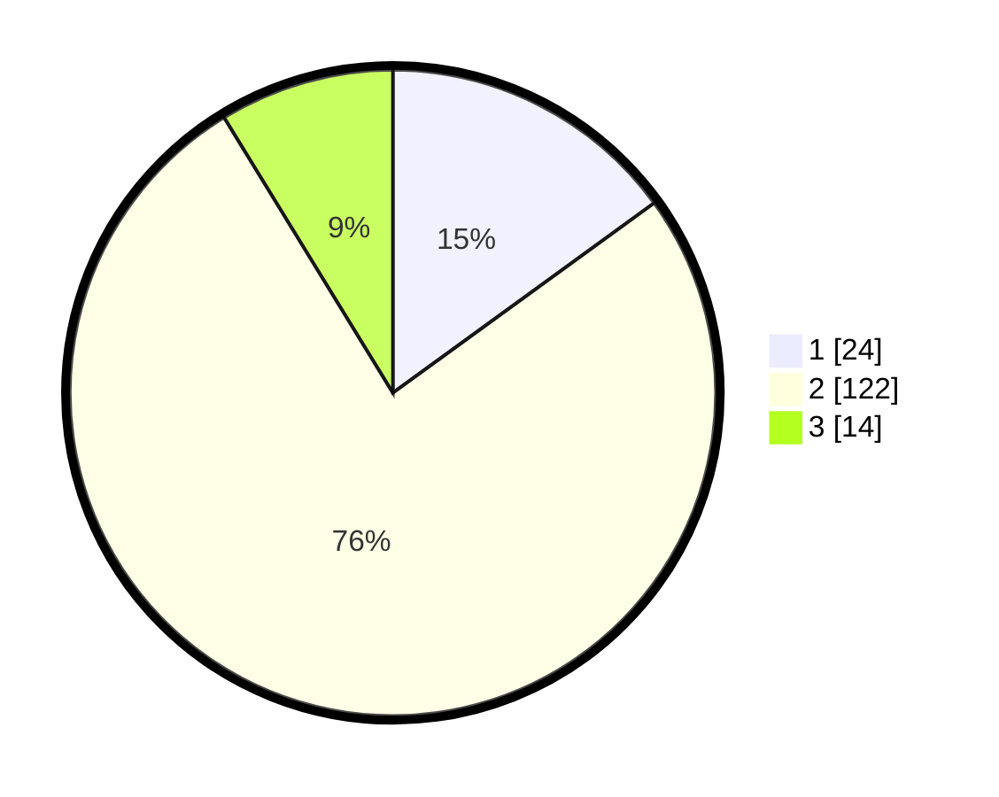

# Hasil

## Grafik

## Tabel

| No. | Nama Paslon    | Suara | Suara (raw) | Persentase |
|:--- |:-------------- | -----:| -----------:| ----------:|
| 1   | ANIES MUHAIMIN | 24    | [24][p-1]   | 15,00      |
| 2   | PRABOWO GIBRAN | 122   | [122][p-2]  | 76,25      |
| 3   | GANJAR MAHFUD  | 14    | [14][p-3]   | 8,75       |

[p-1]: https://github.com/gigit-pemilu/pemilu-2024-16-sumatera-selatan/blob/main/pilpres/hitung-suara/sub/16-sumatera-selatan/sub/04-lahat/sub/19-kikim-barat/sub/2001-saung-naga/sub/003-tps/sub/paslon-1.txt
[p-2]: https://github.com/gigit-pemilu/pemilu-2024-16-sumatera-selatan/blob/main/pilpres/hitung-suara/sub/16-sumatera-selatan/sub/04-lahat/sub/19-kikim-barat/sub/2001-saung-naga/sub/003-tps/sub/paslon-2.txt
[p-3]: https://github.com/gigit-pemilu/pemilu-2024-16-sumatera-selatan/blob/main/pilpres/hitung-suara/sub/16-sumatera-selatan/sub/04-lahat/sub/19-kikim-barat/sub/2001-saung-naga/sub/003-tps/sub/paslon-3.txt

## Foto C Plano

https://sirekap-obj-formc.kpu.go.id/50f9/pemilu/ppwp/16/04/19/20/01/1604192001003-20240222-111431--516974a5-a660-4642-9c06-829c44609073.jpg

https://sirekap-obj-formc.kpu.go.id/50f9/pemilu/ppwp/16/04/19/20/01/1604192001003-20240222-111519--c31e527e-993f-4a6c-9d70-5503b3798f65.jpg

https://sirekap-obj-formc.kpu.go.id/50f9/pemilu/ppwp/16/04/19/20/01/1604192001003-20240222-111559--ebe853c9-2467-4897-bb00-162a4b5a0ac8.jpg

## Metadata

| Key        | Value               |
| ---------- | ------------------- |
| Time Stamp | 2024-02-25 21:00:00 |

