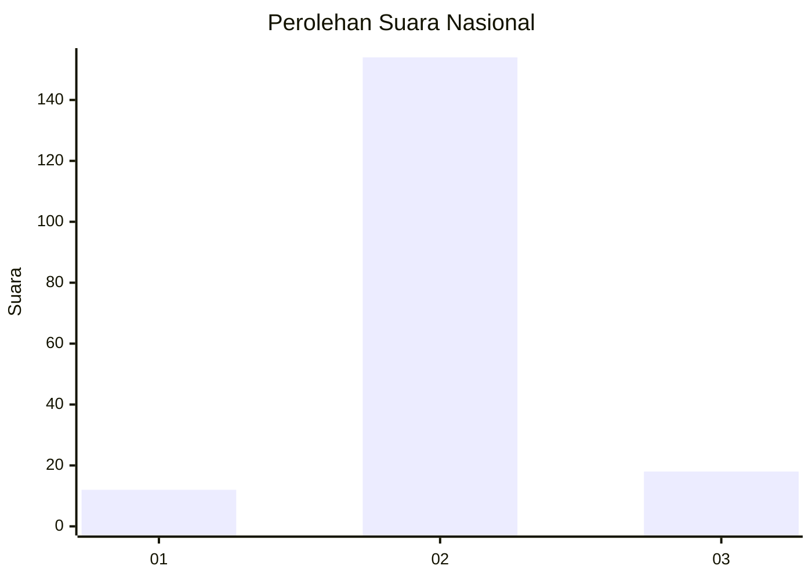
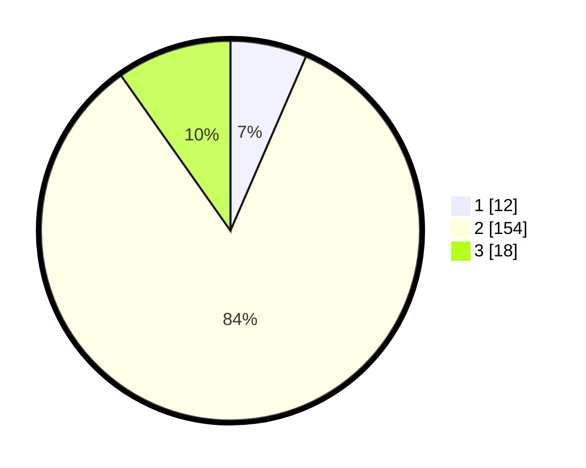

# Hasil

## Grafik

## Tabel

| No. | Nama Paslon    | Suara | Suara (raw) | Persentase |
|:--- |:-------------- | -----:| -----------:| ----------:|
| 1   | ANIES MUHAIMIN | 12    | [12][p-1]   | 6,52       |
| 2   | PRABOWO GIBRAN | 154   | [154][p-2]  | 83,70      |
| 3   | GANJAR MAHFUD  | 18    | [18][p-3]   | 9,78       |

[p-1]: https://github.com/gigit-pemilu/pemilu-2024/blob/main/pilpres/hitung-suara/sub/16-sumatera-selatan/sub/04-lahat/sub/19-kikim-barat/sub/2002-penantian/sub/001-tps/sub/paslon-1.txt
[p-2]: https://github.com/gigit-pemilu/pemilu-2024/blob/main/pilpres/hitung-suara/sub/16-sumatera-selatan/sub/04-lahat/sub/19-kikim-barat/sub/2002-penantian/sub/001-tps/sub/paslon-2.txt
[p-3]: https://github.com/gigit-pemilu/pemilu-2024/blob/main/pilpres/hitung-suara/sub/16-sumatera-selatan/sub/04-lahat/sub/19-kikim-barat/sub/2002-penantian/sub/001-tps/sub/paslon-3.txt

## Foto C Plano

https://sirekap-obj-formc.kpu.go.id/9cc9/pemilu/ppwp/16/04/19/20/02/1604192002001-20240223-215112--3e8bcc71-f270-47b6-ac3a-374a6b5ae4a2.jpg

https://sirekap-obj-formc.kpu.go.id/9cc9/pemilu/ppwp/16/04/19/20/02/1604192002001-20240223-223942--d790cb35-06f6-433a-b117-f05fed169f0b.jpg

https://sirekap-obj-formc.kpu.go.id/9cc9/pemilu/ppwp/16/04/19/20/02/1604192002001-20240223-223635--f9f5aea6-81d8-43ed-9a0e-0868372c5027.jpg

## Metadata

| Key        | Value               |
| ---------- | ------------------- |
| Time Stamp | 2024-02-25 12:00:00 |

