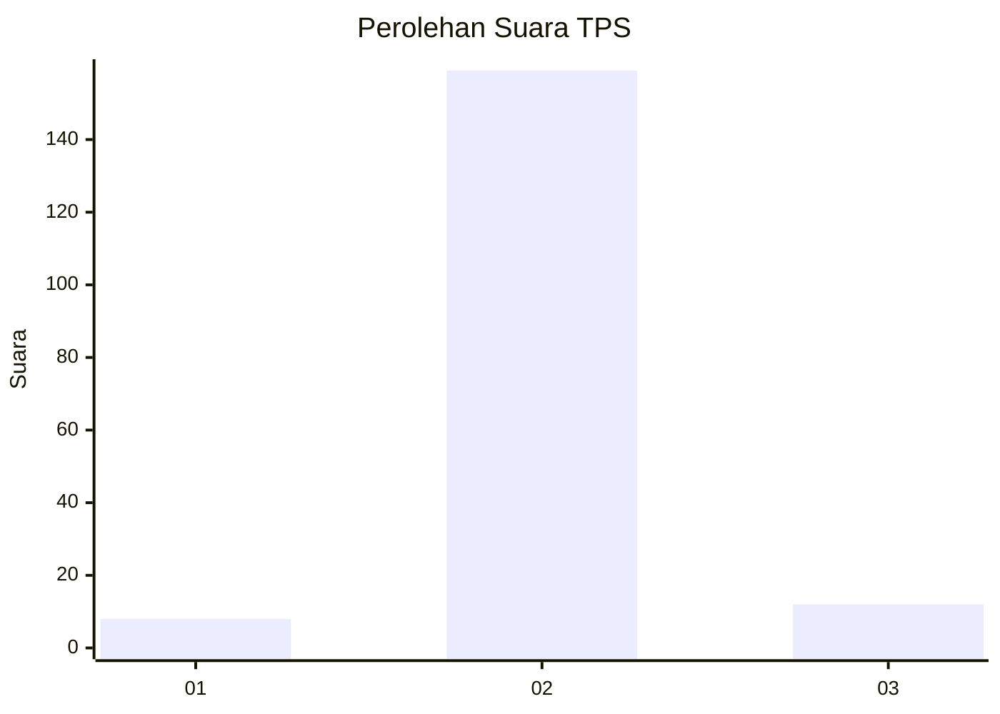
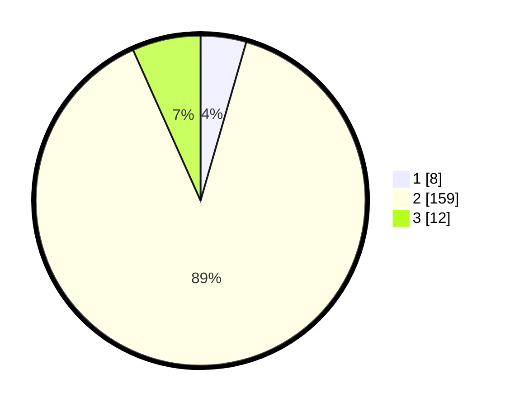

# Hasil

## Grafik

## Tabel

| No. | Nama Paslon    | Suara | Suara (raw) | Persentase |
|:--- |:-------------- | -----:| -----------:| ----------:|
| 1   | ANIES MUHAIMIN | 8     | [8][p-1]    | 4,47       |
| 2   | PRABOWO GIBRAN | 159   | [159][p-2]  | 88,83      |
| 3   | GANJAR MAHFUD  | 12    | [12][p-3]   | 6,70       |

[p-1]: https://github.com/gigit-pemilu/pemilu-2024-16-sumatera-selatan/blob/main/pilpres/hitung-suara/sub/16-sumatera-selatan/sub/04-lahat/sub/19-kikim-barat/sub/2002-penantian/sub/002-tps/sub/paslon-1.txt
[p-2]: https://github.com/gigit-pemilu/pemilu-2024-16-sumatera-selatan/blob/main/pilpres/hitung-suara/sub/16-sumatera-selatan/sub/04-lahat/sub/19-kikim-barat/sub/2002-penantian/sub/002-tps/sub/paslon-2.txt
[p-3]: https://github.com/gigit-pemilu/pemilu-2024-16-sumatera-selatan/blob/main/pilpres/hitung-suara/sub/16-sumatera-selatan/sub/04-lahat/sub/19-kikim-barat/sub/2002-penantian/sub/002-tps/sub/paslon-3.txt

## Foto C Plano

https://sirekap-obj-formc.kpu.go.id/62f9/pemilu/ppwp/16/04/19/20/02/1604192002002-20240223-224740--d57d438f-7c08-49d3-8a7b-e9ee98cfc52f.jpg

https://sirekap-obj-formc.kpu.go.id/62f9/pemilu/ppwp/16/04/19/20/02/1604192002002-20240223-224852--62499acd-f3d7-44a6-8651-c2136331bbe8.jpg

https://sirekap-obj-formc.kpu.go.id/62f9/pemilu/ppwp/16/04/19/20/02/1604192002002-20240223-224930--3c1ef48f-52fe-4122-ab1f-74e7e3faf88c.jpg

## Metadata

| Key        | Value               |
| ---------- | ------------------- |
| Time Stamp | 2024-02-25 11:00:00 |

