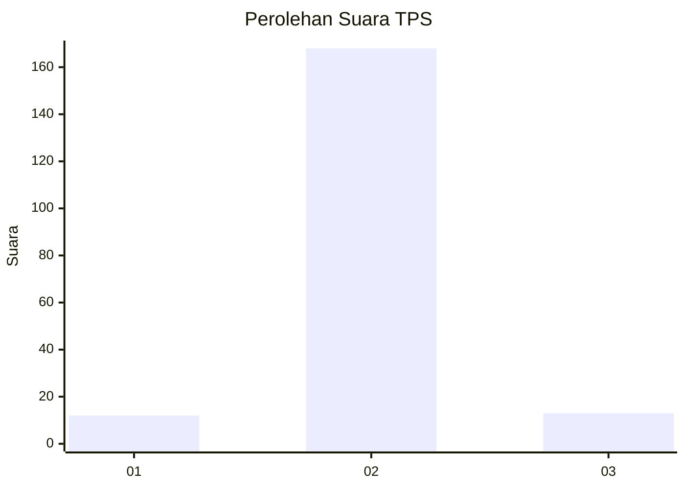
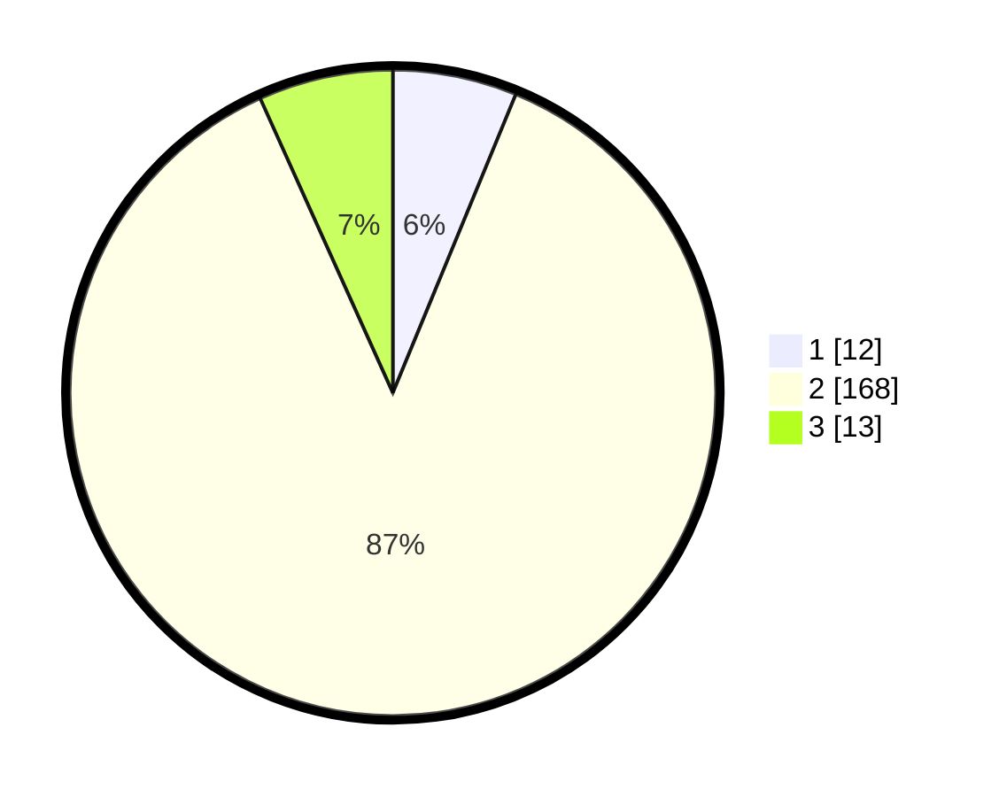

# Hasil

## Grafik

## Tabel

| No. | Nama Paslon    | Suara | Suara (raw) | Persentase |
|:--- |:-------------- | -----:| -----------:| ----------:|
| 1   | ANIES MUHAIMIN | 12    | [12][p-1]   | 6,22       |
| 2   | PRABOWO GIBRAN | 168   | [168][p-2]  | 87,05      |
| 3   | GANJAR MAHFUD  | 13    | [13][p-3]   | 6,74       |

[p-1]: https://github.com/gigit-pemilu/pemilu-2024-16-sumatera-selatan/blob/main/pilpres/hitung-suara/sub/16-sumatera-selatan/sub/04-lahat/sub/19-kikim-barat/sub/2003-suka-merindu/sub/004-tps/sub/paslon-1.txt
[p-2]: https://github.com/gigit-pemilu/pemilu-2024-16-sumatera-selatan/blob/main/pilpres/hitung-suara/sub/16-sumatera-selatan/sub/04-lahat/sub/19-kikim-barat/sub/2003-suka-merindu/sub/004-tps/sub/paslon-2.txt
[p-3]: https://github.com/gigit-pemilu/pemilu-2024-16-sumatera-selatan/blob/main/pilpres/hitung-suara/sub/16-sumatera-selatan/sub/04-lahat/sub/19-kikim-barat/sub/2003-suka-merindu/sub/004-tps/sub/paslon-3.txt

## Foto C Plano

https://sirekap-obj-formc.kpu.go.id/42ca/pemilu/ppwp/16/04/19/20/03/1604192003004-20240223-205103--78452625-1cf7-4c38-aebb-6e5e5c101b0e.jpg

https://sirekap-obj-formc.kpu.go.id/42ca/pemilu/ppwp/16/04/19/20/03/1604192003004-20240223-205846--f5586f54-80ef-45fb-bc64-d8075b0c9c37.jpg

https://sirekap-obj-formc.kpu.go.id/42ca/pemilu/ppwp/16/04/19/20/03/1604192003004-20240223-205626--a90dd5c3-ec63-4bba-81ea-08755b9fcfa1.jpg

## Metadata

| Key        | Value               |
| ---------- | ------------------- |
| Time Stamp | 2024-02-25 20:00:00 |

