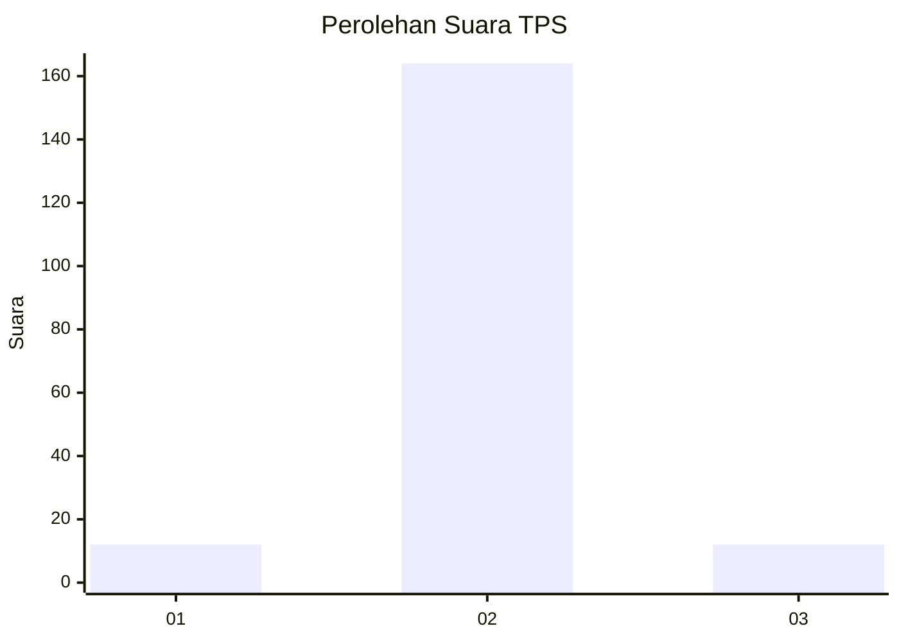
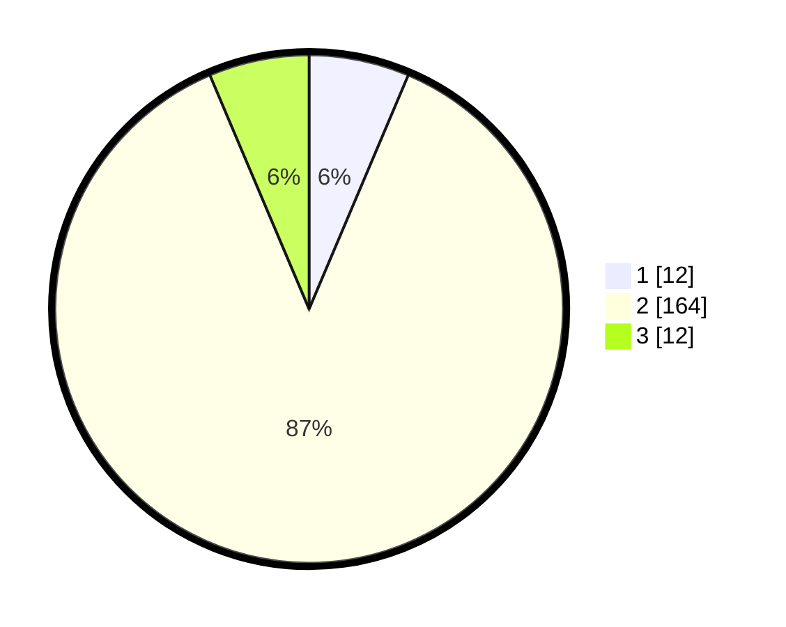

# Hasil

## Grafik

## Tabel

| No. | Nama Paslon    | Suara | Suara (raw) | Persentase |
|:--- |:-------------- | -----:| -----------:| ----------:|
| 1   | ANIES MUHAIMIN | 12    | [12][p-1]   | 6,38       |
| 2   | PRABOWO GIBRAN | 164   | [164][p-2]  | 87,23      |
| 3   | GANJAR MAHFUD  | 12    | [12][p-3]   | 6,38       |

[p-1]: https://github.com/gigit-pemilu/pemilu-2024-16-sumatera-selatan/blob/main/pilpres/hitung-suara/sub/16-sumatera-selatan/sub/04-lahat/sub/19-kikim-barat/sub/2006-babatan-baru/sub/001-tps/sub/paslon-1.txt
[p-2]: https://github.com/gigit-pemilu/pemilu-2024-16-sumatera-selatan/blob/main/pilpres/hitung-suara/sub/16-sumatera-selatan/sub/04-lahat/sub/19-kikim-barat/sub/2006-babatan-baru/sub/001-tps/sub/paslon-2.txt
[p-3]: https://github.com/gigit-pemilu/pemilu-2024-16-sumatera-selatan/blob/main/pilpres/hitung-suara/sub/16-sumatera-selatan/sub/04-lahat/sub/19-kikim-barat/sub/2006-babatan-baru/sub/001-tps/sub/paslon-3.txt

## Foto C Plano

https://sirekap-obj-formc.kpu.go.id/47fe/pemilu/ppwp/16/04/19/20/06/1604192006001-20240221-102952--8f7dfbab-774c-47ad-9972-079e376e1eb7.jpg

https://sirekap-obj-formc.kpu.go.id/47fe/pemilu/ppwp/16/04/19/20/06/1604192006001-20240221-103054--d29c5cc3-fdc4-46ad-abd5-d15c9bfdb76d.jpg

https://sirekap-obj-formc.kpu.go.id/47fe/pemilu/ppwp/16/04/19/20/06/1604192006001-20240221-103203--3414f437-e9dc-4dac-b957-e98e5026e013.jpg

## Metadata

| Key        | Value               |
| ---------- | ------------------- |
| Time Stamp | 2024-02-25 23:00:00 |

