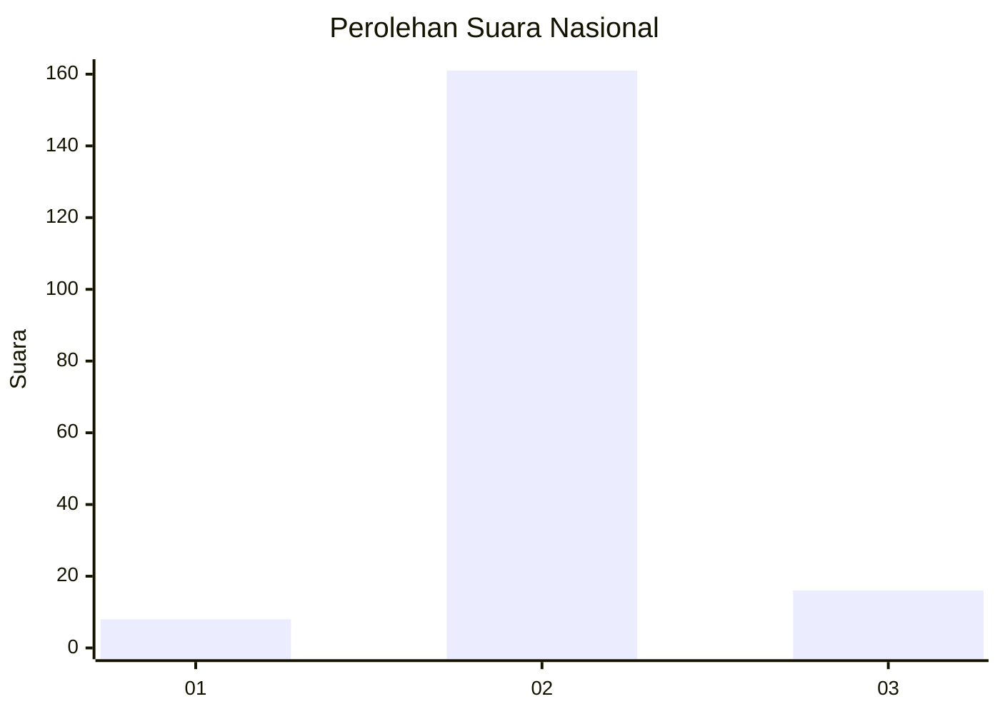
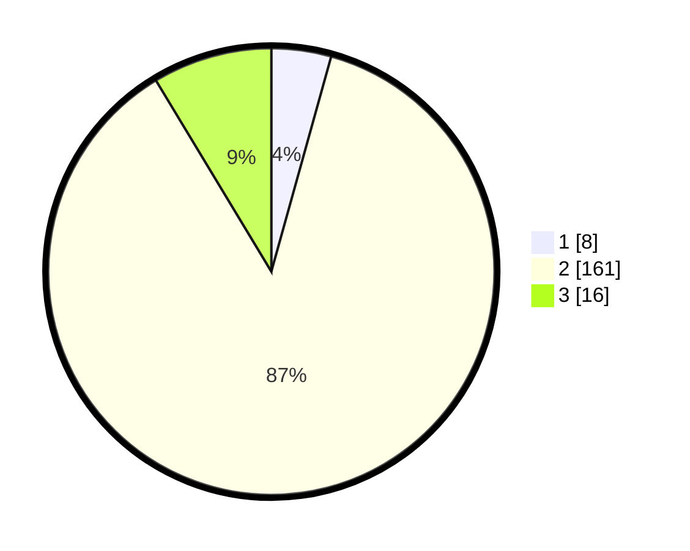

# Hasil

## Grafik

## Tabel

| No. | Nama Paslon    | Suara | Suara (raw) | Persentase |
|:--- |:-------------- | -----:| -----------:| ----------:|
| 1   | ANIES MUHAIMIN | 8     | [8][p-1]    | 4,32       |
| 2   | PRABOWO GIBRAN | 161   | [161][p-2]  | 87,03      |
| 3   | GANJAR MAHFUD  | 16    | [16][p-3]   | 8,65       |

[p-1]: https://github.com/gigit-pemilu/pemilu-2024/blob/main/pilpres/hitung-suara/sub/16-sumatera-selatan/sub/04-lahat/sub/19-kikim-barat/sub/2006-babatan-baru/sub/002-tps/sub/paslon-1.txt
[p-2]: https://github.com/gigit-pemilu/pemilu-2024/blob/main/pilpres/hitung-suara/sub/16-sumatera-selatan/sub/04-lahat/sub/19-kikim-barat/sub/2006-babatan-baru/sub/002-tps/sub/paslon-2.txt
[p-3]: https://github.com/gigit-pemilu/pemilu-2024/blob/main/pilpres/hitung-suara/sub/16-sumatera-selatan/sub/04-lahat/sub/19-kikim-barat/sub/2006-babatan-baru/sub/002-tps/sub/paslon-3.txt

## Foto C Plano

https://sirekap-obj-formc.kpu.go.id/e78d/pemilu/ppwp/16/04/19/20/06/1604192006002-20240221-113601--4c79e91d-d9cc-47fd-9cf7-29bc43bbe9b0.jpg

https://sirekap-obj-formc.kpu.go.id/e78d/pemilu/ppwp/16/04/19/20/06/1604192006002-20240221-113707--1776a4f0-f252-4bde-b42b-1466dd21ea7c.jpg

https://sirekap-obj-formc.kpu.go.id/e78d/pemilu/ppwp/16/04/19/20/06/1604192006002-20240221-113807--6ca114f0-80b2-47bc-a7cc-b0a94f74981e.jpg

## Metadata

| Key        | Value               |
| ---------- | ------------------- |
| Time Stamp | 2024-02-25 15:00:00 |

