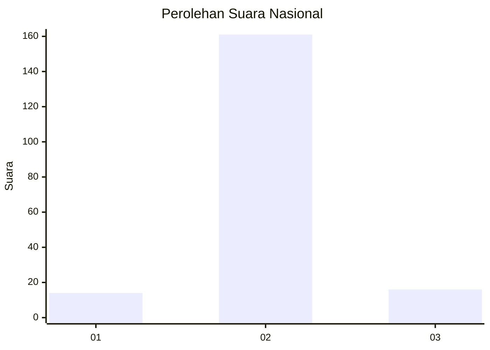
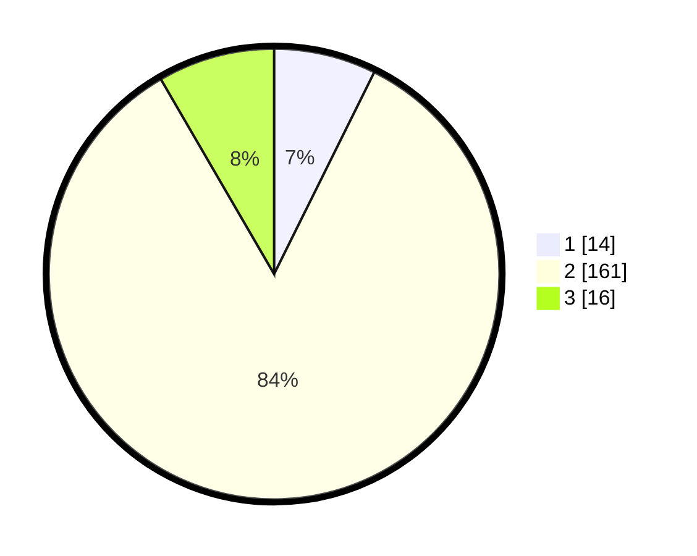

# Hasil

## Grafik

## Tabel

| No. | Nama Paslon    | Suara | Suara (raw) | Persentase |
|:--- |:-------------- | -----:| -----------:| ----------:|
| 1   | ANIES MUHAIMIN | 14    | [14][p-1]   | 7,33       |
| 2   | PRABOWO GIBRAN | 161   | [161][p-2]  | 84,29      |
| 3   | GANJAR MAHFUD  | 16    | [16][p-3]   | 8,38       |

[p-1]: https://github.com/gigit-pemilu/pemilu-2024/blob/main/pilpres/hitung-suara/sub/16-sumatera-selatan/sub/04-lahat/sub/19-kikim-barat/sub/2008-lubuk-seketi/sub/001-tps/sub/paslon-1.txt
[p-2]: https://github.com/gigit-pemilu/pemilu-2024/blob/main/pilpres/hitung-suara/sub/16-sumatera-selatan/sub/04-lahat/sub/19-kikim-barat/sub/2008-lubuk-seketi/sub/001-tps/sub/paslon-2.txt
[p-3]: https://github.com/gigit-pemilu/pemilu-2024/blob/main/pilpres/hitung-suara/sub/16-sumatera-selatan/sub/04-lahat/sub/19-kikim-barat/sub/2008-lubuk-seketi/sub/001-tps/sub/paslon-3.txt

## Foto C Plano

https://sirekap-obj-formc.kpu.go.id/1a94/pemilu/ppwp/16/04/19/20/08/1604192008001-20240220-103120--060bc59f-3416-477d-8ee7-f855f23a1f34.jpg

https://sirekap-obj-formc.kpu.go.id/1a94/pemilu/ppwp/16/04/19/20/08/1604192008001-20240220-103209--7fb50a3b-fb24-49c2-94a8-4acb22c33409.jpg

https://sirekap-obj-formc.kpu.go.id/1a94/pemilu/ppwp/16/04/19/20/08/1604192008001-20240220-103256--5f45e184-28a8-43e4-9385-b6568171e062.jpg

## Metadata

| Key        | Value               |
| ---------- | ------------------- |
| Time Stamp | 2024-02-25 16:00:00 |

