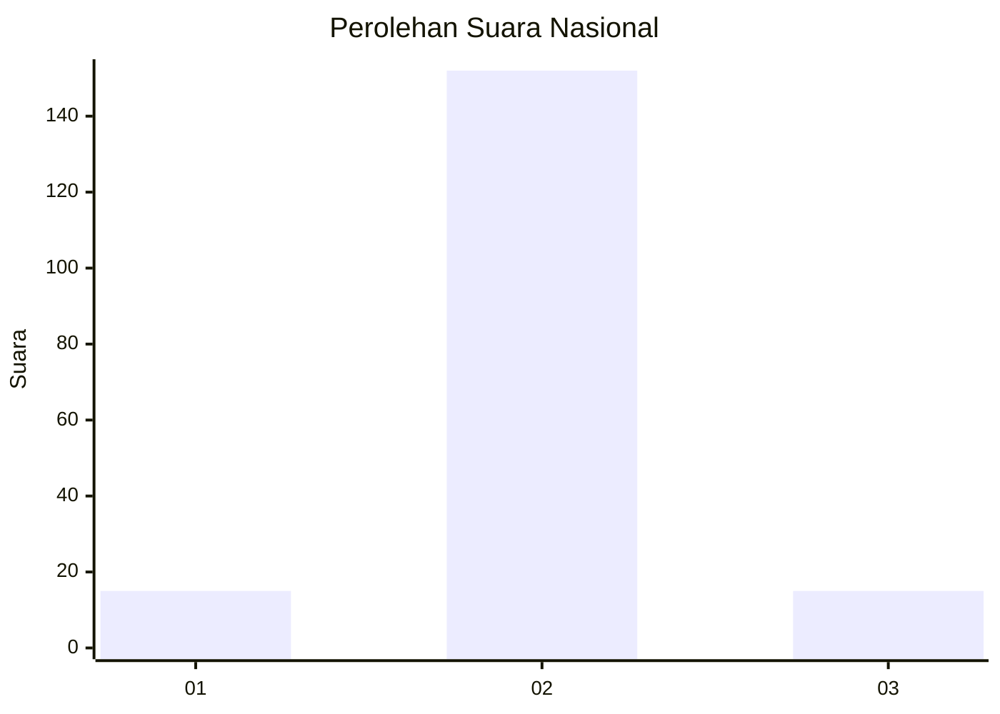
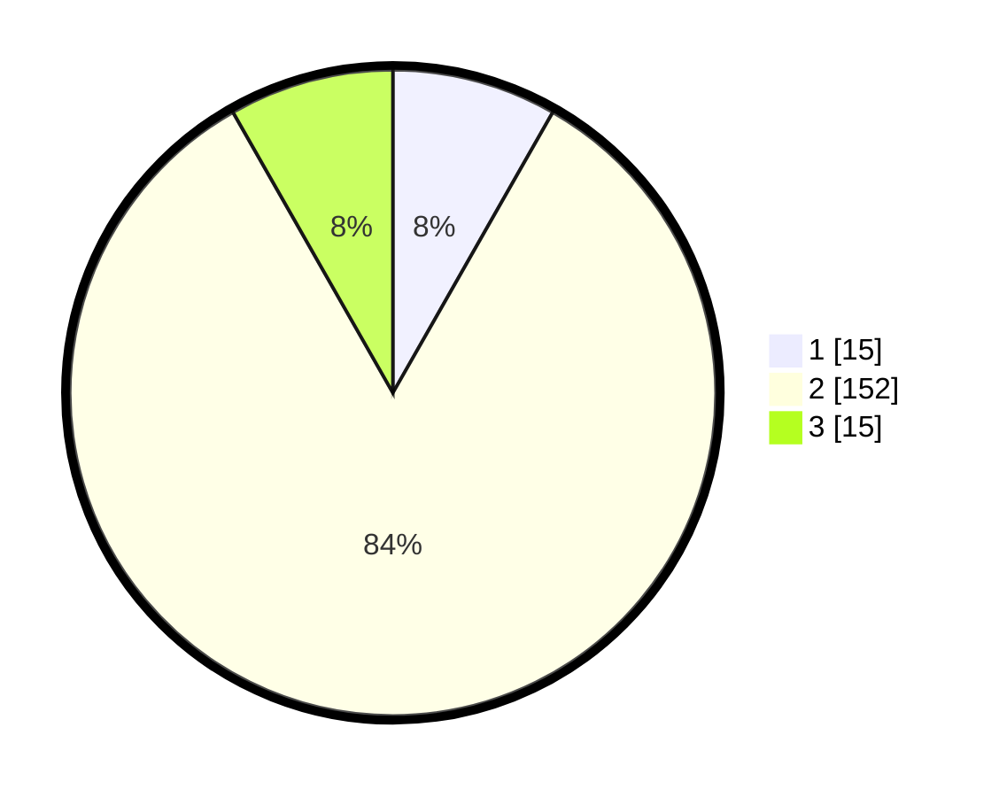

# Hasil

## Grafik

## Tabel

| No. | Nama Paslon    | Suara | Suara (raw) | Persentase |
|:--- |:-------------- | -----:| -----------:| ----------:|
| 1   | ANIES MUHAIMIN | 15    | [15][p-1]   | 8,24       |
| 2   | PRABOWO GIBRAN | 152   | [152][p-2]  | 83,52      |
| 3   | GANJAR MAHFUD  | 15    | [15][p-3]   | 8,24       |

[p-1]: https://github.com/gigit-pemilu/pemilu-2024/blob/main/pilpres/hitung-suara/sub/16-sumatera-selatan/sub/04-lahat/sub/19-kikim-barat/sub/2008-lubuk-seketi/sub/002-tps/sub/paslon-1.txt
[p-2]: https://github.com/gigit-pemilu/pemilu-2024/blob/main/pilpres/hitung-suara/sub/16-sumatera-selatan/sub/04-lahat/sub/19-kikim-barat/sub/2008-lubuk-seketi/sub/002-tps/sub/paslon-2.txt
[p-3]: https://github.com/gigit-pemilu/pemilu-2024/blob/main/pilpres/hitung-suara/sub/16-sumatera-selatan/sub/04-lahat/sub/19-kikim-barat/sub/2008-lubuk-seketi/sub/002-tps/sub/paslon-3.txt

## Foto C Plano

https://sirekap-obj-formc.kpu.go.id/8ecb/pemilu/ppwp/16/04/19/20/08/1604192008002-20240220-110931--235d61e6-9c57-40a4-8d6b-300567bcbc23.jpg

https://sirekap-obj-formc.kpu.go.id/8ecb/pemilu/ppwp/16/04/19/20/08/1604192008002-20240220-111013--b500f73a-fcc2-411e-8c2a-a99838b39413.jpg

https://sirekap-obj-formc.kpu.go.id/8ecb/pemilu/ppwp/16/04/19/20/08/1604192008002-20240220-111053--418026e9-f306-47a4-9a96-517bf63c78f0.jpg

## Metadata

| Key        | Value               |
| ---------- | ------------------- |
| Time Stamp | 2024-02-24 22:31:28 |

