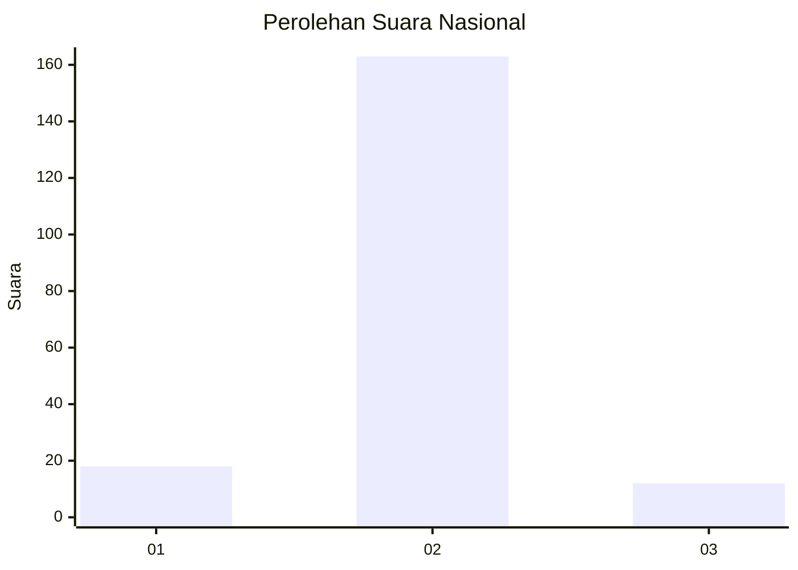
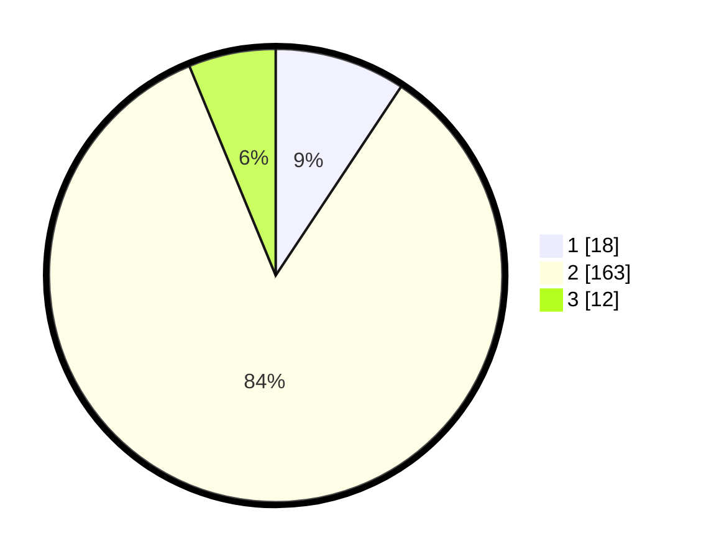

# Hasil

## Grafik

## Tabel

| No. | Nama Paslon    | Suara | Suara (raw) | Persentase |
|:--- |:-------------- | -----:| -----------:| ----------:|
| 1   | ANIES MUHAIMIN | 18    | [18][p-1]   | 9,33       |
| 2   | PRABOWO GIBRAN | 163   | [163][p-2]  | 84,46      |
| 3   | GANJAR MAHFUD  | 12    | [12][p-3]   | 6,22       |

[p-1]: https://github.com/gigit-pemilu/pemilu-2024/blob/main/pilpres/hitung-suara/sub/16-sumatera-selatan/sub/04-lahat/sub/19-kikim-barat/sub/2010-singapura/sub/001-tps/sub/paslon-1.txt
[p-2]: https://github.com/gigit-pemilu/pemilu-2024/blob/main/pilpres/hitung-suara/sub/16-sumatera-selatan/sub/04-lahat/sub/19-kikim-barat/sub/2010-singapura/sub/001-tps/sub/paslon-2.txt
[p-3]: https://github.com/gigit-pemilu/pemilu-2024/blob/main/pilpres/hitung-suara/sub/16-sumatera-selatan/sub/04-lahat/sub/19-kikim-barat/sub/2010-singapura/sub/001-tps/sub/paslon-3.txt

## Foto C Plano

https://sirekap-obj-formc.kpu.go.id/dcc0/pemilu/ppwp/16/04/19/20/10/1604192010001-20240223-125729--108c78e2-3907-46b5-8e00-75eb2940ab98.jpg

https://sirekap-obj-formc.kpu.go.id/dcc0/pemilu/ppwp/16/04/19/20/10/1604192010001-20240223-125828--1192c8c3-dc28-4336-b283-2011d2a62ff7.jpg

https://sirekap-obj-formc.kpu.go.id/dcc0/pemilu/ppwp/16/04/19/20/10/1604192010001-20240223-130021--aac25c50-4ca1-4cb0-8a8b-c1b12d09e66c.jpg

## Metadata

| Key        | Value               |
| ---------- | ------------------- |
| Time Stamp | 2024-02-25 09:00:00 |

