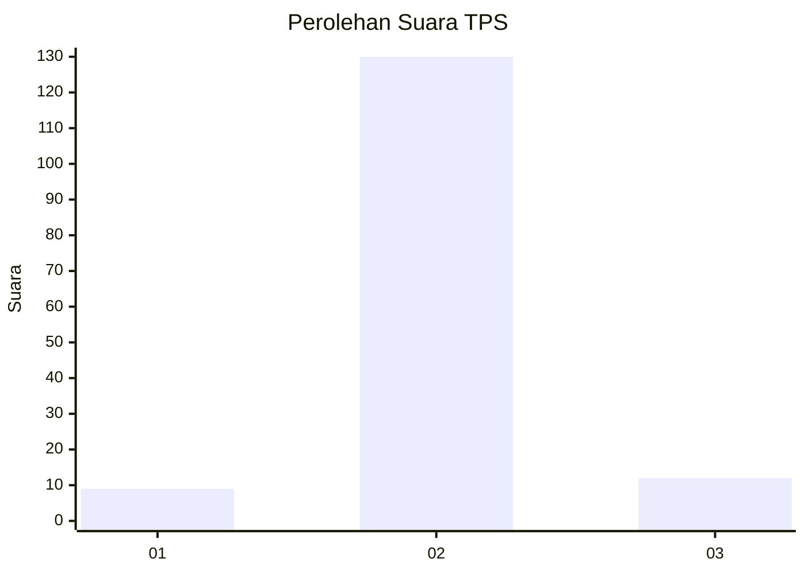
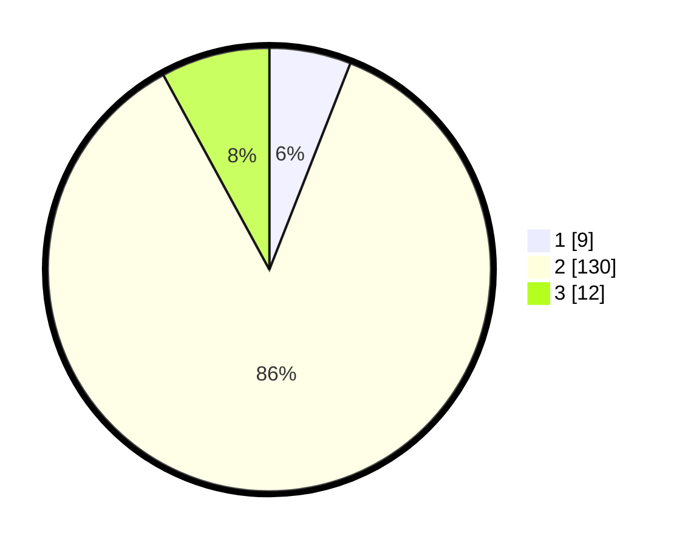

# Hasil

## Grafik

## Tabel

| No. | Nama Paslon    | Suara | Suara (raw) | Persentase |
|:--- |:-------------- | -----:| -----------:| ----------:|
| 1   | ANIES MUHAIMIN | 9     | [9][p-1]    | 5,96       |
| 2   | PRABOWO GIBRAN | 130   | [130][p-2]  | 86,09      |
| 3   | GANJAR MAHFUD  | 12    | [12][p-3]   | 7,95       |

[p-1]: https://github.com/gigit-pemilu/pemilu-2024-16-sumatera-selatan/blob/main/pilpres/hitung-suara/sub/16-sumatera-selatan/sub/04-lahat/sub/19-kikim-barat/sub/2010-singapura/sub/002-tps/sub/paslon-1.txt
[p-2]: https://github.com/gigit-pemilu/pemilu-2024-16-sumatera-selatan/blob/main/pilpres/hitung-suara/sub/16-sumatera-selatan/sub/04-lahat/sub/19-kikim-barat/sub/2010-singapura/sub/002-tps/sub/paslon-2.txt
[p-3]: https://github.com/gigit-pemilu/pemilu-2024-16-sumatera-selatan/blob/main/pilpres/hitung-suara/sub/16-sumatera-selatan/sub/04-lahat/sub/19-kikim-barat/sub/2010-singapura/sub/002-tps/sub/paslon-3.txt

## Foto C Plano

https://sirekap-obj-formc.kpu.go.id/d981/pemilu/ppwp/16/04/19/20/10/1604192010002-20240223-140026--c6105fd0-073d-4a0d-bec3-5627ec19e2d0.jpg

https://sirekap-obj-formc.kpu.go.id/d981/pemilu/ppwp/16/04/19/20/10/1604192010002-20240223-140110--3f781e6c-56dd-4753-b61c-f7259617c219.jpg

https://sirekap-obj-formc.kpu.go.id/d981/pemilu/ppwp/16/04/19/20/10/1604192010002-20240223-140155--92e40a8d-c968-4a48-b8e2-cb8772d79b67.jpg

## Metadata

| Key        | Value               |
| ---------- | ------------------- |
| Time Stamp | 2024-02-24 22:31:28 |

