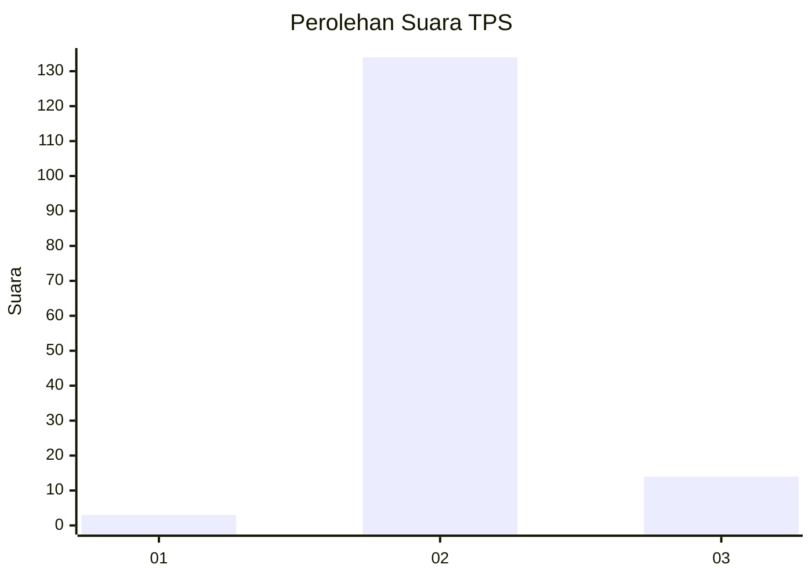
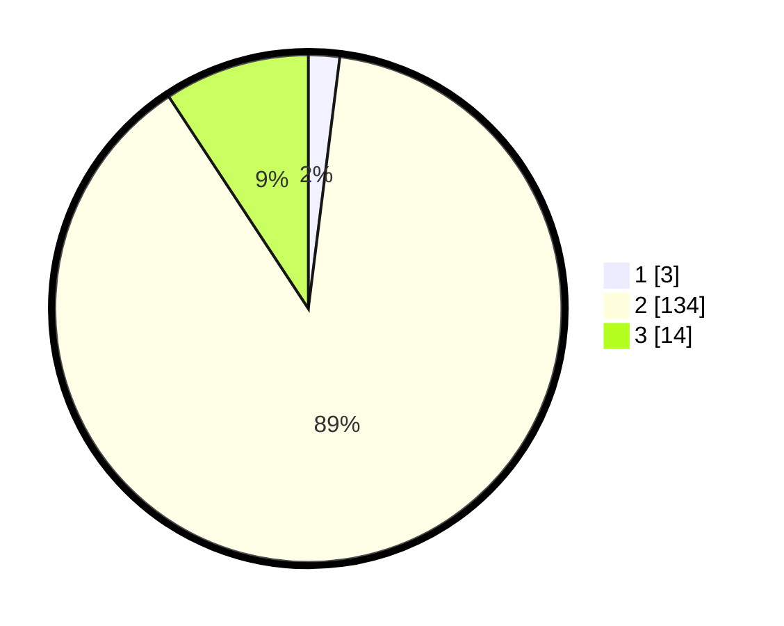

# Hasil

## Grafik

## Tabel

| No. | Nama Paslon    | Suara | Suara (raw) | Persentase |
|:--- |:-------------- | -----:| -----------:| ----------:|
| 1   | ANIES MUHAIMIN | 3     | [3][p-1]    | 1,99       |
| 2   | PRABOWO GIBRAN | 134   | [134][p-2]  | 88,74      |
| 3   | GANJAR MAHFUD  | 14    | [14][p-3]   | 9,27       |

[p-1]: https://github.com/gigit-pemilu/pemilu-2024-16-sumatera-selatan/blob/main/pilpres/hitung-suara/sub/16-sumatera-selatan/sub/04-lahat/sub/19-kikim-barat/sub/2010-singapura/sub/003-tps/sub/paslon-1.txt
[p-2]: https://github.com/gigit-pemilu/pemilu-2024-16-sumatera-selatan/blob/main/pilpres/hitung-suara/sub/16-sumatera-selatan/sub/04-lahat/sub/19-kikim-barat/sub/2010-singapura/sub/003-tps/sub/paslon-2.txt
[p-3]: https://github.com/gigit-pemilu/pemilu-2024-16-sumatera-selatan/blob/main/pilpres/hitung-suara/sub/16-sumatera-selatan/sub/04-lahat/sub/19-kikim-barat/sub/2010-singapura/sub/003-tps/sub/paslon-3.txt

## Foto C Plano

https://sirekap-obj-formc.kpu.go.id/d2ad/pemilu/ppwp/16/04/19/20/10/1604192010003-20240223-151542--4e3fa74f-7efd-4cec-8765-de05156e4f98.jpg

https://sirekap-obj-formc.kpu.go.id/d2ad/pemilu/ppwp/16/04/19/20/10/1604192010003-20240223-151836--e09ea707-53e8-4a8f-9c5e-0b0c087e382f.jpg

https://sirekap-obj-formc.kpu.go.id/d2ad/pemilu/ppwp/16/04/19/20/10/1604192010003-20240223-152114--ee4f539b-5fe6-4bff-9edb-0c358ceb7caa.jpg

## Metadata

| Key        | Value               |
| ---------- | ------------------- |
| Time Stamp | 2024-02-25 11:00:00 |

