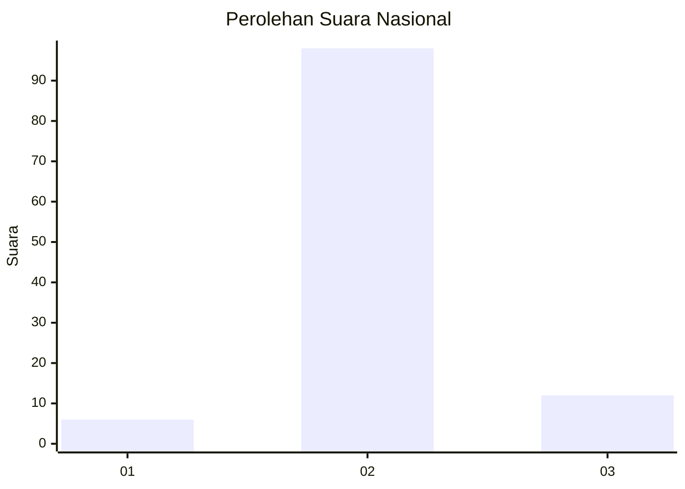
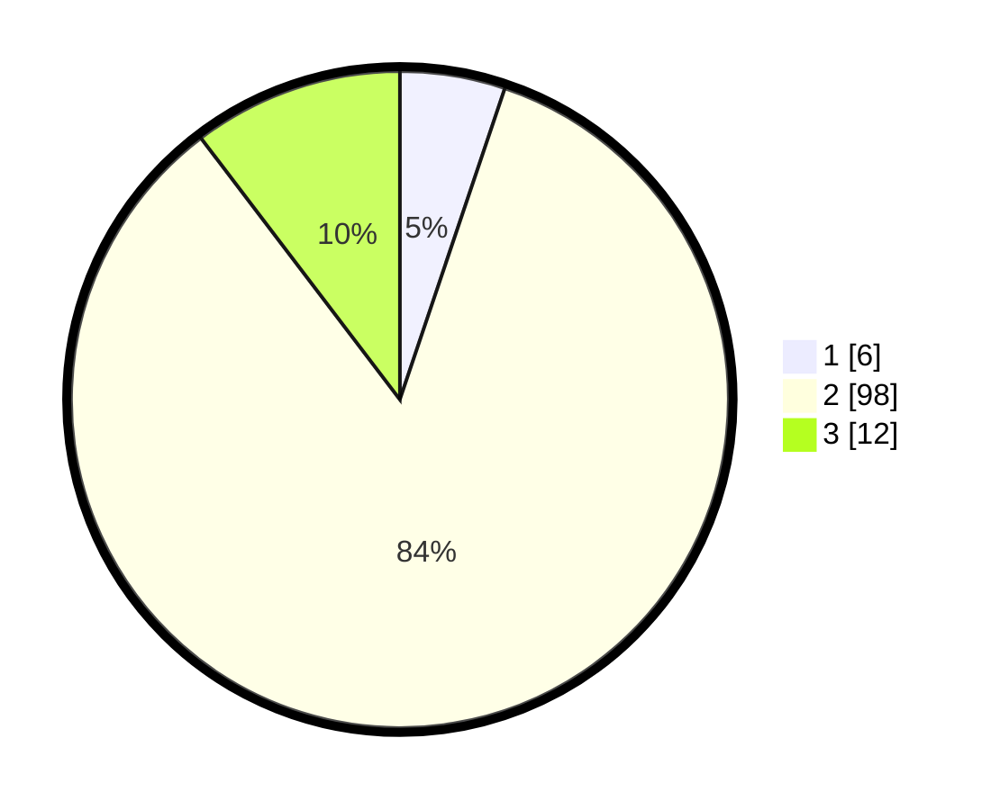

# Hasil

## Grafik

## Tabel

| No. | Nama Paslon    | Suara | Suara (raw) | Persentase |
|:--- |:-------------- | -----:| -----------:| ----------:|
| 1   | ANIES MUHAIMIN | 6     | [6][p-1]    | 5,17       |
| 2   | PRABOWO GIBRAN | 98    | [98][p-2]   | 84,48      |
| 3   | GANJAR MAHFUD  | 12    | [12][p-3]   | 10,34      |

[p-1]: https://github.com/gigit-pemilu/pemilu-2024/blob/main/pilpres/hitung-suara/sub/16-sumatera-selatan/sub/04-lahat/sub/19-kikim-barat/sub/2010-singapura/sub/004-tps/sub/paslon-1.txt
[p-2]: https://github.com/gigit-pemilu/pemilu-2024/blob/main/pilpres/hitung-suara/sub/16-sumatera-selatan/sub/04-lahat/sub/19-kikim-barat/sub/2010-singapura/sub/004-tps/sub/paslon-2.txt
[p-3]: https://github.com/gigit-pemilu/pemilu-2024/blob/main/pilpres/hitung-suara/sub/16-sumatera-selatan/sub/04-lahat/sub/19-kikim-barat/sub/2010-singapura/sub/004-tps/sub/paslon-3.txt

## Foto C Plano

https://sirekap-obj-formc.kpu.go.id/316d/pemilu/ppwp/16/04/19/20/10/1604192010004-20240223-164218--6c1be9da-53b0-41b4-bf72-a7f703790c8e.jpg

https://sirekap-obj-formc.kpu.go.id/316d/pemilu/ppwp/16/04/19/20/10/1604192010004-20240223-164342--494bbeb9-dcad-4c09-bfd6-dcfdf78cca43.jpg

https://sirekap-obj-formc.kpu.go.id/316d/pemilu/ppwp/16/04/19/20/10/1604192010004-20240215-001325--b9adcd1b-accb-4829-94c3-a228d59ed954.jpg

## Metadata

| Key        | Value               |
| ---------- | ------------------- |
| Time Stamp | 2024-02-25 17:00:00 |

