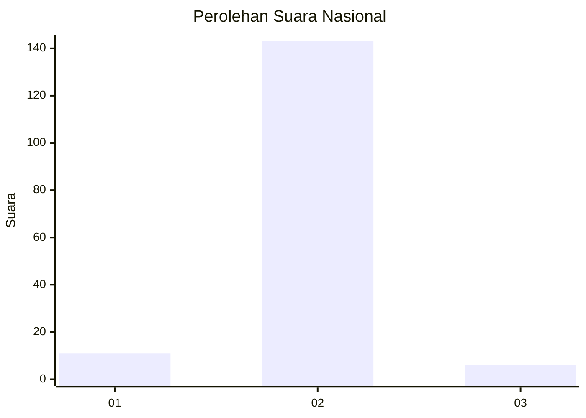
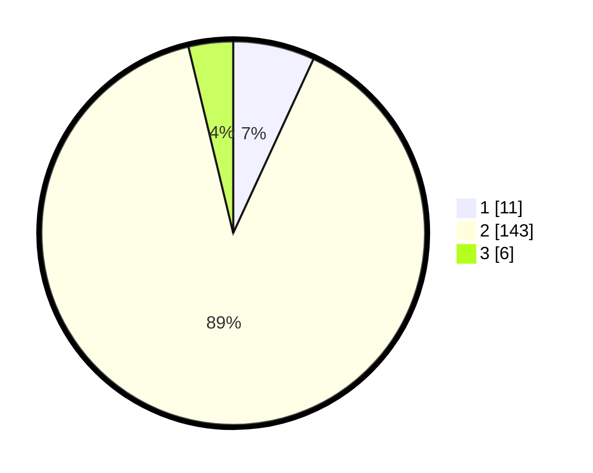

# Hasil

## Grafik

## Tabel

| No. | Nama Paslon    | Suara | Suara (raw) | Persentase |
|:--- |:-------------- | -----:| -----------:| ----------:|
| 1   | ANIES MUHAIMIN | 11    | [11][p-1]   | 6,88       |
| 2   | PRABOWO GIBRAN | 143   | [143][p-2]  | 89,38      |
| 3   | GANJAR MAHFUD  | 6     | [6][p-3]    | 3,75       |

[p-1]: https://github.com/gigit-pemilu/pemilu-2024/blob/main/pilpres/hitung-suara/sub/16-sumatera-selatan/sub/04-lahat/sub/19-kikim-barat/sub/2016-suka-bakti/sub/001-tps/sub/paslon-1.txt
[p-2]: https://github.com/gigit-pemilu/pemilu-2024/blob/main/pilpres/hitung-suara/sub/16-sumatera-selatan/sub/04-lahat/sub/19-kikim-barat/sub/2016-suka-bakti/sub/001-tps/sub/paslon-2.txt
[p-3]: https://github.com/gigit-pemilu/pemilu-2024/blob/main/pilpres/hitung-suara/sub/16-sumatera-selatan/sub/04-lahat/sub/19-kikim-barat/sub/2016-suka-bakti/sub/001-tps/sub/paslon-3.txt

## Foto C Plano

https://sirekap-obj-formc.kpu.go.id/2e71/pemilu/ppwp/16/04/19/20/16/1604192016001-20240220-153252--73df1543-b82f-44d9-96e4-9c6bb9b18200.jpg

https://sirekap-obj-formc.kpu.go.id/2e71/pemilu/ppwp/16/04/19/20/16/1604192016001-20240220-153403--7bb20524-0475-42eb-8203-ad8ed4f8308b.jpg

https://sirekap-obj-formc.kpu.go.id/2e71/pemilu/ppwp/16/04/19/20/16/1604192016001-20240220-153446--6dad0800-0f27-416e-b0f5-1c6c998e2a12.jpg

## Metadata

| Key        | Value               |
| ---------- | ------------------- |
| Time Stamp | 2024-02-25 12:00:00 |

