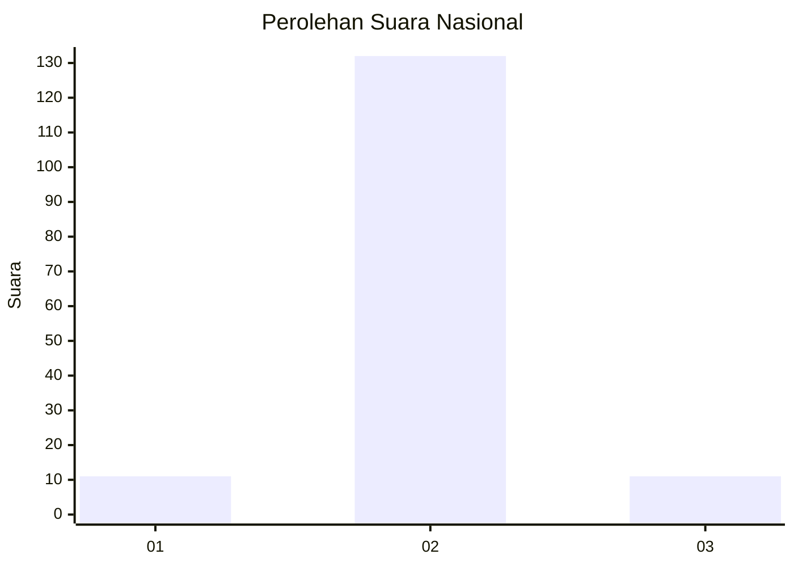
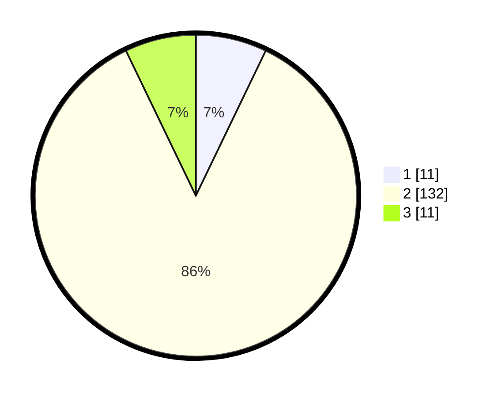

# Hasil

## Grafik

## Tabel

| No. | Nama Paslon    | Suara | Suara (raw) | Persentase |
|:--- |:-------------- | -----:| -----------:| ----------:|
| 1   | ANIES MUHAIMIN | 11    | [11][p-1]   | 7,14       |
| 2   | PRABOWO GIBRAN | 132   | [132][p-2]  | 85,71      |
| 3   | GANJAR MAHFUD  | 11    | [11][p-3]   | 7,14       |

[p-1]: https://github.com/gigit-pemilu/pemilu-2024/blob/main/pilpres/hitung-suara/sub/16-sumatera-selatan/sub/04-lahat/sub/19-kikim-barat/sub/2016-suka-bakti/sub/002-tps/sub/paslon-1.txt
[p-2]: https://github.com/gigit-pemilu/pemilu-2024/blob/main/pilpres/hitung-suara/sub/16-sumatera-selatan/sub/04-lahat/sub/19-kikim-barat/sub/2016-suka-bakti/sub/002-tps/sub/paslon-2.txt
[p-3]: https://github.com/gigit-pemilu/pemilu-2024/blob/main/pilpres/hitung-suara/sub/16-sumatera-selatan/sub/04-lahat/sub/19-kikim-barat/sub/2016-suka-bakti/sub/002-tps/sub/paslon-3.txt

## Foto C Plano

https://sirekap-obj-formc.kpu.go.id/7c5f/pemilu/ppwp/16/04/19/20/16/1604192016002-20240220-164847--50fdc2be-b0a0-47e7-8829-5b3669882ed9.jpg

https://sirekap-obj-formc.kpu.go.id/7c5f/pemilu/ppwp/16/04/19/20/16/1604192016002-20240220-165001--2b0bae19-e74b-4c36-8431-eac624852314.jpg

https://sirekap-obj-formc.kpu.go.id/7c5f/pemilu/ppwp/16/04/19/20/16/1604192016002-20240220-165119--55e8edd6-48ff-4feb-88cf-01ffbbeaf2e4.jpg

## Metadata

| Key        | Value               |
| ---------- | ------------------- |
| Time Stamp | 2024-02-25 21:00:00 |

