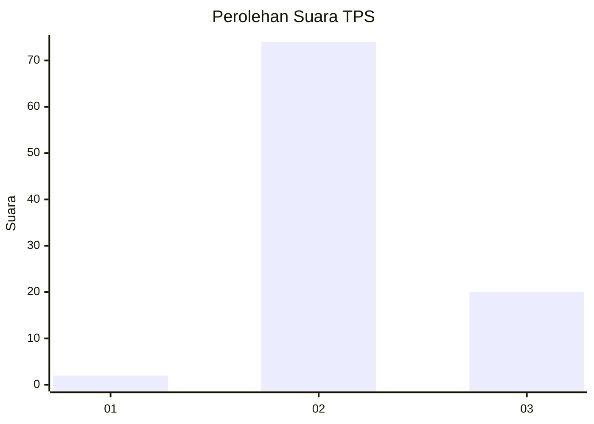

# Hasil

## Grafik

## Tabel

| No. | Nama Paslon    | Suara | Suara (raw) | Persentase |
|:--- |:-------------- | -----:| -----------:| ----------:|
| 1   | ANIES MUHAIMIN | 2     | [2][p-1]    | 2,08       |
| 2   | PRABOWO GIBRAN | 74    | [74][p-2]   | 77,08      |
| 3   | GANJAR MAHFUD  | 20    | [20][p-3]   | 20,83      |

[p-1]: https://github.com/gigit-pemilu/pemilu-2024-16-sumatera-selatan/blob/main/pilpres/hitung-suara/sub/16-sumatera-selatan/sub/04-lahat/sub/19-kikim-barat/sub/2017-mekar-jaya/sub/001-tps/sub/paslon-1.txt
[p-2]: https://github.com/gigit-pemilu/pemilu-2024-16-sumatera-selatan/blob/main/pilpres/hitung-suara/sub/16-sumatera-selatan/sub/04-lahat/sub/19-kikim-barat/sub/2017-mekar-jaya/sub/001-tps/sub/paslon-2.txt
[p-3]: https://github.com/gigit-pemilu/pemilu-2024-16-sumatera-selatan/blob/main/pilpres/hitung-suara/sub/16-sumatera-selatan/sub/04-lahat/sub/19-kikim-barat/sub/2017-mekar-jaya/sub/001-tps/sub/paslon-3.txt

## Foto C Plano

https://sirekap-obj-formc.kpu.go.id/1387/pemilu/ppwp/16/04/19/20/17/1604192017001-20240221-153233--31bf0b32-a944-4ee3-8a61-f0e830d72d43.jpg

https://sirekap-obj-formc.kpu.go.id/1387/pemilu/ppwp/16/04/19/20/17/1604192017001-20240221-153435--87026997-afa8-45b3-a2f0-b022ff7a1d30.jpg

https://sirekap-obj-formc.kpu.go.id/1387/pemilu/ppwp/16/04/19/20/17/1604192017001-20240221-153540--2ace2f4f-7c10-4a3e-beee-136a51f71347.jpg

## Metadata

| Key        | Value               |
| ---------- | ------------------- |
| Time Stamp | 2024-02-25 11:00:00 |

