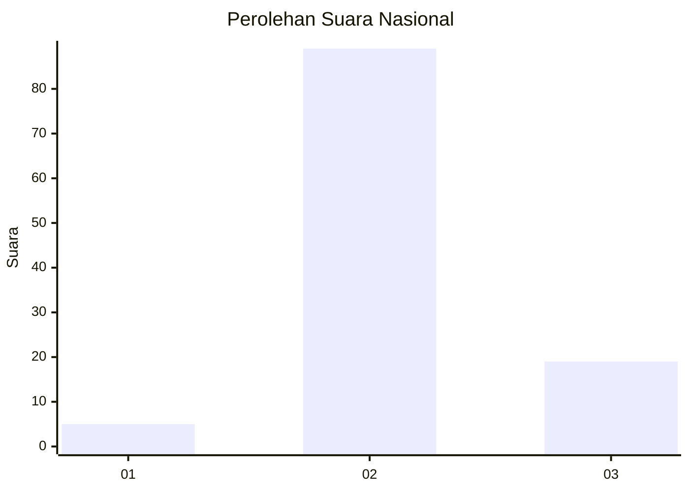
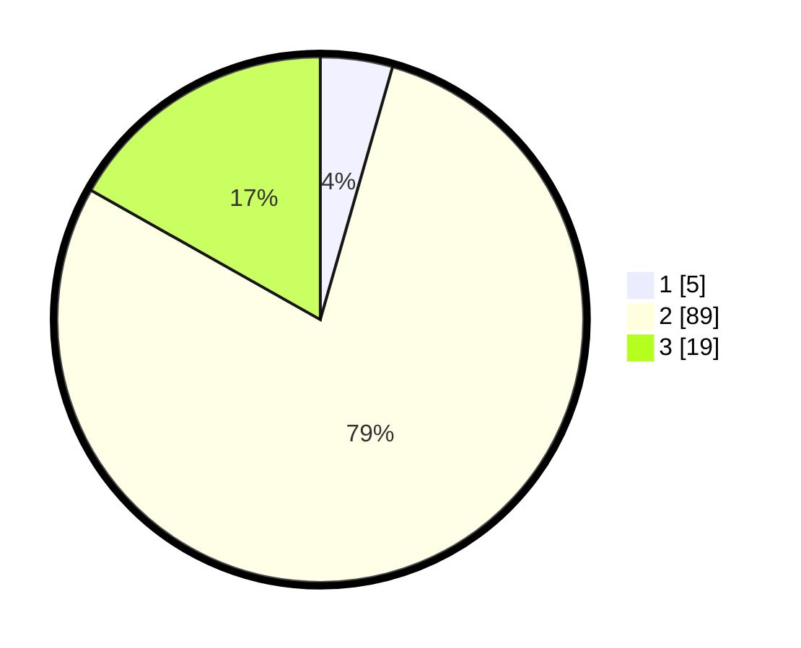

# Hasil

## Grafik

## Tabel

| No. | Nama Paslon    | Suara | Suara (raw) | Persentase |
|:--- |:-------------- | -----:| -----------:| ----------:|
| 1   | ANIES MUHAIMIN | 5     | [5][p-1]    | 4,42       |
| 2   | PRABOWO GIBRAN | 89    | [89][p-2]   | 78,76      |
| 3   | GANJAR MAHFUD  | 19    | [19][p-3]   | 16,81      |

[p-1]: https://github.com/gigit-pemilu/pemilu-2024/blob/main/pilpres/hitung-suara/sub/16-sumatera-selatan/sub/04-lahat/sub/19-kikim-barat/sub/2017-mekar-jaya/sub/002-tps/sub/paslon-1.txt
[p-2]: https://github.com/gigit-pemilu/pemilu-2024/blob/main/pilpres/hitung-suara/sub/16-sumatera-selatan/sub/04-lahat/sub/19-kikim-barat/sub/2017-mekar-jaya/sub/002-tps/sub/paslon-2.txt
[p-3]: https://github.com/gigit-pemilu/pemilu-2024/blob/main/pilpres/hitung-suara/sub/16-sumatera-selatan/sub/04-lahat/sub/19-kikim-barat/sub/2017-mekar-jaya/sub/002-tps/sub/paslon-3.txt

## Foto C Plano

https://sirekap-obj-formc.kpu.go.id/3f46/pemilu/ppwp/16/04/19/20/17/1604192017002-20240221-164620--b84df666-b82a-42d3-8ad8-888297c73d8c.jpg

https://sirekap-obj-formc.kpu.go.id/3f46/pemilu/ppwp/16/04/19/20/17/1604192017002-20240221-164804--2afa1c64-63fb-44f5-97c1-cf341a502bd0.jpg

https://sirekap-obj-formc.kpu.go.id/3f46/pemilu/ppwp/16/04/19/20/17/1604192017002-20240221-164931--385b3fdb-4152-427a-bd54-94079cad0cc7.jpg

## Metadata

| Key        | Value               |
| ---------- | ------------------- |
| Time Stamp | 2024-02-25 16:00:00 |

