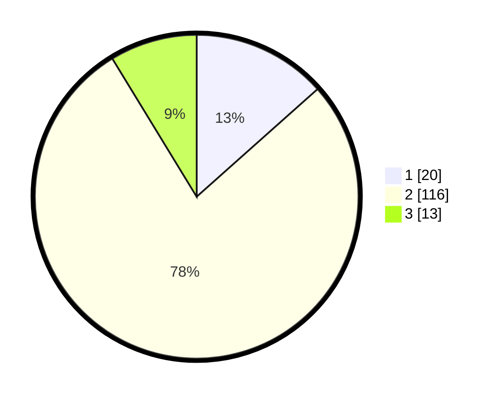

# Hasil

## Grafik

## Tabel

| No. | Nama Paslon    | Suara | Suara (raw) | Persentase |
|:--- |:-------------- | -----:| -----------:| ----------:|
| 1   | ANIES MUHAIMIN | 20    | [20][p-1]   | 13,42      |
| 2   | PRABOWO GIBRAN | 116   | [116][p-2]  | 77,85      |
| 3   | GANJAR MAHFUD  | 13    | [13][p-3]   | 8,72       |

[p-1]: https://github.com/gigit-pemilu/pemilu-2024-16-sumatera-selatan/blob/main/pilpres/hitung-suara/sub/16-sumatera-selatan/sub/04-lahat/sub/19-kikim-barat/sub/2018-darma-raharja/sub/001-tps/sub/paslon-1.txt
[p-2]: https://github.com/gigit-pemilu/pemilu-2024-16-sumatera-selatan/blob/main/pilpres/hitung-suara/sub/16-sumatera-selatan/sub/04-lahat/sub/19-kikim-barat/sub/2018-darma-raharja/sub/001-tps/sub/paslon-2.txt
[p-3]: https://github.com/gigit-pemilu/pemilu-2024-16-sumatera-selatan/blob/main/pilpres/hitung-suara/sub/16-sumatera-selatan/sub/04-lahat/sub/19-kikim-barat/sub/2018-darma-raharja/sub/001-tps/sub/paslon-3.txt

## Foto C Plano

https://sirekap-obj-formc.kpu.go.id/57a2/pemilu/ppwp/16/04/19/20/18/1604192018001-20240221-212059--145418fd-eefb-45bc-b9b4-5bca6a61aa80.jpg

https://sirekap-obj-formc.kpu.go.id/57a2/pemilu/ppwp/16/04/19/20/18/1604192018001-20240221-212147--ba0d4b2c-dc66-445f-856e-036be7a63ffb.jpg

https://sirekap-obj-formc.kpu.go.id/57a2/pemilu/ppwp/16/04/19/20/18/1604192018001-20240221-212248--8943b159-5ada-483f-8bba-17c4a578edad.jpg

## Metadata

| Key        | Value               |
| ---------- | ------------------- |
| Time Stamp | 2024-02-24 22:31:28 |

