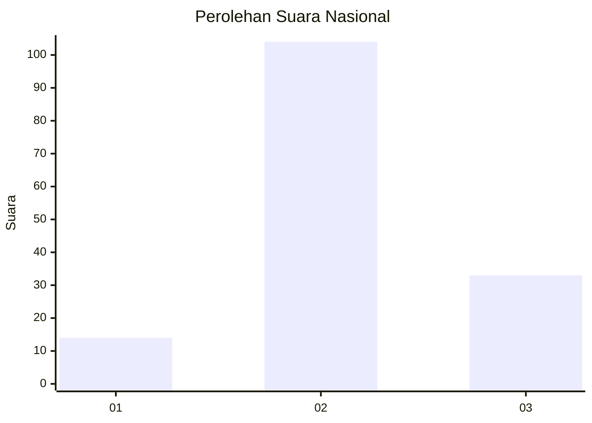
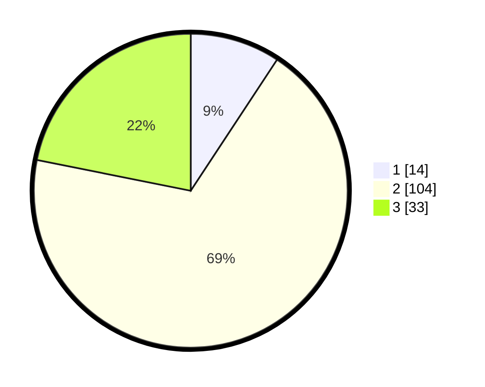

# Hasil

## Grafik

## Tabel

| No. | Nama Paslon    | Suara | Suara (raw) | Persentase |
|:--- |:-------------- | -----:| -----------:| ----------:|
| 1   | ANIES MUHAIMIN | 14    | [14][p-1]   | 9,27       |
| 2   | PRABOWO GIBRAN | 104   | [104][p-2]  | 68,87      |
| 3   | GANJAR MAHFUD  | 33    | [33][p-3]   | 21,85      |

[p-1]: https://github.com/gigit-pemilu/pemilu-2024/blob/main/pilpres/hitung-suara/sub/16-sumatera-selatan/sub/04-lahat/sub/19-kikim-barat/sub/2018-darma-raharja/sub/002-tps/sub/paslon-1.txt
[p-2]: https://github.com/gigit-pemilu/pemilu-2024/blob/main/pilpres/hitung-suara/sub/16-sumatera-selatan/sub/04-lahat/sub/19-kikim-barat/sub/2018-darma-raharja/sub/002-tps/sub/paslon-2.txt
[p-3]: https://github.com/gigit-pemilu/pemilu-2024/blob/main/pilpres/hitung-suara/sub/16-sumatera-selatan/sub/04-lahat/sub/19-kikim-barat/sub/2018-darma-raharja/sub/002-tps/sub/paslon-3.txt

## Foto C Plano

https://sirekap-obj-formc.kpu.go.id/9986/pemilu/ppwp/16/04/19/20/18/1604192018002-20240221-223158--c8e15258-125d-4e2b-96b2-3079a2249994.jpg

https://sirekap-obj-formc.kpu.go.id/9986/pemilu/ppwp/16/04/19/20/18/1604192018002-20240221-223323--0338faad-5223-4b85-b933-fa996913ecc3.jpg

https://sirekap-obj-formc.kpu.go.id/9986/pemilu/ppwp/16/04/19/20/18/1604192018002-20240221-223408--447b97a8-87fa-4631-95da-4949e56f5328.jpg

## Metadata

| Key        | Value               |
| ---------- | ------------------- |
| Time Stamp | 2024-02-24 22:31:28 |

