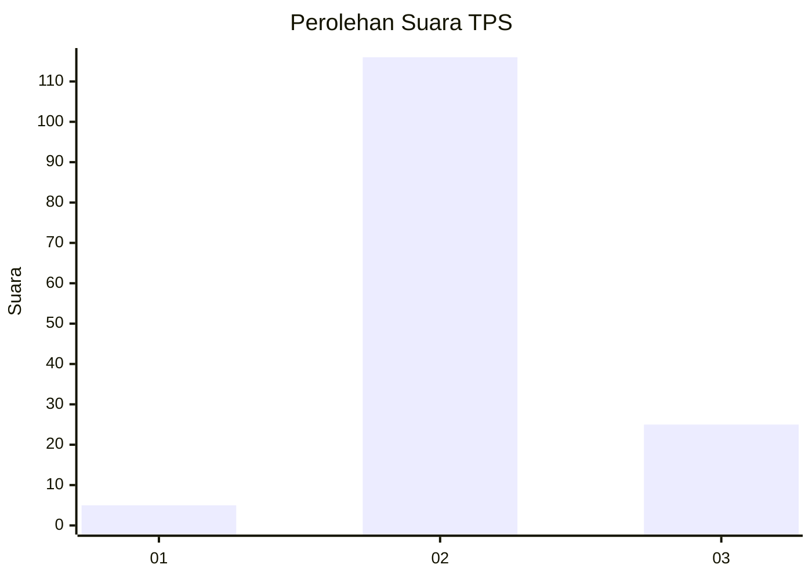

# Hasil

## Grafik

## Tabel

| No. | Nama Paslon    | Suara | Suara (raw) | Persentase |
|:--- |:-------------- | -----:| -----------:| ----------:|
| 1   | ANIES MUHAIMIN | 5     | [5][p-1]    | 3,42       |
| 2   | PRABOWO GIBRAN | 116   | [116][p-2]  | 79,45      |
| 3   | GANJAR MAHFUD  | 25    | [25][p-3]   | 17,12      |

[p-1]: https://github.com/gigit-pemilu/pemilu-2024-16-sumatera-selatan/blob/main/pilpres/hitung-suara/sub/16-sumatera-selatan/sub/04-lahat/sub/19-kikim-barat/sub/2018-darma-raharja/sub/003-tps/sub/paslon-1.txt
[p-2]: https://github.com/gigit-pemilu/pemilu-2024-16-sumatera-selatan/blob/main/pilpres/hitung-suara/sub/16-sumatera-selatan/sub/04-lahat/sub/19-kikim-barat/sub/2018-darma-raharja/sub/003-tps/sub/paslon-2.txt
[p-3]: https://github.com/gigit-pemilu/pemilu-2024-16-sumatera-selatan/blob/main/pilpres/hitung-suara/sub/16-sumatera-selatan/sub/04-lahat/sub/19-kikim-barat/sub/2018-darma-raharja/sub/003-tps/sub/paslon-3.txt

## Foto C Plano

https://sirekap-obj-formc.kpu.go.id/91e5/pemilu/ppwp/16/04/19/20/18/1604192018003-20240221-233444--87768e37-e81b-408c-bb8f-4b5c4d36987a.jpg

https://sirekap-obj-formc.kpu.go.id/91e5/pemilu/ppwp/16/04/19/20/18/1604192018003-20240221-233555--6a1b4f5b-a3de-46fd-9e00-17d0fd335397.jpg

https://sirekap-obj-formc.kpu.go.id/91e5/pemilu/ppwp/16/04/19/20/18/1604192018003-20240221-233650--37535b69-96f0-44f4-b367-931ce8c47e85.jpg

## Metadata

| Key        | Value               |
| ---------- | ------------------- |
| Time Stamp | 2024-02-25 16:00:00 |

