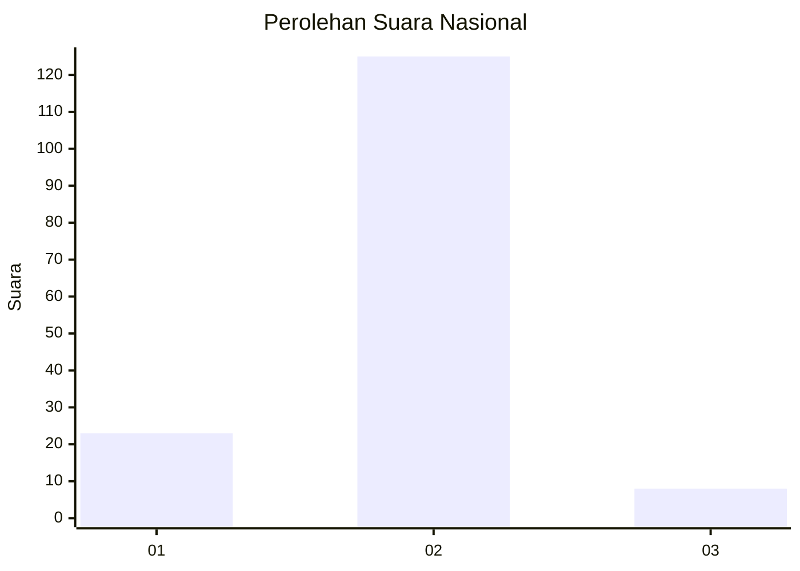
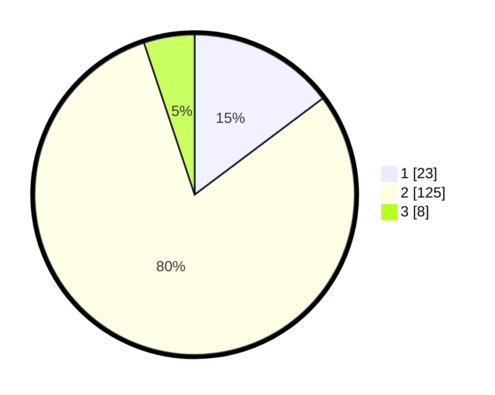

# Hasil

## Grafik

## Tabel

| No. | Nama Paslon    | Suara | Suara (raw) | Persentase |
|:--- |:-------------- | -----:| -----------:| ----------:|
| 1   | ANIES MUHAIMIN | 23    | [23][p-1]   | 14,74      |
| 2   | PRABOWO GIBRAN | 125   | [125][p-2]  | 80,13      |
| 3   | GANJAR MAHFUD  | 8     | [8][p-3]    | 5,13       |

[p-1]: https://github.com/gigit-pemilu/pemilu-2024/blob/main/pilpres/hitung-suara/sub/16-sumatera-selatan/sub/04-lahat/sub/20-pseksu/sub/2005-batu-niding/sub/003-tps/sub/paslon-1.txt
[p-2]: https://github.com/gigit-pemilu/pemilu-2024/blob/main/pilpres/hitung-suara/sub/16-sumatera-selatan/sub/04-lahat/sub/20-pseksu/sub/2005-batu-niding/sub/003-tps/sub/paslon-2.txt
[p-3]: https://github.com/gigit-pemilu/pemilu-2024/blob/main/pilpres/hitung-suara/sub/16-sumatera-selatan/sub/04-lahat/sub/20-pseksu/sub/2005-batu-niding/sub/003-tps/sub/paslon-3.txt

## Foto C Plano

https://sirekap-obj-formc.kpu.go.id/781d/pemilu/ppwp/16/04/20/20/05/1604202005003-20240215-044315--573bff14-f110-4a82-8dde-b590e4ab0d7e.jpg

https://sirekap-obj-formc.kpu.go.id/781d/pemilu/ppwp/16/04/20/20/05/1604202005003-20240215-044443--aada7b95-ad61-4cb6-9d13-ee57c3262bf9.jpg

https://sirekap-obj-formc.kpu.go.id/781d/pemilu/ppwp/16/04/20/20/05/1604202005003-20240215-044636--609f2c59-d80f-49ba-93d6-45a5525b9dfb.jpg

## Metadata

| Key        | Value               |
| ---------- | ------------------- |
| Time Stamp | 2024-02-15 19:00:26 |

