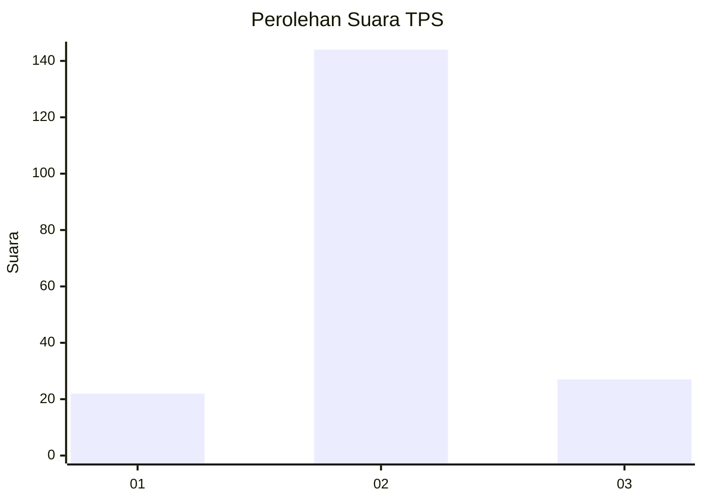
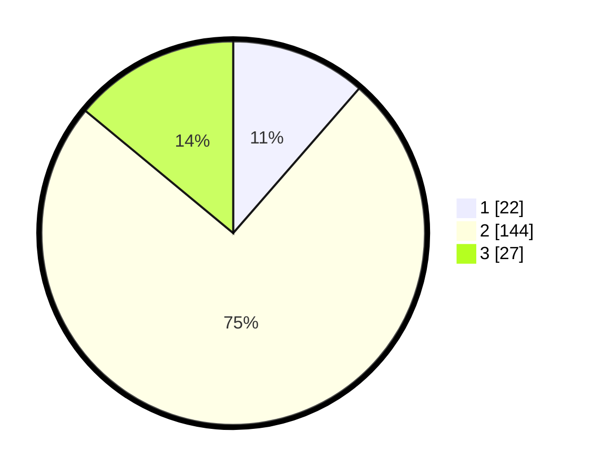

# Hasil

## Grafik

## Tabel

| No. | Nama Paslon    | Suara | Suara (raw) | Persentase |
|:--- |:-------------- | -----:| -----------:| ----------:|
| 1   | ANIES MUHAIMIN | 22    | [22][p-1]   | 11,40      |
| 2   | PRABOWO GIBRAN | 144   | [144][p-2]  | 74,61      |
| 3   | GANJAR MAHFUD  | 27    | [27][p-3]   | 13,99      |

[p-1]: https://github.com/gigit-pemilu/pemilu-2024-16-sumatera-selatan/blob/main/pilpres/hitung-suara/sub/16-sumatera-selatan/sub/04-lahat/sub/21-gumay-talang/sub/2001-sugi-waras/sub/002-tps/sub/paslon-1.txt
[p-2]: https://github.com/gigit-pemilu/pemilu-2024-16-sumatera-selatan/blob/main/pilpres/hitung-suara/sub/16-sumatera-selatan/sub/04-lahat/sub/21-gumay-talang/sub/2001-sugi-waras/sub/002-tps/sub/paslon-2.txt
[p-3]: https://github.com/gigit-pemilu/pemilu-2024-16-sumatera-selatan/blob/main/pilpres/hitung-suara/sub/16-sumatera-selatan/sub/04-lahat/sub/21-gumay-talang/sub/2001-sugi-waras/sub/002-tps/sub/paslon-3.txt

## Foto C Plano

https://sirekap-obj-formc.kpu.go.id/cd58/pemilu/ppwp/16/04/21/20/01/1604212001002-20240215-142128--4cb856ef-7a96-4cd5-9cbe-10a1a15c2e52.jpg

https://sirekap-obj-formc.kpu.go.id/cd58/pemilu/ppwp/16/04/21/20/01/1604212001002-20240215-142610--eb5a5dd0-7030-4e57-a389-8788d770fa56.jpg

https://sirekap-obj-formc.kpu.go.id/cd58/pemilu/ppwp/16/04/21/20/01/1604212001002-20240215-031624--0645eaba-9ffc-48ae-bf56-8185280bfbe2.jpg

## Metadata

| Key        | Value               |
| ---------- | ------------------- |
| Time Stamp | 2024-02-15 19:30:26 |

