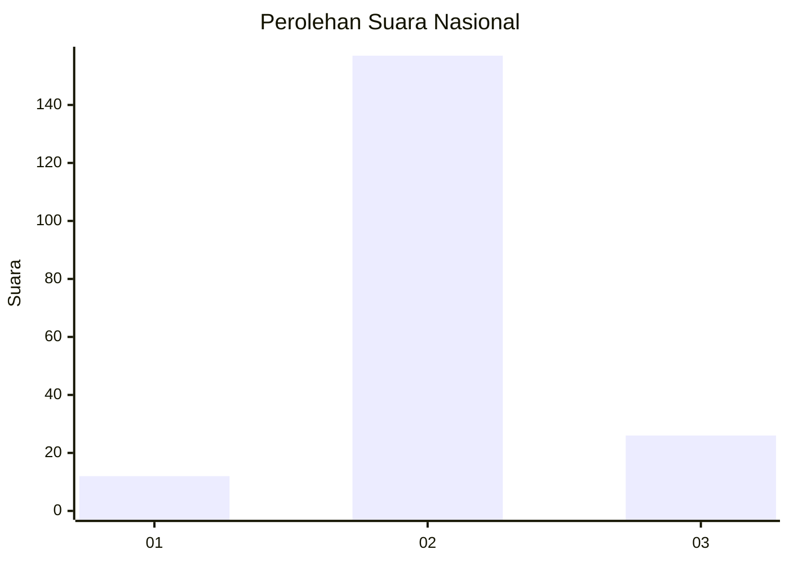
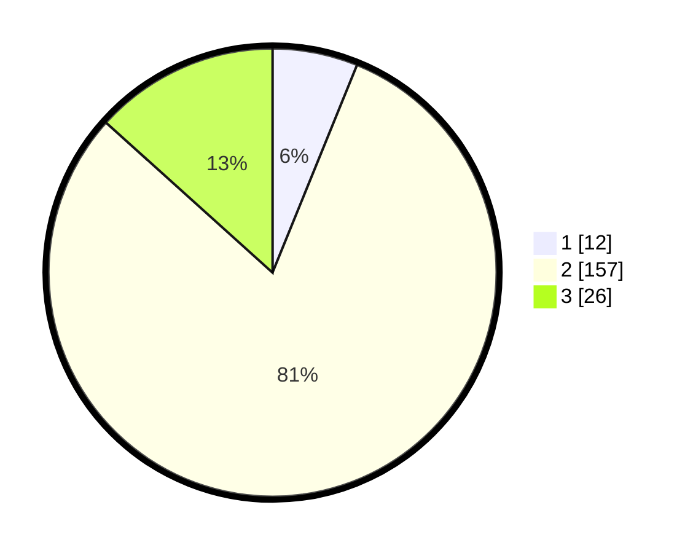

# Hasil

## Grafik

## Tabel

| No. | Nama Paslon    | Suara | Suara (raw) | Persentase |
|:--- |:-------------- | -----:| -----------:| ----------:|
| 1   | ANIES MUHAIMIN | 12    | [12][p-1]   | 6,15       |
| 2   | PRABOWO GIBRAN | 157   | [157][p-2]  | 80,51      |
| 3   | GANJAR MAHFUD  | 26    | [26][p-3]   | 13,33      |

[p-1]: https://github.com/gigit-pemilu/pemilu-2024/blob/main/pilpres/hitung-suara/sub/16-sumatera-selatan/sub/04-lahat/sub/21-gumay-talang/sub/2001-sugi-waras/sub/003-tps/sub/paslon-1.txt
[p-2]: https://github.com/gigit-pemilu/pemilu-2024/blob/main/pilpres/hitung-suara/sub/16-sumatera-selatan/sub/04-lahat/sub/21-gumay-talang/sub/2001-sugi-waras/sub/003-tps/sub/paslon-2.txt
[p-3]: https://github.com/gigit-pemilu/pemilu-2024/blob/main/pilpres/hitung-suara/sub/16-sumatera-selatan/sub/04-lahat/sub/21-gumay-talang/sub/2001-sugi-waras/sub/003-tps/sub/paslon-3.txt

## Foto C Plano

https://sirekap-obj-formc.kpu.go.id/b8b8/pemilu/ppwp/16/04/21/20/01/1604212001003-20240221-154832--68037063-43f9-4617-864b-752b3b3fb930.jpg

https://sirekap-obj-formc.kpu.go.id/b8b8/pemilu/ppwp/16/04/21/20/01/1604212001003-20240221-154930--ae1692b5-c292-478b-8320-7794dfd423d2.jpg

https://sirekap-obj-formc.kpu.go.id/b8b8/pemilu/ppwp/16/04/21/20/01/1604212001003-20240221-154958--305346d3-f60c-464a-9f7f-f3f814fb252d.jpg

## Metadata

| Key        | Value               |
| ---------- | ------------------- |
| Time Stamp | 2024-02-24 22:31:28 |

