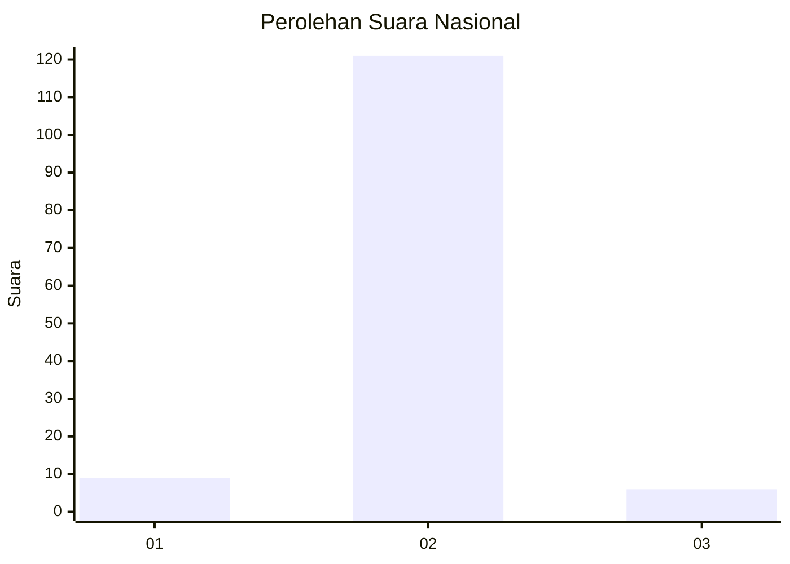
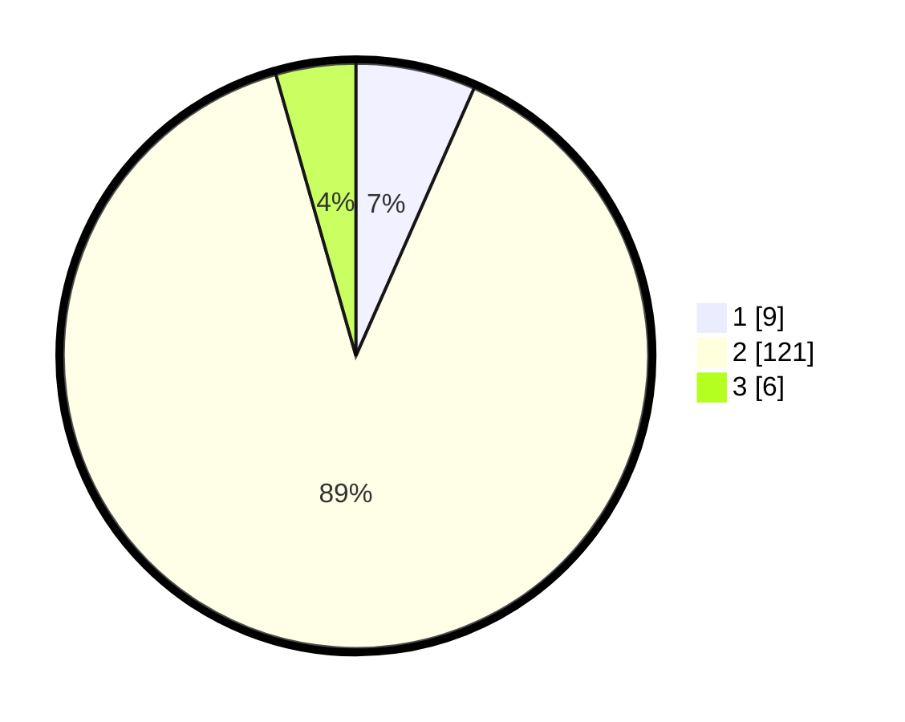

# Hasil

## Grafik

## Tabel

| No. | Nama Paslon    | Suara | Suara (raw) | Persentase |
|:--- |:-------------- | -----:| -----------:| ----------:|
| 1   | ANIES MUHAIMIN | 9     | [9][p-1]    | 6,62       |
| 2   | PRABOWO GIBRAN | 121   | [121][p-2]  | 88,97      |
| 3   | GANJAR MAHFUD  | 6     | [6][p-3]    | 4,41       |

[p-1]: https://github.com/gigit-pemilu/pemilu-2024/blob/main/pilpres/hitung-suara/sub/16-sumatera-selatan/sub/04-lahat/sub/21-gumay-talang/sub/2002-tanjung-periuk/sub/002-tps/sub/paslon-1.txt
[p-2]: https://github.com/gigit-pemilu/pemilu-2024/blob/main/pilpres/hitung-suara/sub/16-sumatera-selatan/sub/04-lahat/sub/21-gumay-talang/sub/2002-tanjung-periuk/sub/002-tps/sub/paslon-2.txt
[p-3]: https://github.com/gigit-pemilu/pemilu-2024/blob/main/pilpres/hitung-suara/sub/16-sumatera-selatan/sub/04-lahat/sub/21-gumay-talang/sub/2002-tanjung-periuk/sub/002-tps/sub/paslon-3.txt

## Foto C Plano

https://sirekap-obj-formc.kpu.go.id/9721/pemilu/ppwp/16/04/21/20/02/1604212002002-20240223-094404--faf4cc8b-e0e8-43f0-ab09-bb9bd3b77fc5.jpg

https://sirekap-obj-formc.kpu.go.id/9721/pemilu/ppwp/16/04/21/20/02/1604212002002-20240223-094501--497aa91a-eaae-4d43-938f-170d6362e317.jpg

https://sirekap-obj-formc.kpu.go.id/9721/pemilu/ppwp/16/04/21/20/02/1604212002002-20240223-094630--033a5ecd-f8fb-4aab-825d-736fdeeb1520.jpg

## Metadata

| Key        | Value               |
| ---------- | ------------------- |
| Time Stamp | 2024-02-25 21:00:00 |

