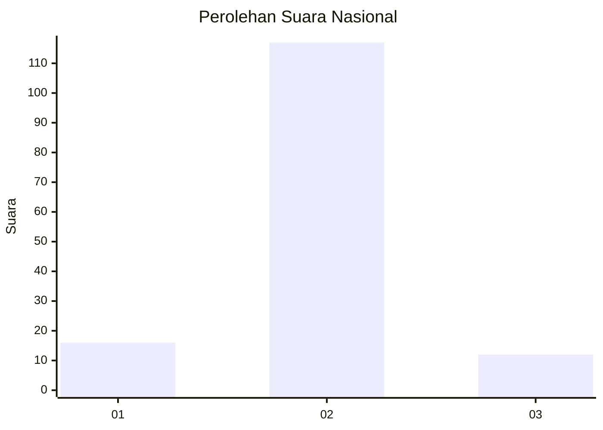
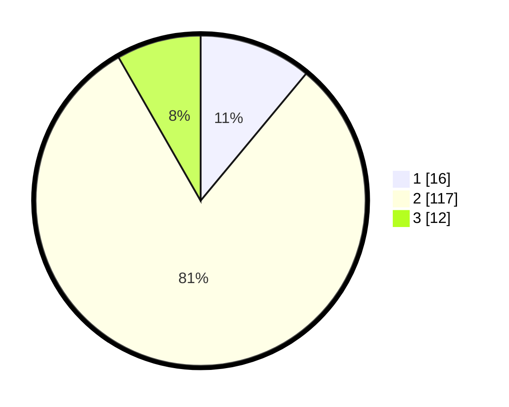

# Hasil

## Grafik

## Tabel

| No. | Nama Paslon    | Suara | Suara (raw) | Persentase |
|:--- |:-------------- | -----:| -----------:| ----------:|
| 1   | ANIES MUHAIMIN | 16    | [16][p-1]   | 11,03      |
| 2   | PRABOWO GIBRAN | 117   | [117][p-2]  | 80,69      |
| 3   | GANJAR MAHFUD  | 12    | [12][p-3]   | 8,28       |

[p-1]: https://github.com/gigit-pemilu/pemilu-2024/blob/main/pilpres/hitung-suara/sub/16-sumatera-selatan/sub/04-lahat/sub/21-gumay-talang/sub/2004-muara-tandi/sub/003-tps/sub/paslon-1.txt
[p-2]: https://github.com/gigit-pemilu/pemilu-2024/blob/main/pilpres/hitung-suara/sub/16-sumatera-selatan/sub/04-lahat/sub/21-gumay-talang/sub/2004-muara-tandi/sub/003-tps/sub/paslon-2.txt
[p-3]: https://github.com/gigit-pemilu/pemilu-2024/blob/main/pilpres/hitung-suara/sub/16-sumatera-selatan/sub/04-lahat/sub/21-gumay-talang/sub/2004-muara-tandi/sub/003-tps/sub/paslon-3.txt

## Foto C Plano

https://sirekap-obj-formc.kpu.go.id/3364/pemilu/ppwp/16/04/21/20/04/1604212004003-20240215-091824--54eb4324-3438-4aa5-bdf5-fe591318cb56.jpg

https://sirekap-obj-formc.kpu.go.id/3364/pemilu/ppwp/16/04/21/20/04/1604212004003-20240215-091721--a1e197b5-851a-4953-a794-3174e33f6040.jpg

https://sirekap-obj-formc.kpu.go.id/3364/pemilu/ppwp/16/04/21/20/04/1604212004003-20240215-042342--d4734480-e8a2-4d94-b1b3-fcb26e2d50f3.jpg

## Metadata

| Key        | Value               |
| ---------- | ------------------- |
| Time Stamp | 2024-02-15 21:30:27 |

