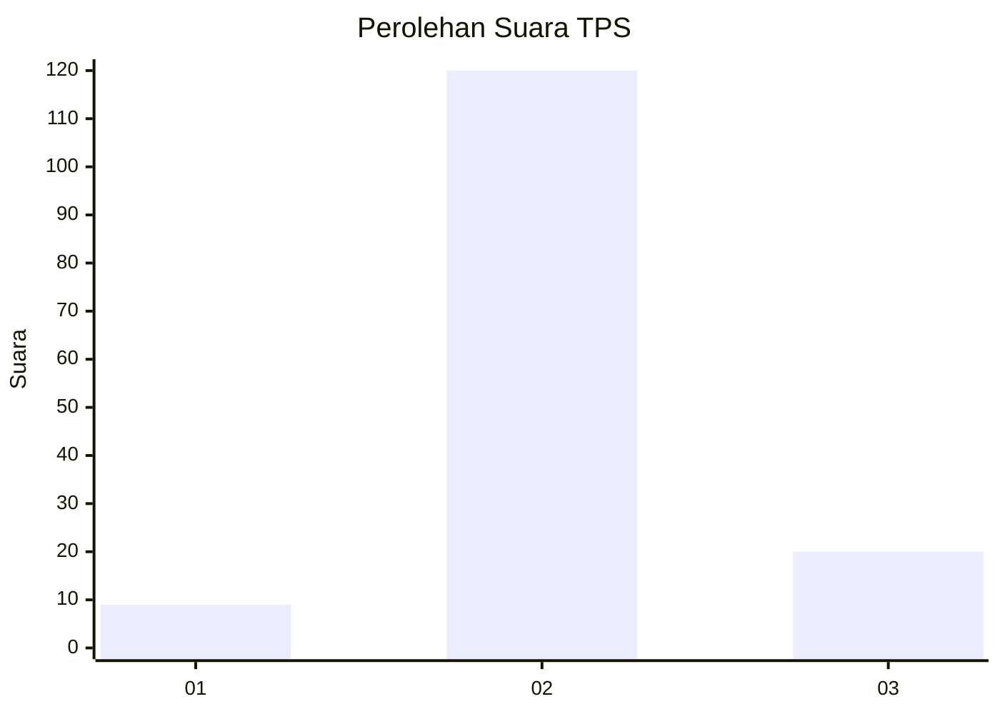
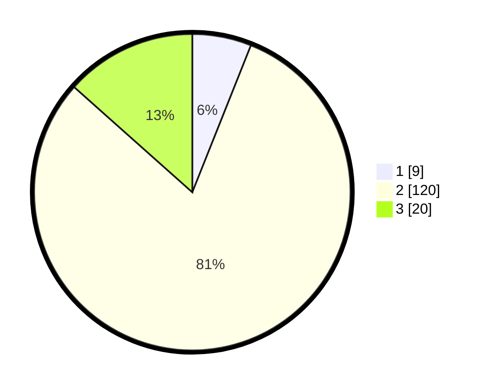

# Hasil

## Grafik

## Tabel

| No. | Nama Paslon    | Suara | Suara (raw) | Persentase |
|:--- |:-------------- | -----:| -----------:| ----------:|
| 1   | ANIES MUHAIMIN | 9     | [9][p-1]    | 6,04       |
| 2   | PRABOWO GIBRAN | 120   | [120][p-2]  | 80,54      |
| 3   | GANJAR MAHFUD  | 20    | [20][p-3]   | 13,42      |

[p-1]: https://github.com/gigit-pemilu/pemilu-2024-16-sumatera-selatan/blob/main/pilpres/hitung-suara/sub/16-sumatera-selatan/sub/04-lahat/sub/21-gumay-talang/sub/2008-mandi-angin/sub/001-tps/sub/paslon-1.txt
[p-2]: https://github.com/gigit-pemilu/pemilu-2024-16-sumatera-selatan/blob/main/pilpres/hitung-suara/sub/16-sumatera-selatan/sub/04-lahat/sub/21-gumay-talang/sub/2008-mandi-angin/sub/001-tps/sub/paslon-2.txt
[p-3]: https://github.com/gigit-pemilu/pemilu-2024-16-sumatera-selatan/blob/main/pilpres/hitung-suara/sub/16-sumatera-selatan/sub/04-lahat/sub/21-gumay-talang/sub/2008-mandi-angin/sub/001-tps/sub/paslon-3.txt

## Foto C Plano

https://sirekap-obj-formc.kpu.go.id/008f/pemilu/ppwp/16/04/21/20/08/1604212008001-20240222-192201--dc656e48-518d-4d57-80e1-70f696eea364.jpg

https://sirekap-obj-formc.kpu.go.id/008f/pemilu/ppwp/16/04/21/20/08/1604212008001-20240222-192259--573ee7be-69e4-499c-b223-a0c28ae331b0.jpg

https://sirekap-obj-formc.kpu.go.id/008f/pemilu/ppwp/16/04/21/20/08/1604212008001-20240222-192320--ccae94aa-6c94-4010-bf24-3855c09031a7.jpg

## Metadata

| Key        | Value               |
| ---------- | ------------------- |
| Time Stamp | 2024-02-24 22:31:28 |

