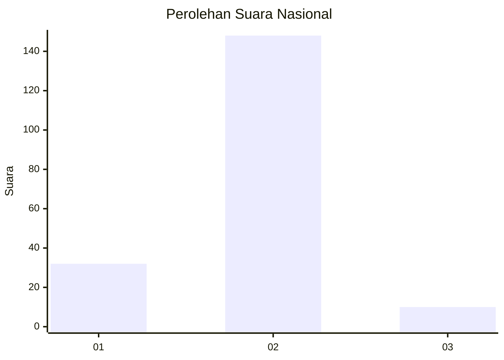
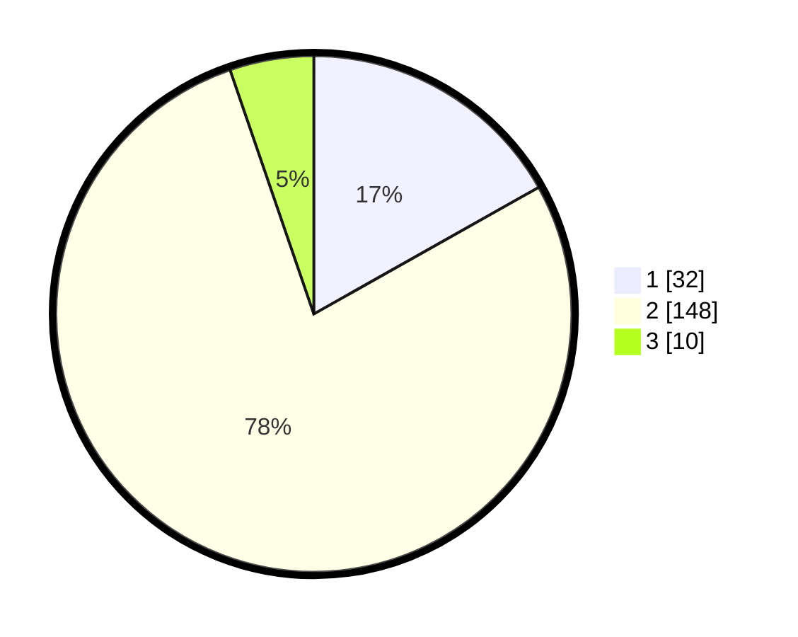

# Hasil

## Grafik

## Tabel

| No. | Nama Paslon    | Suara | Suara (raw) | Persentase |
|:--- |:-------------- | -----:| -----------:| ----------:|
| 1   | ANIES MUHAIMIN | 32    | [32][p-1]   | 16,84      |
| 2   | PRABOWO GIBRAN | 148   | [148][p-2]  | 77,89      |
| 3   | GANJAR MAHFUD  | 10    | [10][p-3]   | 5,26       |

[p-1]: https://github.com/gigit-pemilu/pemilu-2024/blob/main/pilpres/hitung-suara/sub/16-sumatera-selatan/sub/04-lahat/sub/21-gumay-talang/sub/2009-ngalam-baru/sub/003-tps/sub/paslon-1.txt
[p-2]: https://github.com/gigit-pemilu/pemilu-2024/blob/main/pilpres/hitung-suara/sub/16-sumatera-selatan/sub/04-lahat/sub/21-gumay-talang/sub/2009-ngalam-baru/sub/003-tps/sub/paslon-2.txt
[p-3]: https://github.com/gigit-pemilu/pemilu-2024/blob/main/pilpres/hitung-suara/sub/16-sumatera-selatan/sub/04-lahat/sub/21-gumay-talang/sub/2009-ngalam-baru/sub/003-tps/sub/paslon-3.txt

## Foto C Plano

https://sirekap-obj-formc.kpu.go.id/f0fa/pemilu/ppwp/16/04/21/20/09/1604212009003-20240215-054154--eda00b5d-ea66-433b-8a7a-e17612fc53d4.jpg

https://sirekap-obj-formc.kpu.go.id/f0fa/pemilu/ppwp/16/04/21/20/09/1604212009003-20240215-054255--2cbfdd45-370c-49ee-9a47-05bd6dce0a03.jpg

https://sirekap-obj-formc.kpu.go.id/f0fa/pemilu/ppwp/16/04/21/20/09/1604212009003-20240215-054408--dea5e797-c5cb-49fd-9b63-d5877c8b64df.jpg

## Metadata

| Key        | Value               |
| ---------- | ------------------- |
| Time Stamp | 2024-02-15 21:30:27 |

