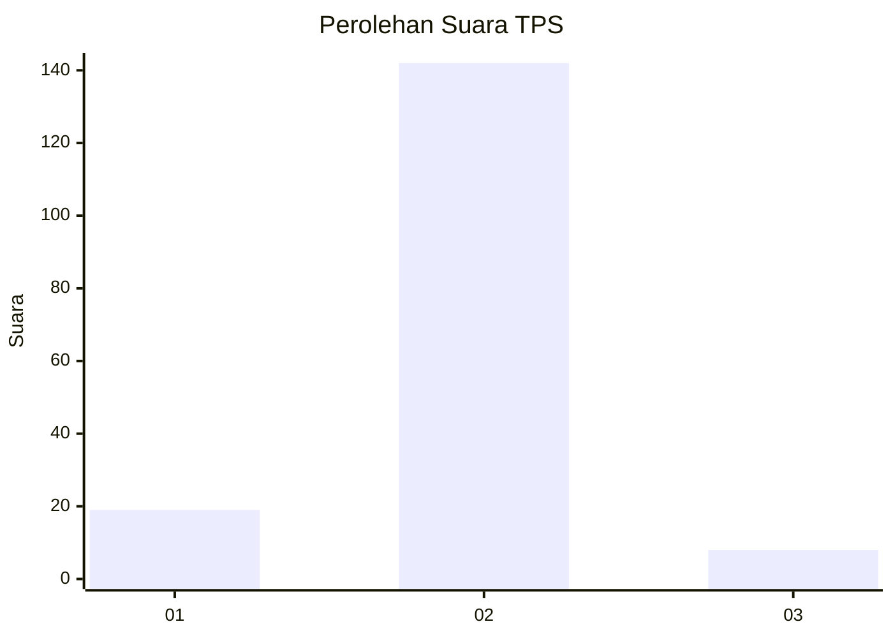
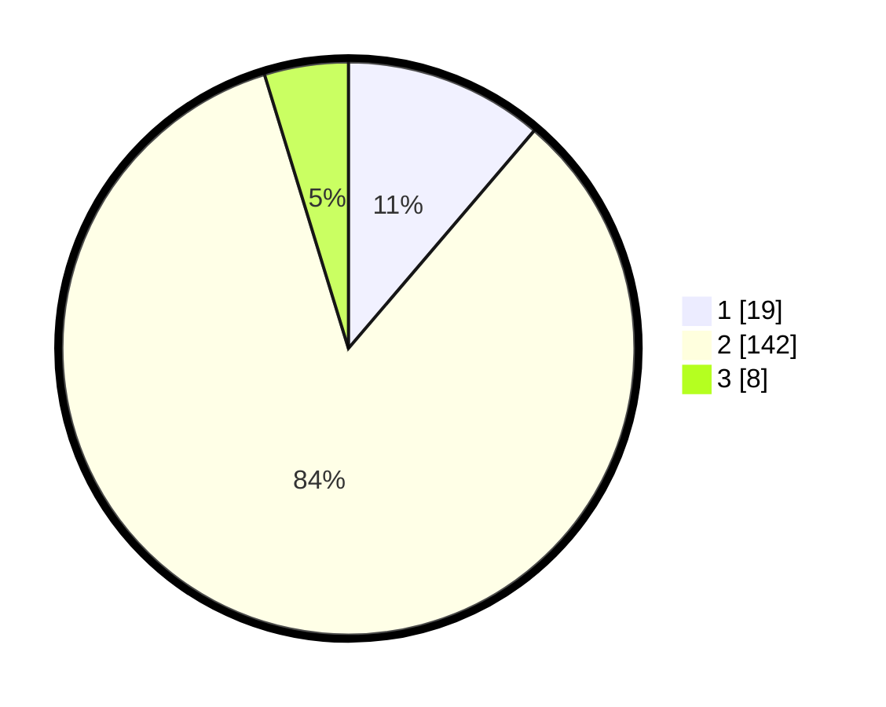

# Hasil

## Grafik

## Tabel

| No. | Nama Paslon    | Suara | Suara (raw) | Persentase |
|:--- |:-------------- | -----:| -----------:| ----------:|
| 1   | ANIES MUHAIMIN | 19    | [19][p-1]   | 11,24      |
| 2   | PRABOWO GIBRAN | 142   | [142][p-2]  | 84,02      |
| 3   | GANJAR MAHFUD  | 8     | [8][p-3]    | 4,73       |

[p-1]: https://github.com/gigit-pemilu/pemilu-2024-16-sumatera-selatan/blob/main/pilpres/hitung-suara/sub/16-sumatera-selatan/sub/04-lahat/sub/21-gumay-talang/sub/2011-tanjung-dalam/sub/002-tps/sub/paslon-1.txt
[p-2]: https://github.com/gigit-pemilu/pemilu-2024-16-sumatera-selatan/blob/main/pilpres/hitung-suara/sub/16-sumatera-selatan/sub/04-lahat/sub/21-gumay-talang/sub/2011-tanjung-dalam/sub/002-tps/sub/paslon-2.txt
[p-3]: https://github.com/gigit-pemilu/pemilu-2024-16-sumatera-selatan/blob/main/pilpres/hitung-suara/sub/16-sumatera-selatan/sub/04-lahat/sub/21-gumay-talang/sub/2011-tanjung-dalam/sub/002-tps/sub/paslon-3.txt

## Foto C Plano

https://sirekap-obj-formc.kpu.go.id/30e8/pemilu/ppwp/16/04/21/20/11/1604212011002-20240220-133856--ccc356a1-1e00-4f99-be23-c8ec3c6c29aa.jpg

https://sirekap-obj-formc.kpu.go.id/30e8/pemilu/ppwp/16/04/21/20/11/1604212011002-20240220-134149--78e5419c-30e5-43db-9071-c8af32a12a27.jpg

https://sirekap-obj-formc.kpu.go.id/30e8/pemilu/ppwp/16/04/21/20/11/1604212011002-20240220-134226--a5de6ecc-a4ba-4fe7-900f-e9278c6b0dd7.jpg

## Metadata

| Key        | Value               |
| ---------- | ------------------- |
| Time Stamp | 2024-02-25 21:00:00 |

