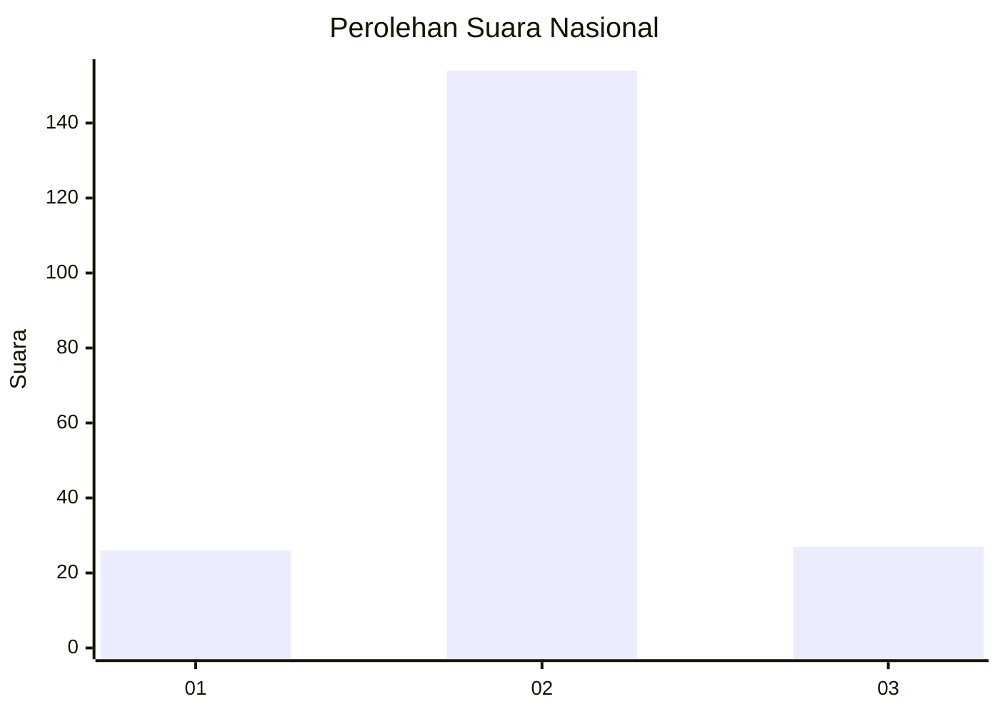
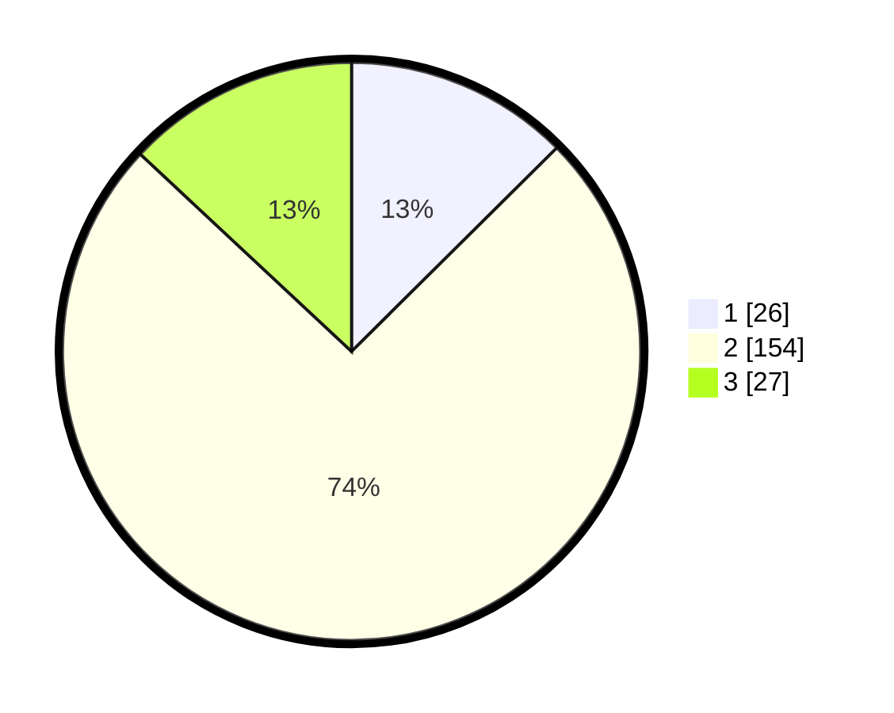

# Hasil

## Grafik

## Tabel

| No. | Nama Paslon    | Suara | Suara (raw) | Persentase |
|:--- |:-------------- | -----:| -----------:| ----------:|
| 1   | ANIES MUHAIMIN | 26    | [26][p-1]   | 12,56      |
| 2   | PRABOWO GIBRAN | 154   | [154][p-2]  | 74,40      |
| 3   | GANJAR MAHFUD  | 27    | [27][p-3]   | 13,04      |

[p-1]: https://github.com/gigit-pemilu/pemilu-2024/blob/main/pilpres/hitung-suara/sub/16-sumatera-selatan/sub/04-lahat/sub/21-gumay-talang/sub/2012-tanah-pilih/sub/002-tps/sub/paslon-1.txt
[p-2]: https://github.com/gigit-pemilu/pemilu-2024/blob/main/pilpres/hitung-suara/sub/16-sumatera-selatan/sub/04-lahat/sub/21-gumay-talang/sub/2012-tanah-pilih/sub/002-tps/sub/paslon-2.txt
[p-3]: https://github.com/gigit-pemilu/pemilu-2024/blob/main/pilpres/hitung-suara/sub/16-sumatera-selatan/sub/04-lahat/sub/21-gumay-talang/sub/2012-tanah-pilih/sub/002-tps/sub/paslon-3.txt

## Foto C Plano

https://sirekap-obj-formc.kpu.go.id/967b/pemilu/ppwp/16/04/21/20/12/1604212012002-20240221-091824--348d2b11-4ec6-47ef-bded-d37c17ffad0d.jpg

https://sirekap-obj-formc.kpu.go.id/967b/pemilu/ppwp/16/04/21/20/12/1604212012002-20240221-091920--fc9efe7e-7e52-4183-accf-abdd8cf6c2af.jpg

https://sirekap-obj-formc.kpu.go.id/967b/pemilu/ppwp/16/04/21/20/12/1604212012002-20240221-092009--c6eea758-baf1-474f-befb-e84d09c8ef7b.jpg

## Metadata

| Key        | Value               |
| ---------- | ------------------- |
| Time Stamp | 2024-02-25 14:00:00 |

