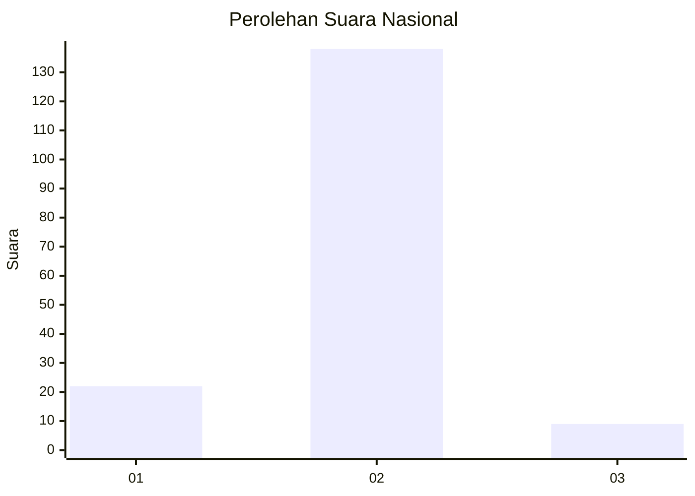
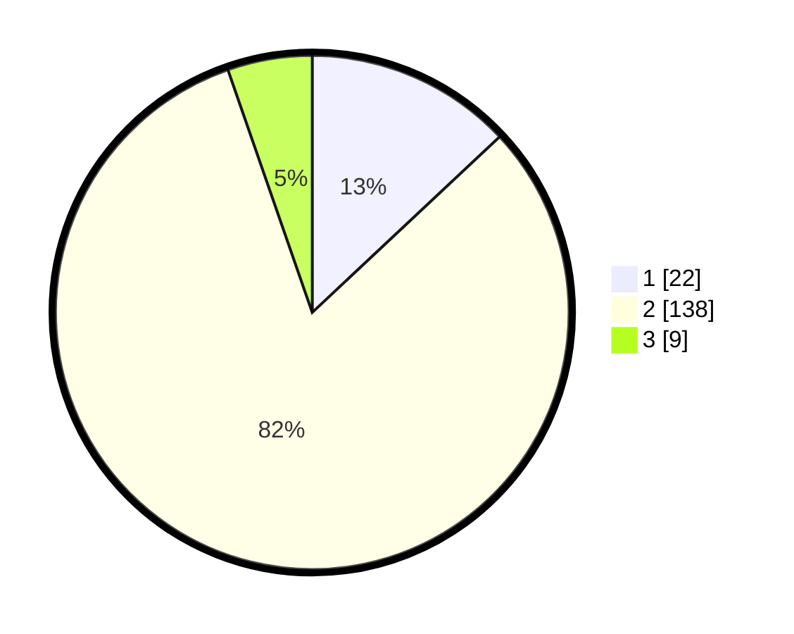

# Hasil

## Grafik

## Tabel

| No. | Nama Paslon    | Suara | Suara (raw) | Persentase |
|:--- |:-------------- | -----:| -----------:| ----------:|
| 1   | ANIES MUHAIMIN | 22    | [22][p-1]   | 13,02      |
| 2   | PRABOWO GIBRAN | 138   | [138][p-2]  | 81,66      |
| 3   | GANJAR MAHFUD  | 9     | [9][p-3]    | 5,33       |

[p-1]: https://github.com/gigit-pemilu/pemilu-2024/blob/main/pilpres/hitung-suara/sub/16-sumatera-selatan/sub/04-lahat/sub/21-gumay-talang/sub/2013-tanjung-beringin/sub/001-tps/sub/paslon-1.txt
[p-2]: https://github.com/gigit-pemilu/pemilu-2024/blob/main/pilpres/hitung-suara/sub/16-sumatera-selatan/sub/04-lahat/sub/21-gumay-talang/sub/2013-tanjung-beringin/sub/001-tps/sub/paslon-2.txt
[p-3]: https://github.com/gigit-pemilu/pemilu-2024/blob/main/pilpres/hitung-suara/sub/16-sumatera-selatan/sub/04-lahat/sub/21-gumay-talang/sub/2013-tanjung-beringin/sub/001-tps/sub/paslon-3.txt

## Foto C Plano

https://sirekap-obj-formc.kpu.go.id/16ae/pemilu/ppwp/16/04/21/20/13/1604212013001-20240222-163024--0912efed-fc06-420d-a1a9-4ab73181827f.jpg

https://sirekap-obj-formc.kpu.go.id/16ae/pemilu/ppwp/16/04/21/20/13/1604212013001-20240222-164046--1e1532b4-7746-4281-88af-3b06edad39c9.jpg

https://sirekap-obj-formc.kpu.go.id/16ae/pemilu/ppwp/16/04/21/20/13/1604212013001-20240222-164121--f500ad9a-547f-484e-87bd-966f74c3e8d3.jpg

## Metadata

| Key        | Value               |
| ---------- | ------------------- |
| Time Stamp | 2024-02-25 11:00:00 |

