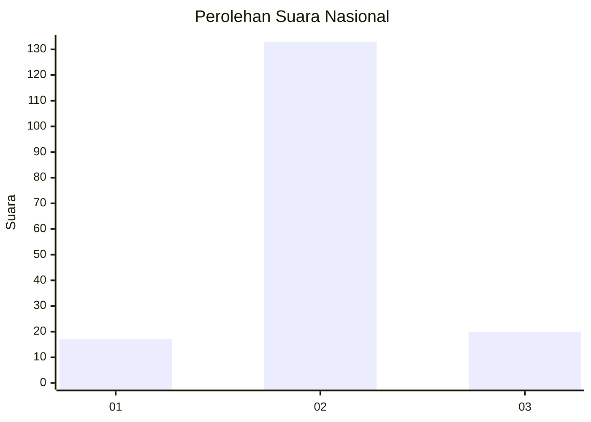
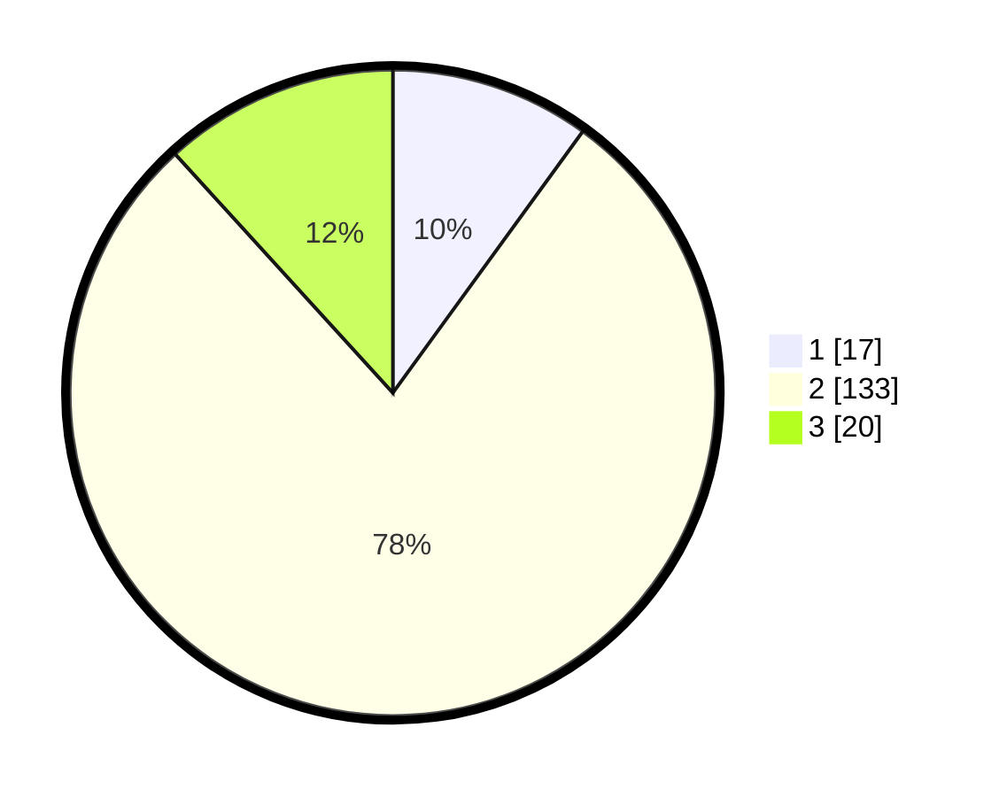

# Hasil

## Grafik

## Tabel

| No. | Nama Paslon    | Suara | Suara (raw) | Persentase |
|:--- |:-------------- | -----:| -----------:| ----------:|
| 1   | ANIES MUHAIMIN | 17    | [17][p-1]   | 10,00      |
| 2   | PRABOWO GIBRAN | 133   | [133][p-2]  | 78,24      |
| 3   | GANJAR MAHFUD  | 20    | [20][p-3]   | 11,76      |

[p-1]: https://github.com/gigit-pemilu/pemilu-2024/blob/main/pilpres/hitung-suara/sub/16-sumatera-selatan/sub/04-lahat/sub/21-gumay-talang/sub/2013-tanjung-beringin/sub/002-tps/sub/paslon-1.txt
[p-2]: https://github.com/gigit-pemilu/pemilu-2024/blob/main/pilpres/hitung-suara/sub/16-sumatera-selatan/sub/04-lahat/sub/21-gumay-talang/sub/2013-tanjung-beringin/sub/002-tps/sub/paslon-2.txt
[p-3]: https://github.com/gigit-pemilu/pemilu-2024/blob/main/pilpres/hitung-suara/sub/16-sumatera-selatan/sub/04-lahat/sub/21-gumay-talang/sub/2013-tanjung-beringin/sub/002-tps/sub/paslon-3.txt

## Foto C Plano

https://sirekap-obj-formc.kpu.go.id/b406/pemilu/ppwp/16/04/21/20/13/1604212013002-20240215-041326--0d3d98a9-86c8-42e0-9699-24d2d883c386.jpg

https://sirekap-obj-formc.kpu.go.id/b406/pemilu/ppwp/16/04/21/20/13/1604212013002-20240215-041219--2187f1b1-7920-4654-8bc6-6e7e083c9a7e.jpg

https://sirekap-obj-formc.kpu.go.id/b406/pemilu/ppwp/16/04/21/20/13/1604212013002-20240215-041447--c8f568a2-4171-45af-9fab-4a7f458cbe2d.jpg

## Metadata

| Key        | Value               |
| ---------- | ------------------- |
| Time Stamp | 2024-02-15 15:00:29 |

