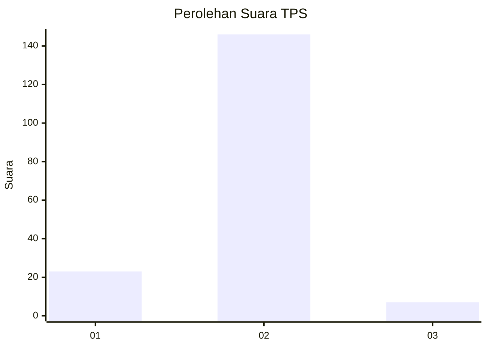
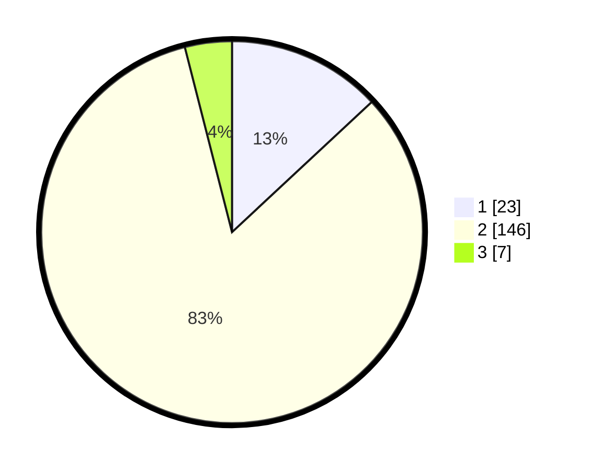

# Hasil

## Grafik

## Tabel

| No. | Nama Paslon    | Suara | Suara (raw) | Persentase |
|:--- |:-------------- | -----:| -----------:| ----------:|
| 1   | ANIES MUHAIMIN | 23    | [23][p-1]   | 13,07      |
| 2   | PRABOWO GIBRAN | 146   | [146][p-2]  | 82,95      |
| 3   | GANJAR MAHFUD  | 7     | [7][p-3]    | 3,98       |

[p-1]: https://github.com/gigit-pemilu/pemilu-2024-16-sumatera-selatan/blob/main/pilpres/hitung-suara/sub/16-sumatera-selatan/sub/04-lahat/sub/21-gumay-talang/sub/2015-suka-makmur/sub/001-tps/sub/paslon-1.txt
[p-2]: https://github.com/gigit-pemilu/pemilu-2024-16-sumatera-selatan/blob/main/pilpres/hitung-suara/sub/16-sumatera-selatan/sub/04-lahat/sub/21-gumay-talang/sub/2015-suka-makmur/sub/001-tps/sub/paslon-2.txt
[p-3]: https://github.com/gigit-pemilu/pemilu-2024-16-sumatera-selatan/blob/main/pilpres/hitung-suara/sub/16-sumatera-selatan/sub/04-lahat/sub/21-gumay-talang/sub/2015-suka-makmur/sub/001-tps/sub/paslon-3.txt

## Foto C Plano

https://sirekap-obj-formc.kpu.go.id/40fd/pemilu/ppwp/16/04/21/20/15/1604212015001-20240223-133334--881b454a-2f68-45a6-8055-656a3f58c94a.jpg

https://sirekap-obj-formc.kpu.go.id/40fd/pemilu/ppwp/16/04/21/20/15/1604212015001-20240223-133416--500ef39f-1bcb-4b0d-84ba-7362b419776e.jpg

https://sirekap-obj-formc.kpu.go.id/40fd/pemilu/ppwp/16/04/21/20/15/1604212015001-20240223-133446--9e94590b-1293-419d-90c3-ed254f1ba6f6.jpg

## Metadata

| Key        | Value               |
| ---------- | ------------------- |
| Time Stamp | 2024-02-24 22:31:28 |

