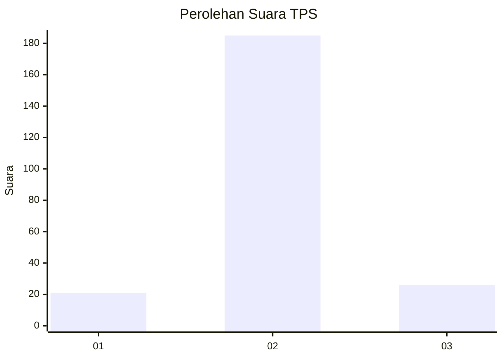
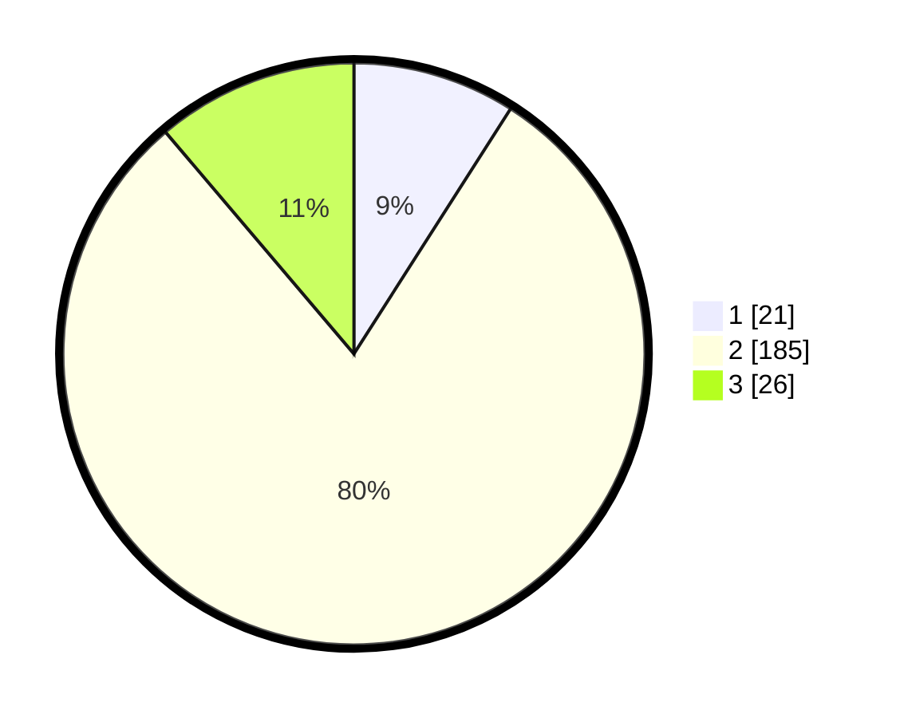

# Hasil

## Grafik

## Tabel

| No. | Nama Paslon    | Suara | Suara (raw) | Persentase |
|:--- |:-------------- | -----:| -----------:| ----------:|
| 1   | ANIES MUHAIMIN | 21    | [21][p-1]   | 9,05       |
| 2   | PRABOWO GIBRAN | 185   | [185][p-2]  | 79,74      |
| 3   | GANJAR MAHFUD  | 26    | [26][p-3]   | 11,21      |

[p-1]: https://github.com/gigit-pemilu/pemilu-2024-16-sumatera-selatan/blob/main/pilpres/hitung-suara/sub/16-sumatera-selatan/sub/04-lahat/sub/22-pagar-gunung/sub/2001-kedaton/sub/002-tps/sub/paslon-1.txt
[p-2]: https://github.com/gigit-pemilu/pemilu-2024-16-sumatera-selatan/blob/main/pilpres/hitung-suara/sub/16-sumatera-selatan/sub/04-lahat/sub/22-pagar-gunung/sub/2001-kedaton/sub/002-tps/sub/paslon-2.txt
[p-3]: https://github.com/gigit-pemilu/pemilu-2024-16-sumatera-selatan/blob/main/pilpres/hitung-suara/sub/16-sumatera-selatan/sub/04-lahat/sub/22-pagar-gunung/sub/2001-kedaton/sub/002-tps/sub/paslon-3.txt

## Foto C Plano

https://sirekap-obj-formc.kpu.go.id/07f5/pemilu/ppwp/16/04/22/20/01/1604222001002-20240222-093003--07ca8f87-ca24-4273-af3b-cce55e54b791.jpg

https://sirekap-obj-formc.kpu.go.id/07f5/pemilu/ppwp/16/04/22/20/01/1604222001002-20240222-093033--0b8eba4a-429d-4489-8886-b642e9467456.jpg

https://sirekap-obj-formc.kpu.go.id/07f5/pemilu/ppwp/16/04/22/20/01/1604222001002-20240222-093100--19f20eb1-82d5-4e49-86a8-e2bdafbd3a6e.jpg

## Metadata

| Key        | Value               |
| ---------- | ------------------- |
| Time Stamp | 2024-02-25 11:00:00 |

