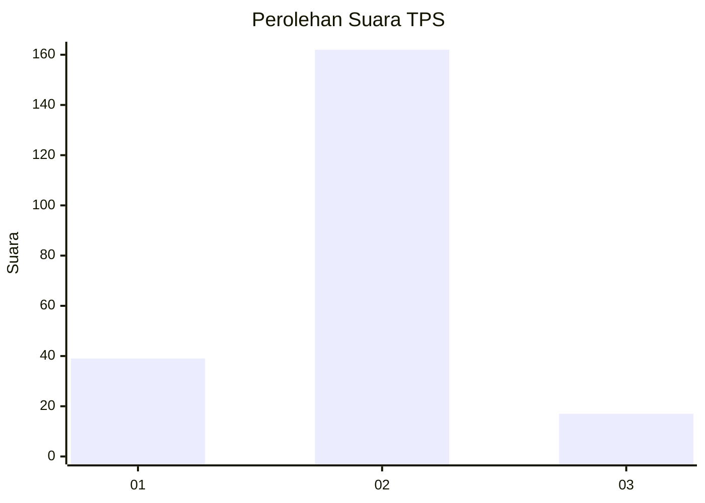
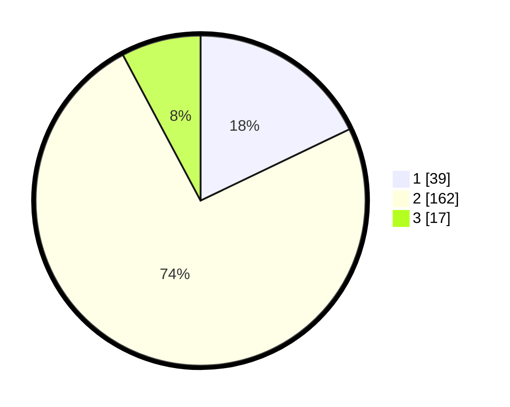

# Hasil

## Grafik

## Tabel

| No. | Nama Paslon    | Suara | Suara (raw) | Persentase |
|:--- |:-------------- | -----:| -----------:| ----------:|
| 1   | ANIES MUHAIMIN | 39    | [39][p-1]   | 17,89      |
| 2   | PRABOWO GIBRAN | 162   | [162][p-2]  | 74,31      |
| 3   | GANJAR MAHFUD  | 17    | [17][p-3]   | 7,80       |

[p-1]: https://github.com/gigit-pemilu/pemilu-2024-16-sumatera-selatan/blob/main/pilpres/hitung-suara/sub/16-sumatera-selatan/sub/04-lahat/sub/22-pagar-gunung/sub/2002-tanjung-agung/sub/001-tps/sub/paslon-1.txt
[p-2]: https://github.com/gigit-pemilu/pemilu-2024-16-sumatera-selatan/blob/main/pilpres/hitung-suara/sub/16-sumatera-selatan/sub/04-lahat/sub/22-pagar-gunung/sub/2002-tanjung-agung/sub/001-tps/sub/paslon-2.txt
[p-3]: https://github.com/gigit-pemilu/pemilu-2024-16-sumatera-selatan/blob/main/pilpres/hitung-suara/sub/16-sumatera-selatan/sub/04-lahat/sub/22-pagar-gunung/sub/2002-tanjung-agung/sub/001-tps/sub/paslon-3.txt

## Foto C Plano

https://sirekap-obj-formc.kpu.go.id/85bb/pemilu/ppwp/16/04/22/20/02/1604222002001-20240221-095724--542deb42-5afc-49fa-8ae0-7815622eefd5.jpg

https://sirekap-obj-formc.kpu.go.id/85bb/pemilu/ppwp/16/04/22/20/02/1604222002001-20240221-095755--01228ced-b2b2-43e0-baaf-46b591bcafe7.jpg

https://sirekap-obj-formc.kpu.go.id/85bb/pemilu/ppwp/16/04/22/20/02/1604222002001-20240221-095829--66333713-81b1-4867-a422-f69b20d07dd4.jpg

## Metadata

| Key        | Value               |
| ---------- | ------------------- |
| Time Stamp | 2024-02-24 22:31:28 |

