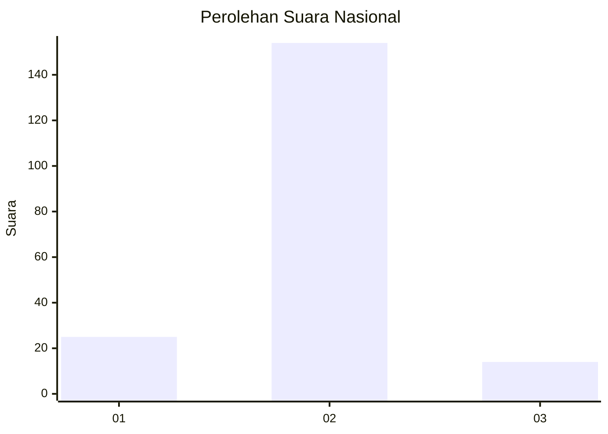
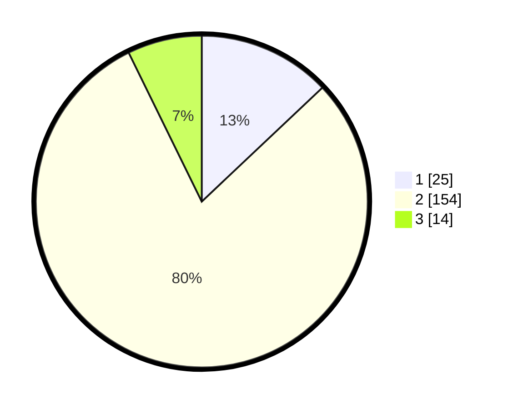

# Hasil

## Grafik

## Tabel

| No. | Nama Paslon    | Suara | Suara (raw) | Persentase |
|:--- |:-------------- | -----:| -----------:| ----------:|
| 1   | ANIES MUHAIMIN | 25    | [25][p-1]   | 12,95      |
| 2   | PRABOWO GIBRAN | 154   | [154][p-2]  | 79,79      |
| 3   | GANJAR MAHFUD  | 14    | [14][p-3]   | 7,25       |

[p-1]: https://github.com/gigit-pemilu/pemilu-2024/blob/main/pilpres/hitung-suara/sub/16-sumatera-selatan/sub/04-lahat/sub/22-pagar-gunung/sub/2002-tanjung-agung/sub/002-tps/sub/paslon-1.txt
[p-2]: https://github.com/gigit-pemilu/pemilu-2024/blob/main/pilpres/hitung-suara/sub/16-sumatera-selatan/sub/04-lahat/sub/22-pagar-gunung/sub/2002-tanjung-agung/sub/002-tps/sub/paslon-2.txt
[p-3]: https://github.com/gigit-pemilu/pemilu-2024/blob/main/pilpres/hitung-suara/sub/16-sumatera-selatan/sub/04-lahat/sub/22-pagar-gunung/sub/2002-tanjung-agung/sub/002-tps/sub/paslon-3.txt

## Foto C Plano

https://sirekap-obj-formc.kpu.go.id/6384/pemilu/ppwp/16/04/22/20/02/1604222002002-20240221-101709--e4fb2a41-c96c-4165-913c-4bdd1d42a6f7.jpg

https://sirekap-obj-formc.kpu.go.id/6384/pemilu/ppwp/16/04/22/20/02/1604222002002-20240221-101740--e7601065-11ce-4d2b-a797-2a908c0cf456.jpg

https://sirekap-obj-formc.kpu.go.id/6384/pemilu/ppwp/16/04/22/20/02/1604222002002-20240221-101813--8a80c502-882a-47a7-9425-c05d8f09acfc.jpg

## Metadata

| Key        | Value               |
| ---------- | ------------------- |
| Time Stamp | 2024-02-25 11:00:00 |

