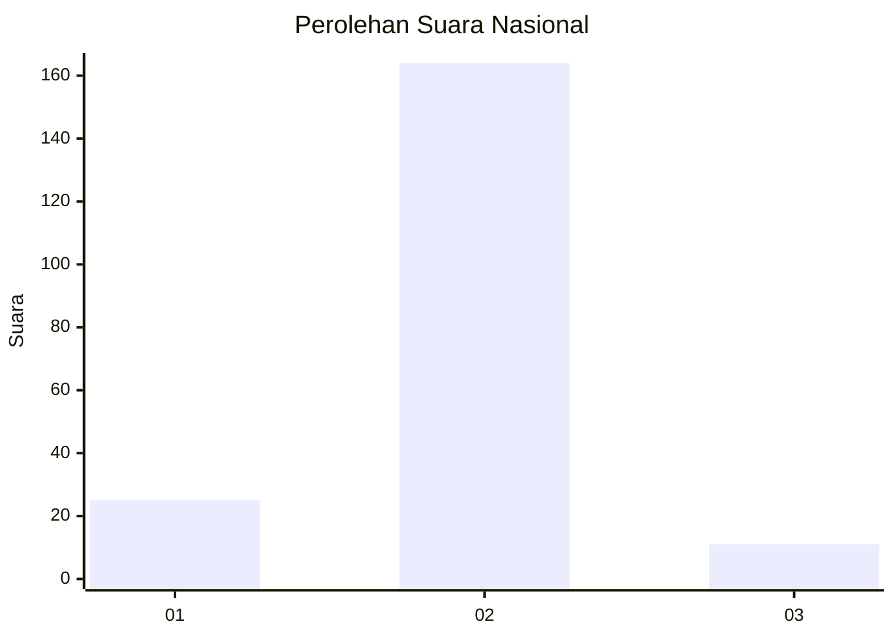
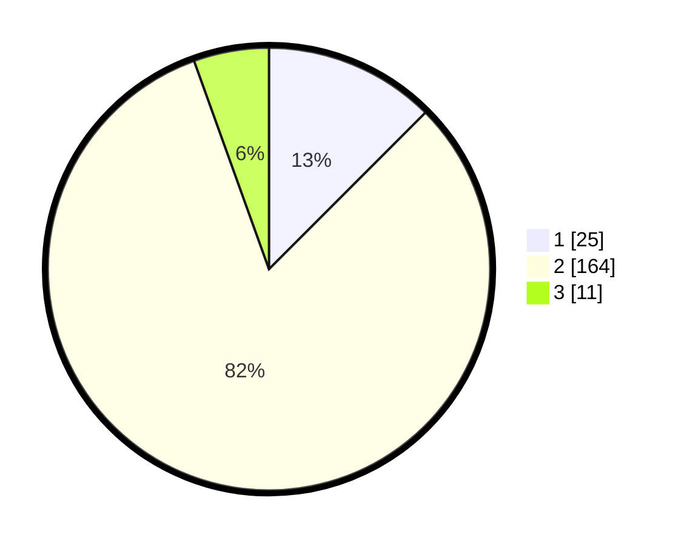

# Hasil

## Grafik

## Tabel

| No. | Nama Paslon    | Suara | Suara (raw) | Persentase |
|:--- |:-------------- | -----:| -----------:| ----------:|
| 1   | ANIES MUHAIMIN | 25    | [25][p-1]   | 12,50      |
| 2   | PRABOWO GIBRAN | 164   | [164][p-2]  | 82,00      |
| 3   | GANJAR MAHFUD  | 11    | [11][p-3]   | 5,50       |

[p-1]: https://github.com/gigit-pemilu/pemilu-2024/blob/main/pilpres/hitung-suara/sub/16-sumatera-selatan/sub/04-lahat/sub/22-pagar-gunung/sub/2004-bandung-agung/sub/002-tps/sub/paslon-1.txt
[p-2]: https://github.com/gigit-pemilu/pemilu-2024/blob/main/pilpres/hitung-suara/sub/16-sumatera-selatan/sub/04-lahat/sub/22-pagar-gunung/sub/2004-bandung-agung/sub/002-tps/sub/paslon-2.txt
[p-3]: https://github.com/gigit-pemilu/pemilu-2024/blob/main/pilpres/hitung-suara/sub/16-sumatera-selatan/sub/04-lahat/sub/22-pagar-gunung/sub/2004-bandung-agung/sub/002-tps/sub/paslon-3.txt

## Foto C Plano

https://sirekap-obj-formc.kpu.go.id/9dd4/pemilu/ppwp/16/04/22/20/04/1604222004002-20240221-131324--33b6c762-c7b6-4420-b230-8531352395d3.jpg

https://sirekap-obj-formc.kpu.go.id/9dd4/pemilu/ppwp/16/04/22/20/04/1604222004002-20240221-131406--6664781b-ddf8-4aa7-95c6-8184819fafde.jpg

https://sirekap-obj-formc.kpu.go.id/9dd4/pemilu/ppwp/16/04/22/20/04/1604222004002-20240221-131433--b52bb8e3-1695-4ac0-9414-d56a8d4a4669.jpg

## Metadata

| Key        | Value               |
| ---------- | ------------------- |
| Time Stamp | 2024-02-25 00:00:00 |

