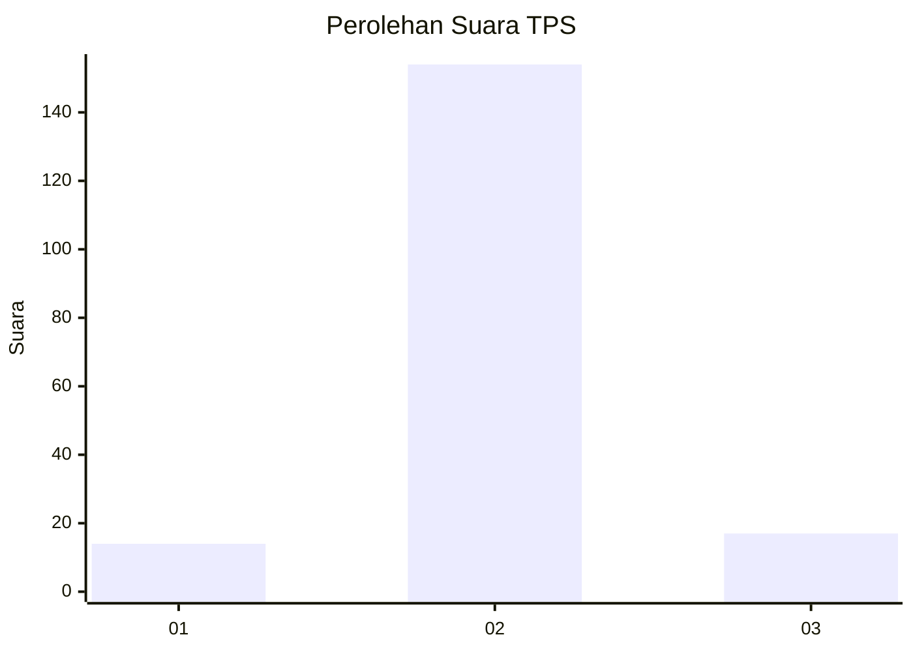
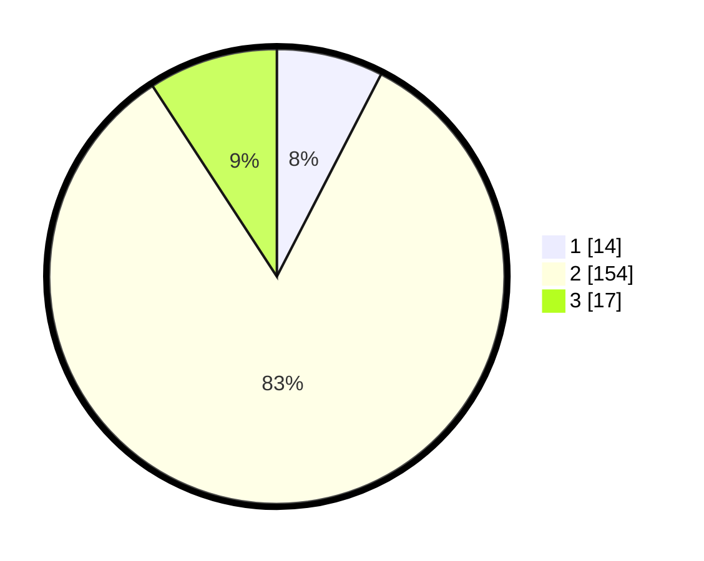

# Hasil

## Grafik

## Tabel

| No. | Nama Paslon    | Suara | Suara (raw) | Persentase |
|:--- |:-------------- | -----:| -----------:| ----------:|
| 1   | ANIES MUHAIMIN | 14    | [14][p-1]   | 7,57       |
| 2   | PRABOWO GIBRAN | 154   | [154][p-2]  | 83,24      |
| 3   | GANJAR MAHFUD  | 17    | [17][p-3]   | 9,19       |

[p-1]: https://github.com/gigit-pemilu/pemilu-2024-16-sumatera-selatan/blob/main/pilpres/hitung-suara/sub/16-sumatera-selatan/sub/04-lahat/sub/22-pagar-gunung/sub/2005-lesung-batu/sub/004-tps/sub/paslon-1.txt
[p-2]: https://github.com/gigit-pemilu/pemilu-2024-16-sumatera-selatan/blob/main/pilpres/hitung-suara/sub/16-sumatera-selatan/sub/04-lahat/sub/22-pagar-gunung/sub/2005-lesung-batu/sub/004-tps/sub/paslon-2.txt
[p-3]: https://github.com/gigit-pemilu/pemilu-2024-16-sumatera-selatan/blob/main/pilpres/hitung-suara/sub/16-sumatera-selatan/sub/04-lahat/sub/22-pagar-gunung/sub/2005-lesung-batu/sub/004-tps/sub/paslon-3.txt

## Foto C Plano

https://sirekap-obj-formc.kpu.go.id/8540/pemilu/ppwp/16/04/22/20/05/1604222005004-20240222-164609--d36caa25-d075-4c46-b173-f3ac599f9b70.jpg

https://sirekap-obj-formc.kpu.go.id/8540/pemilu/ppwp/16/04/22/20/05/1604222005004-20240222-164841--43c673e1-9170-4c53-82b3-d892618f35a8.jpg

https://sirekap-obj-formc.kpu.go.id/8540/pemilu/ppwp/16/04/22/20/05/1604222005004-20240222-164636--6c93601c-6ef1-4fc0-95cb-f976e200095d.jpg

## Metadata

| Key        | Value               |
| ---------- | ------------------- |
| Time Stamp | 2024-02-25 15:00:00 |

