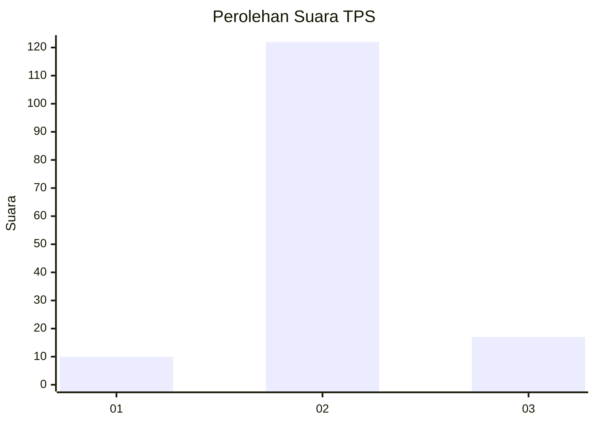
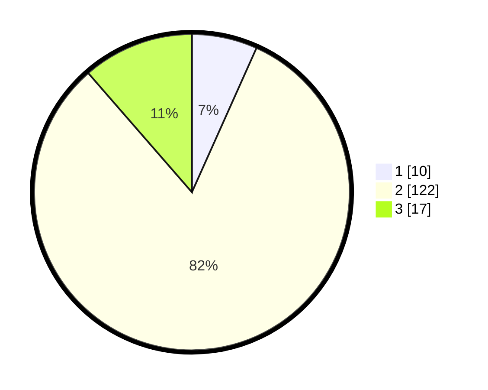

# Hasil

## Grafik

## Tabel

| No. | Nama Paslon    | Suara | Suara (raw) | Persentase |
|:--- |:-------------- | -----:| -----------:| ----------:|
| 1   | ANIES MUHAIMIN | 10    | [10][p-1]   | 6,71       |
| 2   | PRABOWO GIBRAN | 122   | [122][p-2]  | 81,88      |
| 3   | GANJAR MAHFUD  | 17    | [17][p-3]   | 11,41      |

[p-1]: https://github.com/gigit-pemilu/pemilu-2024-16-sumatera-selatan/blob/main/pilpres/hitung-suara/sub/16-sumatera-selatan/sub/04-lahat/sub/22-pagar-gunung/sub/2007-batu-rusa/sub/001-tps/sub/paslon-1.txt
[p-2]: https://github.com/gigit-pemilu/pemilu-2024-16-sumatera-selatan/blob/main/pilpres/hitung-suara/sub/16-sumatera-selatan/sub/04-lahat/sub/22-pagar-gunung/sub/2007-batu-rusa/sub/001-tps/sub/paslon-2.txt
[p-3]: https://github.com/gigit-pemilu/pemilu-2024-16-sumatera-selatan/blob/main/pilpres/hitung-suara/sub/16-sumatera-selatan/sub/04-lahat/sub/22-pagar-gunung/sub/2007-batu-rusa/sub/001-tps/sub/paslon-3.txt

## Foto C Plano

https://sirekap-obj-formc.kpu.go.id/be64/pemilu/ppwp/16/04/22/20/07/1604222007001-20240220-104035--6af9b5fb-e4d1-44a3-a92f-c2cb5a66f401.jpg

https://sirekap-obj-formc.kpu.go.id/be64/pemilu/ppwp/16/04/22/20/07/1604222007001-20240220-104200--4fb8a35b-0f88-4791-9f69-89b421287738.jpg

https://sirekap-obj-formc.kpu.go.id/be64/pemilu/ppwp/16/04/22/20/07/1604222007001-20240220-104311--067321a1-3f63-4ef2-8d18-6b1528a26455.jpg

## Metadata

| Key        | Value               |
| ---------- | ------------------- |
| Time Stamp | 2024-02-25 16:00:00 |

