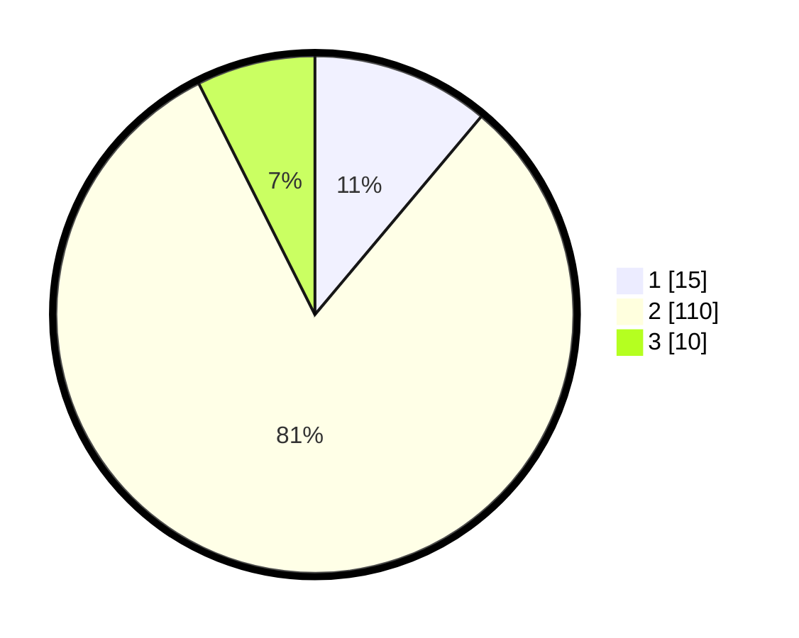

# Hasil

## Grafik

## Tabel

| No. | Nama Paslon    | Suara | Suara (raw) | Persentase |
|:--- |:-------------- | -----:| -----------:| ----------:|
| 1   | ANIES MUHAIMIN | 15    | [15][p-1]   | 11,11      |
| 2   | PRABOWO GIBRAN | 110   | [110][p-2]  | 81,48      |
| 3   | GANJAR MAHFUD  | 10    | [10][p-3]   | 7,41       |

[p-1]: https://github.com/gigit-pemilu/pemilu-2024-16-sumatera-selatan/blob/main/pilpres/hitung-suara/sub/16-sumatera-selatan/sub/04-lahat/sub/22-pagar-gunung/sub/2007-batu-rusa/sub/002-tps/sub/paslon-1.txt
[p-2]: https://github.com/gigit-pemilu/pemilu-2024-16-sumatera-selatan/blob/main/pilpres/hitung-suara/sub/16-sumatera-selatan/sub/04-lahat/sub/22-pagar-gunung/sub/2007-batu-rusa/sub/002-tps/sub/paslon-2.txt
[p-3]: https://github.com/gigit-pemilu/pemilu-2024-16-sumatera-selatan/blob/main/pilpres/hitung-suara/sub/16-sumatera-selatan/sub/04-lahat/sub/22-pagar-gunung/sub/2007-batu-rusa/sub/002-tps/sub/paslon-3.txt

## Foto C Plano

https://sirekap-obj-formc.kpu.go.id/b398/pemilu/ppwp/16/04/22/20/07/1604222007002-20240214-230403--458f78ca-d0d8-4198-aff6-c07519114eb2.jpg

https://sirekap-obj-formc.kpu.go.id/b398/pemilu/ppwp/16/04/22/20/07/1604222007002-20240214-230555--d97b8cac-f55e-49f5-a934-9ff1d8cff780.jpg

https://sirekap-obj-formc.kpu.go.id/b398/pemilu/ppwp/16/04/22/20/07/1604222007002-20240214-230655--aab27a84-a49c-4174-9394-79d9be5c7248.jpg

## Metadata

| Key        | Value               |
| ---------- | ------------------- |
| Time Stamp | 2024-02-16 11:00:29 |

